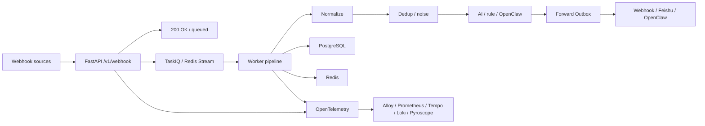

# WebhookWise

WebhookWise 是一个面向生产运维的智能 Webhook 接收、分析和转发服务。它把 Prometheus、Grafana、Alertmanager、飞书或任意第三方系统发来的事件统一归一化，异步写入队列和数据库，再通过 AI 分析、降噪去重、事务性转发和可观测性能力，把告警变成可以追踪、可以审计、可以行动的运维事件。

它不是一个简单的 Webhook relay，而是一个小型 AIOps 控制面：

- API 快速返回 `200 OK` 并完成入队，耗时处理进入 TaskIQ/Redis Stream。
- Worker pipeline 负责归一化、持久化、去重、AI/rule 分析、降噪和转发决策。
- Forward Outbox 让业务状态和外部 HTTP/飞书/OpenClaw 副作用解耦。
- OTel-first 可观测性把 metrics、traces、logs、events、signals、profiles 串起来。

## 快速入口

| 你想做什么 | 去哪里 |
| --- | --- |
| 启动本地环境 | [快速开始](#快速开始) |
| 查看 API | 启动后访问 `http://localhost:8000/docs`，导出说明见 [docs/reference/api.md](docs/reference/api.md) |
| 理解模块边界 | [docs/architecture/boundaries.md](docs/architecture/boundaries.md) |
| 打开观测栈 | [docs/operations/observability/local-lab/README.md](docs/operations/observability/local-lab/README.md) |
| 查询观测数据 | [docs/operations/observability/query-tools.md](docs/operations/observability/query-tools.md) |
| 排查问题 | [docs/operations/troubleshooting.md](docs/operations/troubleshooting.md) |
| 部署到 Kubernetes | [deploy/k8s/README.md](deploy/k8s/README.md) |
| 参与开发 | [CONTRIBUTING.md](CONTRIBUTING.md) |
| 看版本变化 | [CHANGELOG.md](CHANGELOG.md) |

## 核心能力

| 能力 | 说明 |
| --- | --- |
| 异步 Webhook 接收 | API 只做鉴权、限流、入队和基础落库，快速释放上游请求。 |
| 多来源归一化 | Adapter 将不同生态 payload 规范成统一内部结构。 |
| AI + rule 双分析 | 首选 LLM 结构化分析，外部异常时自动降级为规则分析。 |
| OpenClaw 深度分析 | 可选接入 OpenClaw，通过 TaskIQ 延迟任务轮询分析结果。 |
| 去重与降噪 | 基于 alert hash、时间窗口、相似度和可选语义信号识别重复与衍生告警。 |
| 规则化转发 | 支持通用 Webhook、飞书卡片和 OpenClaw 目标。 |
| 事务性 Outbox | 处理结果和转发意图同事务写库，再由 Worker 异步投递和重试。 |
| OTel-first 可观测性 | 应用通过 OTLP 输出遥测，本地栈接入 Alloy、Prometheus、Tempo、Loki、Pyroscope。 |

## 系统流向



## 快速开始

### 1. 准备配置

```bash
cp .env.example .env
```

最少需要替换：

| 变量 | 用途 |
| --- | --- |
| `API_KEY` | 管理 API 读权限 Token。 |
| `ADMIN_WRITE_KEY` | 写操作、重放、转发、重新分析等管理动作 Token。 |
| `WEBHOOK_SECRET` | Webhook HMAC-SHA256 签名密钥。 |
| `OPENAI_API_KEY` | 可选；开启 AI 分析时填写。 |

完整配置参考 [.env.example.all](.env.example.all)。配置只在进程启动时读取，修改后需要重启进程或滚动发布。

### 2. 启动本地完整栈

```bash
docker compose up -d --build
curl http://localhost:8000/ready
```

Compose 会先启动 PostgreSQL 和 Redis，再运行 `migrate`，迁移成功后启动 API、Worker 和 Scheduler。使用云数据库或托管 Redis 时，可以只运行 `docker compose -p webhookwise --env-file .env -f deploy/compose/docker-compose.yml up -d --build`，并在 `.env` 中把 `DATABASE_URL` / `REDIS_URL` 指向外部实例。

根目录的 `compose.yaml` 是日常入口，只 include PostgreSQL、Redis、API、Worker、Scheduler 等业务栈；`docker compose ps/logs/exec` 默认也只看这组容器。完整 Compose 片段仍放在 `deploy/compose/`，观测栈使用独立 Compose project 启动。

### 3. 发送测试事件

```bash
curl -X POST http://localhost:8000/v1/webhook \
  -H "Content-Type: application/json" \
  -d '{"alertname":"TestAlert","severity":"critical","host":"prod-01"}'
```

业务 API 只在 `/v1` 下暴露；如果启用了 Webhook 鉴权，需要按当前配置补充签名或 Token。

### 4. 打开入口

| 入口 | 地址 |
| --- | --- |
| Dashboard | `http://localhost:8000/` 或 `http://localhost:8000/dashboard` |
| Swagger UI | `http://localhost:8000/docs` |
| ReDoc | `http://localhost:8000/redoc` |
| Health | `http://localhost:8000/live` / `http://localhost:8000/ready` |

## 本地开发

如果 API/Worker 直接跑在宿主机，而 PostgreSQL/Redis 仍由 `deploy/compose/docker-compose.infra.yml` 提供，请在本机环境或 `.env` 中把 `DATABASE_URL` 的 host 改为 `localhost`，并把 `REDIS_URL` 改为 `redis://localhost:6379/0`。

```bash
pip install -r requirements.lock
pip install -r requirements-dev.lock

uvicorn api.app:app --reload --port 8000
```

另开一个终端启动 Worker：

```bash
taskiq worker services.operations.taskiq_wiring:broker
```

Scheduler 入口：

```bash
taskiq scheduler services.operations.taskiq_wiring:scheduler
```

依赖策略：

- `requirements.txt` / `requirements-dev.txt` 是人工维护的直接依赖，统一表达最低支持版本。
- `requirements.lock` / `requirements-dev.lock` 精确锁定解析结果，是本地安装、CI、Docker 构建和部署的准绳；不要用 `requirements.txt` 作为可复现安装入口。
- 锁文件由 uv 生成，项目当前不是 `[project]` 风格 uv 工程，因此不维护 `uv.lock`。
- GitHub Actions 使用 lock 文件安装，Dockerfile 只安装 `requirements.lock`，`scripts/check_requirements_locks.py` 会检查这些路径没有漂移。
- Dependabot 每周扫描根目录 pip 依赖；依赖升级 PR 需要同时更新直接依赖声明和对应 lock 文件。

更新锁文件：

```bash
uv pip compile requirements.txt -o requirements.lock --python-version 3.12
uv pip compile requirements-dev.txt -c requirements.lock -o requirements-dev.lock --python-version 3.12
```

## 常用验证

| 层级 | 命令 | 覆盖内容 |
| --- | --- | --- |
| 静态检查 | `ruff check .` / `mypy` | 代码风格、类型边界。 |
| 单元和进程内集成 | `pytest` | 纯函数、核心服务、FastAPI 到 pipeline 的进程内链路。 |
| Docker E2E | `tests/e2e/run_webhook_to_feishu.sh` | PostgreSQL、Redis、API、Worker、Scheduler、fake Feishu 完整链路。 |

发版前或改动迁移、队列、转发链路时建议跑 Docker E2E。

## 部署

### Docker Compose

```bash
docker compose up -d --build
docker compose ps
```

观测栈单独使用 `webhookwise-observability` project：

```bash
docker compose -p webhookwise-observability --env-file .env -f deploy/compose/docker-compose.observability.yml up -d
```

### Kubernetes

`deploy/k8s/` 提供基础清单：API、Worker、Scheduler、迁移 Job、Redis、PostgreSQL、ConfigMap、Secret 示例与 ServiceAccount。

```bash
cp deploy/k8s/secret.example.yaml /tmp/webhookwise-secret.yaml
$EDITOR /tmp/webhookwise-secret.yaml
kubectl apply -f /tmp/webhookwise-secret.yaml
kubectl apply -k deploy/k8s
```

应用镜像必须使用 release tag 或 digest，避免使用 `latest`。更多细节见 [deploy/k8s/README.md](deploy/k8s/README.md)。

## 项目结构

```text
.
├── api/                  # FastAPI 路由、请求响应绑定和鉴权依赖
├── adapters/             # 外部 Webhook payload 归一化和插件注册
├── alembic/              # 数据库迁移
├── core/                 # 配置、日志、鉴权、Redis、OTel、HTTP client 等运行时基础设施
├── db/                   # SQLAlchemy engine/session 生命周期
├── deploy/               # Compose、Kubernetes 与可观测性部署资源
├── docs/                 # 架构、运维、参考文档
├── models/               # SQLAlchemy ORM 模型
├── prompts/              # AI 和深度分析 Prompt 模板
├── schemas/              # Pydantic API schema
├── scripts/              # 运维、导出、观测查询脚本
├── services/
│   ├── analysis/         # AI/rule/OpenClaw 分析、缓存、用量
│   ├── forwarding/       # 转发规则、Outbox、远端投递、重试
│   ├── notifications/    # 通知渠道和消息格式化
│   ├── operations/       # TaskIQ 任务、调度、恢复、维护
│   └── webhooks/         # Webhook ingest、pipeline、查询与命令
├── templates/            # Dashboard HTML 和静态资源
└── tests/
    ├── adapters/         # 外部 payload 适配器测试
    ├── analysis/         # AI、OpenClaw、降噪和分析策略测试
    ├── api/              # FastAPI 路由和 API contract 测试
    ├── forwarding/       # 转发规则、Outbox、重试和 URL 安全测试
    ├── integration/      # 进程内业务链路集成测试
    ├── observability/    # 可观测性、文档和运维契约测试
    ├── runtime/          # 配置、日志、Redis、迁移和运行时基础设施测试
    ├── webhooks/         # Webhook 解析、pipeline、去重和抑制测试
    ├── e2e/              # Docker E2E
    ├── helpers/          # pytest helper
    └── k6/               # 压测脚本
```

更严格的 ownership 规则见 [docs/architecture/boundaries.md](docs/architecture/boundaries.md)。

## 运行契约

- API 接收层不做长耗时分析，不直接执行外部转发副作用。
- Worker 是业务 pipeline 的主执行面，Scheduler 只投递周期任务。
- Forward Outbox 是外部投递的审计边界，重试和过期状态必须落库。
- 配置是静态进程配置，不从数据库或 Redis 动态覆盖。
- 应用只通过 OTLP 输出遥测，不直接暴露 `/metrics`。
- 新增 Webhook 来源优先新增 adapter 和测试，再复用现有 pipeline。
- 新增业务能力优先放入最近的 `services/*` 领域包，避免把业务逻辑塞进 `core/`。

## 文档地图

完整文档入口见 [docs/README.md](docs/README.md)。

| 分类 | 文档 |
| --- | --- |
| 架构 | [模块边界](docs/architecture/boundaries.md) |
| 运维 | [可观测性](docs/operations/observability/overview.md)、[Grafana 大盘](docs/operations/observability/dashboards.md)、[查询工具](docs/operations/observability/query-tools.md)、[排障](docs/operations/troubleshooting.md) |
| 参考 | [API 文档](docs/reference/api.md)、[Kubernetes](deploy/k8s/README.md)、[贡献指南](CONTRIBUTING.md)、[变更记录](CHANGELOG.md) |

## License

MIT License
