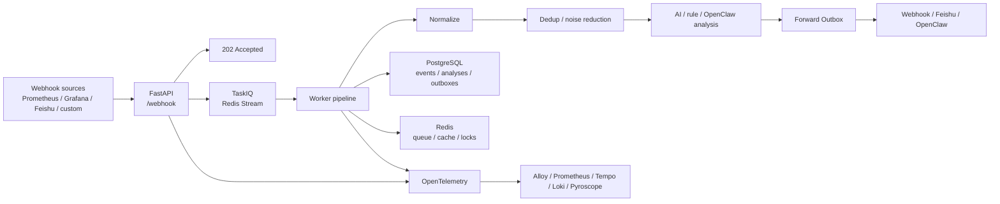

# WebhookWise

WebhookWise 是一个面向生产运维的智能 Webhook 接收、分析和转发服务。它把 Prometheus、Grafana、Alertmanager、飞书或任意第三方系统发来的事件统一归一化，异步写入队列和数据库，再通过 AI 分析、降噪去重、事务性转发和可观测性能力，把告警变成可以追踪、可以审计、可以行动的运维事件。

它不是一个简单的 Webhook relay，而是一个小型 AIOps 控制面：

- 接收层快速返回 `202 Accepted`，耗时处理全部进入 TaskIQ/Redis Stream。
- Pipeline 负责归一化、持久化、去重、AI/rule 分析、告警降噪和转发决策。
- Forward Outbox 让业务状态和外部 HTTP/飞书/OpenClaw 副作用解耦。
- OTel-first 可观测性把 metrics、traces、logs、events、signals、profiles 串起来。

## 快速入口

| 你想做什么 | 去哪里 |
|:---|:---|
| 启动本地环境 | [快速开始](#快速开始) |
| 查看 API | 启动后访问 `http://localhost:8000/docs`，离线导出见 [docs/api/README.md](docs/api/README.md) |
| 理解模块边界 | [docs/architecture/boundaries.md](docs/architecture/boundaries.md) |
| 打开观测栈 | [docs/architecture/observability-local-lab.md](docs/architecture/observability-local-lab.md) |
| 查询观测数据 | [docs/architecture/observability-query-tools.md](docs/architecture/observability-query-tools.md) |
| 部署到 Kubernetes | [deploy/k8s/README.md](deploy/k8s/README.md) |
| 参与开发 | [CONTRIBUTING.md](CONTRIBUTING.md) |
| 看版本变化 | [CHANGELOG.md](CHANGELOG.md) |

## 核心能力

| 能力 | 说明 |
|:---|:---|
| 异步 Webhook 接收 | API 只做鉴权、限流、入队和基础落库，快速释放上游请求。 |
| 多来源归一化 | Adapter 将不同生态 payload 规范成统一内部结构，便于后续分析和规则匹配。 |
| AI + rule 双分析 | 首选 LLM 结构化分析，缺少 Key 或外部异常时自动降级为规则分析。 |
| OpenClaw 深度分析 | 可选接入 OpenClaw，使用 TaskIQ 动态延迟任务轮询分析结果。 |
| 去重与降噪 | 基于 `alert_hash`、时间窗口、混合相似度和可选语义信号识别重复与衍生告警。 |
| 告警风暴背压 | Redis 分布式 single-flight、短窗口 fail-fast 和全局 Worker 并发令牌降低雪崩风险。 |
| 规则化转发 | 按优先级匹配规则，支持通用 Webhook、飞书卡片和 OpenClaw 目标。 |
| 事务性 Outbox | 处理结果和转发意图同事务写库，再由 Worker 异步投递和重试。 |
| 生命周期维护 | 定时扫描 outbox、OpenClaw poll、运行指标和冷热数据归档。 |
| OTel-first 可观测性 | 应用不暴露 `/metrics`，统一通过 OTLP 输出到 Alloy/Prometheus/Tempo/Loki。 |

## 系统流向



默认部署拓扑是一组独立进程：

| 进程 | 职责 |
|:---|:---|
| `migrate` | 一次性等待 PostgreSQL 就绪并执行 `alembic upgrade head`。 |
| `webhook-service` | FastAPI HTTP 服务，默认监听 `:8000`。 |
| `worker` | TaskIQ Worker，消费 Webhook 处理、转发、OpenClaw 轮询等任务，可横向扩容。 |
| `scheduler` | TaskIQ Scheduler，只负责周期性投递任务，保持单实例。 |
| `redis` | TaskIQ Stream、缓存、分布式锁和短窗口计数。 |
| `postgres` | Webhook 事件、分析记录、转发 outbox、死信和审计状态。 |

`docker-compose.supervisor.yml` 提供 all-in-one override，可把 API、Worker、Scheduler 放在一个应用容器里，适合演示或单机小部署。生产默认仍推荐独立进程拓扑。

## 快速开始

### 1. 准备配置

```bash
cp .env.example .env
```

最少需要替换：

| 变量 | 用途 |
|:---|:---|
| `API_KEY` | 管理 API 读权限 Token。 |
| `ADMIN_WRITE_KEY` | 写操作、重放、转发、重新分析等管理动作 Token。 |
| `WEBHOOK_SECRET` | Webhook HMAC-SHA256 签名密钥。 |
| `OPENAI_API_KEY` | 可选；开启 AI 分析时填写。 |

完整配置参考 [.env.example.all](.env.example.all)。配置只在进程启动时读取，修改 `.env`、环境变量、ConfigMap 或 Secret 后需要重启进程或滚动发布。

### 2. 启动默认栈

```bash
docker compose up -d --build
curl http://localhost:8000/ready
```

Compose 会先运行 `migrate`，迁移成功后再启动 API、Worker 和 Scheduler。

### 3. 发送测试事件

```bash
curl -X POST http://localhost:8000/webhook \
  -H "Content-Type: application/json" \
  -d '{"alertname":"TestAlert","severity":"critical","host":"prod-01"}'
```

如果启用了 Webhook 鉴权，需要按当前配置补充签名或 Token。

### 4. 打开管理界面和 API 文档

| 入口 | 地址 |
|:---|:---|
| Dashboard | `http://localhost:8000/` 或 `http://localhost:8000/dashboard` |
| Swagger UI | `http://localhost:8000/docs` |
| ReDoc | `http://localhost:8000/redoc` |
| Health | `http://localhost:8000/live` / `http://localhost:8000/ready` |

## 本地开发

```bash
pip install -r requirements.lock
pip install -r requirements-dev.lock

uvicorn main:app --reload --port 8000
```

另开一个终端启动 Worker：

```bash
taskiq worker services.operations.taskiq_wiring:broker
```

Scheduler 入口：

```bash
taskiq scheduler services.operations.taskiq_wiring:scheduler
```

依赖策略：

- `requirements.txt` / `requirements-dev.txt` 是人工维护的直接依赖。
- `requirements.lock` / `requirements-dev.lock` 是安装和 CI/Docker 的准绳。
- 锁文件由 uv 生成，项目当前不是 `[project]` 风格 uv 工程，因此不维护 `uv.lock`。

更新锁文件：

```bash
uv pip compile requirements.txt -o requirements.lock --python-version 3.12
uv pip compile requirements-dev.txt -c requirements.lock -o requirements-dev.lock --python-version 3.12
```

## API 速览

所有 `/api/*` 端点需要：

```text
Authorization: Bearer <API_KEY>
```

会修改状态、触发 AI/OpenClaw 或发起外部转发的写接口需要：

```text
Authorization: Bearer <ADMIN_WRITE_KEY>
```

`/webhook` 默认按配置要求 Webhook 签名或 Token 鉴权；生产环境不要公开无鉴权入口。

| 分组 | 方法与路径 | 说明 |
|:---|:---|:---|
| Webhook 接收 | `POST /webhook` | 接收通用 Webhook，自动检测来源。 |
| Webhook 接收 | `POST /webhook/{source}` | 接收指定来源 Webhook。 |
| 事件管理 | `GET /api/webhooks` | 分页列举事件，支持 source、importance、status 过滤。 |
| 事件管理 | `GET /api/webhooks/{id}` | 获取单条事件详情和原始 payload。 |
| 分析 | `POST /api/reanalyze/{webhook_id}` | 强制重新 AI 分析。 |
| 分析 | `POST /api/deep-analyze/{webhook_id}` | 触发 OpenClaw 深度分析。 |
| 分析 | `GET /api/deep-analyses` | 分页列举深度分析记录。 |
| 分析 | `POST /api/deep-analyses/{id}/retry` | 重拉或重试 OpenClaw 分析结果。 |
| 分析 | `POST /api/deep-analyses/{id}/forward` | 手动转发深度分析结果。 |
| 转发 | `GET /api/forward-rules` | 列举转发规则。 |
| 转发 | `POST /api/forward-rules` | 创建转发规则。 |
| 转发 | `PUT /api/forward-rules/{id}` | 更新转发规则。 |
| 转发 | `DELETE /api/forward-rules/{id}` | 删除转发规则。 |
| 转发 | `POST /api/forward/{webhook_id}` | 手动触发转发。 |
| 运维 | `GET /api/config` | 查看当前有效配置。 |
| 运维 | `GET /api/config/sources` | 查看配置来源。 |
| 运维 | `GET /api/prompt?kind=user\|deep_analysis` | 查看当前 Prompt。 |
| 运维 | `POST /api/prompt/reload?kind=user\|deep_analysis` | 热重载文件型 Prompt。 |
| 运维 | `GET /api/admin/dead-letters` | 查看死信队列。 |
| 运维 | `POST /api/admin/dead-letters/{id}/replay` | 重放死信事件。 |
| 成本 | `GET /api/ai-usage` | 查看 AI 用量和成本统计。 |

完整 OpenAPI 合约见运行时 `/docs`、`/redoc` 和 [docs/api/README.md](docs/api/README.md)。

## 可观测性

启动本地观测栈：

```bash
docker compose -f docker-compose.yml -f docker-compose.observability.yml up -d --build
```

常用入口：

| 组件 | 地址 | 用途 |
|:---|:---|:---|
| Grafana | `http://localhost:3000` | 统一查看 metrics、traces、logs、profiles。 |
| Alloy | `http://localhost:12345` | 查看采集管线和组件状态。 |
| Prometheus | `http://localhost:9090` | 查询应用、Beyla、k6 指标。 |
| Loki | `http://localhost:3100` | 查询 OTLP 日志、文件日志、Faro 日志。 |
| Tempo | `http://localhost:3200` | 查询应用、Beyla、Faro traces。 |
| Pyroscope | `http://localhost:4040` | 查看 Python 持续 profiling。 |
| Faro receiver | `http://localhost:12347/collect` | Dashboard 前端遥测入口。 |

运行一次 k6 学习压测：

```bash
docker compose -f docker-compose.yml -f docker-compose.observability.yml --profile load run --rm k6
```

更多说明：

- [docs/architecture/observability.md](docs/architecture/observability.md)
- [docs/architecture/observability-dashboard.md](docs/architecture/observability-dashboard.md)
- [docs/architecture/observability-query-tools.md](docs/architecture/observability-query-tools.md)
- [docs/architecture/observability-local-lab.md](docs/architecture/observability-local-lab.md)

## 部署

### Docker Compose

默认 Compose 是多容器拓扑：

```bash
docker compose up -d --build
docker compose ps
```

单机 all-in-one 拓扑：

```bash
docker compose -f docker-compose.yml -f docker-compose.supervisor.yml up -d --build
docker compose -f docker-compose.yml -f docker-compose.supervisor.yml exec webhook-service supervisorctl -c /app/supervisord.conf status
```

all-in-one 只改变进程管理方式，不改变业务语义：Webhook 仍进入 Redis Stream，Worker 仍通过 TaskIQ 消费，Outbox、重试、缓存和分布式锁仍使用同一套实现。

### Kubernetes

`deploy/k8s/` 提供基础清单：API、Worker、Scheduler、迁移 Job、Redis、PostgreSQL、ConfigMap、Secret 示例与 ServiceAccount。

```bash
cp deploy/k8s/secret.example.yaml /tmp/webhookwise-secret.yaml
$EDITOR /tmp/webhookwise-secret.yaml
kubectl apply -f /tmp/webhookwise-secret.yaml
kubectl apply -k deploy/k8s
```

应用镜像必须使用 release tag 或 digest，避免使用 `latest`。更多细节见 [deploy/k8s/README.md](deploy/k8s/README.md)。

## 测试与验证

| 层级 | 命令 | 覆盖内容 |
|:---|:---|:---|
| 静态检查 | `ruff check .` / `mypy .` | 代码风格、类型边界。 |
| 单元和进程内集成 | `pytest` | 纯函数、核心服务、FastAPI 到 pipeline 的进程内链路。 |
| Docker E2E | `tests/e2e/run_webhook_to_feishu.sh` | PostgreSQL、Redis、API、Worker、Scheduler、fake Feishu 完整链路。 |

常规快速验证：

```bash
ruff check .
mypy .
pytest
```

发版前或改动迁移、队列、转发链路时建议跑：

```bash
tests/e2e/run_webhook_to_feishu.sh
```

E2E 脚本会启动一次性 Docker 环境，执行 Alembic 迁移，发送真实 HTTP Webhook，等待 Worker 消费，并断言 fake Feishu 收到 `interactive` card。失败时会打印相关容器最近日志，退出时自动清理容器和数据卷。

## 项目结构

```text
.
├── api/                  # FastAPI 路由、请求响应绑定和鉴权依赖
├── adapters/             # 外部 Webhook payload 归一化和插件注册
├── alembic/              # 数据库迁移
├── core/                 # 配置、日志、鉴权、Redis、OTel、HTTP client 等运行时胶水
├── db/                   # SQLAlchemy engine/session 生命周期
├── deploy/               # Kubernetes 与可观测性部署资源
├── docs/                 # 架构、API、观测、排障文档
├── models/               # SQLAlchemy ORM 模型
├── prompts/              # AI 和深度分析 Prompt 模板
├── schemas/              # Pydantic API schema
├── scripts/              # 运维、导出、观测查询脚本
├── services/
│   ├── analysis/         # AI/rule/OpenClaw 分析、缓存、用量
│   ├── configuration/    # 只读配置查询
│   ├── forwarding/       # 转发规则、Outbox、远端投递、重试
│   ├── notifications/    # 通知渠道和消息格式化
│   ├── operations/       # TaskIQ 任务、调度、恢复、维护
│   └── webhooks/         # Webhook ingest、pipeline、查询与命令
├── templates/            # Dashboard HTML 和静态资源
├── tests/                # pytest、Docker E2E、k6
├── main.py               # FastAPI 入口
├── worker.py             # Worker 入口兼容层
├── Dockerfile
├── docker-compose.yml
└── docker-compose.observability.yml
```

更严格的 ownership 规则见 [docs/architecture/boundaries.md](docs/architecture/boundaries.md)。

## 运行契约

- API 接收层不做长耗时分析，不直接执行外部转发副作用。
- Worker 是业务 pipeline 的主执行面，Scheduler 只投递周期任务。
- Forward Outbox 是外部投递的审计边界，重试和过期状态必须落库。
- 配置是静态进程配置，不从数据库或 Redis 动态覆盖。
- 应用只通过 OTLP 输出遥测，不直接暴露 `/metrics`。
- 新增 Webhook 来源优先新增 adapter 和测试，再复用现有 pipeline。
- 新增业务能力优先放入最近的 `services/*` 领域包，避免把业务逻辑塞进 `core/`。

## 安全

- 管理 API 使用 `API_KEY`。
- 写操作使用独立 `ADMIN_WRITE_KEY`。
- Webhook 接收支持 HMAC-SHA256 签名校验。
- 生产环境默认要求 Webhook 鉴权，除非显式设置 `ALLOW_UNAUTHENTICATED_WEBHOOK=true`。
- 内置限流、分布式处理锁、告警风暴 fail-fast 和下游熔断。
- Docker 运行时使用非 root 用户。

## 文档索引

| 文档 | 内容 |
|:---|:---|
| [docs/README.md](docs/README.md) | 长期文档入口。 |
| [docs/api/README.md](docs/api/README.md) | OpenAPI 导出和再生成说明。 |
| [docs/architecture/boundaries.md](docs/architecture/boundaries.md) | 模块边界、部署形态和依赖策略。 |
| [docs/architecture/observability.md](docs/architecture/observability.md) | OTel-first 可观测性架构。 |
| [docs/architecture/observability-dashboard.md](docs/architecture/observability-dashboard.md) | Grafana 大盘说明。 |
| [docs/architecture/observability-query-tools.md](docs/architecture/observability-query-tools.md) | PromQL、LogQL、Tempo、Pyroscope 查询工具。 |
| [docs/architecture/observability-local-lab.md](docs/architecture/observability-local-lab.md) | 本地观测实验手册。 |
| [docs/troubleshooting/TROUBLESHOOTING.md](docs/troubleshooting/TROUBLESHOOTING.md) | 排障指南。 |
| [docs/troubleshooting/HOW_TO_VIEW_DETAILS.md](docs/troubleshooting/HOW_TO_VIEW_DETAILS.md) | 查看事件详情说明。 |
| [deploy/k8s/README.md](deploy/k8s/README.md) | Kubernetes 清单使用说明。 |

## License

MIT License
