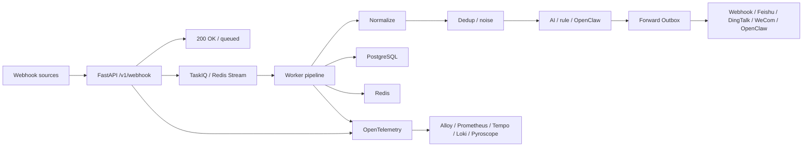

# WebhookWise

WebhookWise is an intelligent Webhook receive, analysis, and forwarding service built for production operations. It normalizes events from Prometheus, Grafana, Alertmanager, Feishu, or any third-party system into a unified shape, writes them asynchronously to a queue and database, and then uses AI analysis, noise reduction and deduplication, transactional forwarding, and observability to turn alerts into operational events that can be tracked, audited, and acted on.

It is not a simple Webhook relay, but a small AIOps control plane:

- The API quickly returns `200 OK` once the request is enqueued, while time-consuming processing moves into TaskIQ/Redis Stream. Enqueueing is the durability boundary; see [Delivery Semantics](#delivery-semantics).
- The Worker pipeline handles normalization, persistence, deduplication, AI/rule analysis, noise reduction, and forwarding decisions.
- The Forward Outbox decouples business state from external HTTP/Feishu/OpenClaw side effects.
- OTel-first observability ties together metrics, traces, logs, events, signals, and profiles.

## Quick Links

| What you want to do | Where to go |
| --- | --- |
| Start the local environment | [Quick Start](#quick-start) |
| View the API | After startup, visit `http://localhost:8000/docs`; for export notes see [docs/reference/api.md](docs/reference/api.md) |
| Understand module boundaries | [docs/architecture/boundaries.md](docs/architecture/boundaries.md) |
| Open the observability stack | [docs/operations/observability/local-lab/README.md](docs/operations/observability/local-lab/README.md) |
| Query observability data | [docs/operations/observability/query-tools.md](docs/operations/observability/query-tools.md) |
| Troubleshoot issues | [docs/operations/troubleshooting.md](docs/operations/troubleshooting.md) |
| Deploy to Kubernetes | [deploy/k8s/README.md](deploy/k8s/README.md) |
| Contribute to development | [CONTRIBUTING.md](CONTRIBUTING.md) |
| See version changes | [CHANGELOG.md](CHANGELOG.md) |

## Core Capabilities

| Capability | Description |
| --- | --- |
| Asynchronous Webhook receiving | The API only handles authentication, rate limiting, enqueueing, and basic persistence, releasing the upstream request quickly. |
| Multi-source normalization | Adapters normalize payloads from different ecosystems into a unified internal structure. |
| AI + rule dual analysis | Structured LLM analysis is preferred; it automatically falls back to rule-based analysis when the external service has problems. |
| OpenClaw deep analysis | Optionally integrate OpenClaw and poll for analysis results via TaskIQ delayed tasks. |
| Deduplication and noise reduction | Identifies duplicate and derived alerts based on alert hash, time window, similarity, and optional semantic signals. |
| Rule-based forwarding | Supports generic Webhook, Feishu card, DingTalk/WeCom bot (URL auto-detected), and OpenClaw targets. |
| Silencing and maintenance windows | One-off silences (with backtest + suppression debt report) plus recurring maintenance windows materialized into expiring silences by the scheduler. |
| Escalation-lite | Optional auto-SLA per importance arms the SLA-breach escalation card (@all / dedicated webhook) for unacknowledged incidents; status-flapping identities are detected and can be muted while they oscillate. |
| Learn loop | Resolved incidents sediment into KB drafts; published KB entries are attached to outgoing Feishu alert cards and one-click incident postmortem drafts (Markdown) close the review loop. |
| Transactional Outbox | Processing results and forwarding intent are written to the database in the same transaction, then delivered and retried asynchronously by the Worker. |
| OTel-first observability | The application emits telemetry over OTLP; the local stack integrates Alloy, Prometheus, Tempo, Loki, and Pyroscope. |

## System Flow



## Quick Start

### 1. Prepare configuration

```bash
cp .env.example .env
```

At a minimum you need to replace:

| Variable | Purpose |
| --- | --- |
| `API_KEY` | Token for read access to the management API. |
| `ADMIN_WRITE_KEY` | Token for management actions such as writes, replays, forwarding, and re-analysis. |
| `WEBHOOK_SECRET` | Webhook HMAC-SHA256 signing key. |
| `OPENAI_API_KEY` | Optional; fill in when enabling AI analysis. |

The management API is limited to 300 requests per IP per minute by default. Expensive per-alert actions also have a 60-second distributed cooldown, with a five-minute minimum for starting deep analysis; the base values are configurable through `ADMIN_API_RATE_LIMIT_PER_MINUTE` and `ADMIN_ACTION_COOLDOWN_SECONDS`.

For the complete configuration, see [.env.example.all](.env.example.all). Configuration is read only at process startup; after changes you must restart the process or perform a rolling release.

### 2. Start the full local stack

```bash
docker compose up -d --build
curl http://localhost:8000/ready
```

Compose first starts PostgreSQL and Redis, then runs `migrate`, and after the migration succeeds it starts the API, Worker, and Scheduler. When using a cloud database or managed Redis, you can run only `docker compose -p webhookwise --env-file .env -f deploy/compose/docker-compose.yml up -d --build` and point `DATABASE_URL` / `REDIS_URL` in `.env` at the external instances.

The root `compose.yaml` is the everyday entry point; it only includes the business stack such as PostgreSQL, Redis, API, Worker, and Scheduler, so `docker compose ps/logs/exec` by default only sees this set of containers. The full Compose fragments still live in `deploy/compose/`, and the observability stack is started as a separate Compose project.

### 3. Send a test event

```bash
curl -X POST http://localhost:8000/v1/webhook \
  -H "Content-Type: application/json" \
  -d '{"alertname":"TestAlert","severity":"critical","host":"prod-01"}'
```

Or seed a realistic five-minute demo (dedup storm, recoveries, a flapping
identity, multi-vendor payloads) through the real ingest path:

```bash
python scripts/seed_demo_data.py --base-url http://localhost:8000
```

The business API is only exposed under `/v1`; if Webhook authentication is enabled, you need to add a signature or Token according to the current configuration.

Out-of-the-box source formats: volcengine, Grafana, Prometheus Alertmanager, Datadog, PagerDuty, Feishu cards (code adapters), plus declarative YAML specs for Zabbix, Uptime-Kuma, Alibaba CloudMonitor, Tencent Cloud Monitor, Jenkins, and Sentry under `adapters/specs/` — add your own simple source with one YAML file (see `adapters/specs/README.md`).

### 4. Open the entry points

| Entry point | Address |
| --- | --- |
| Dashboard | `http://localhost:8000/` or `http://localhost:8000/dashboard` |
| Swagger UI | `http://localhost:8000/docs` |
| ReDoc | `http://localhost:8000/redoc` |
| Health | `http://localhost:8000/live` / `http://localhost:8000/ready` |

## Local Development

If the API/Worker run directly on the host while PostgreSQL/Redis are still provided by `deploy/compose/docker-compose.infra.yml`, change the host in `DATABASE_URL` to `localhost` and set `REDIS_URL` to `redis://localhost:6379/0` in your local environment or `.env`.

```bash
pip install -r requirements.lock
pip install -r requirements-dev.lock

uvicorn api.app:app --reload --port 8000
```

In another terminal, start the Worker:

```bash
taskiq worker services.operations.taskiq_wiring:broker
```

Scheduler entry point:

```bash
taskiq scheduler services.operations.taskiq_wiring:scheduler
```

Dependency policy:

- `requirements.txt` / `requirements-dev.txt` are the manually maintained direct dependencies and uniformly express the minimum supported versions.
- `requirements.lock` / `requirements-dev.lock` pin the exact resolution result and are the source of truth for local installs, CI, Docker builds, and deployment; do not use `requirements.txt` as a reproducible install entry point.
- The lock files are generated by uv. The project is currently not a `[project]`-style uv project, so it does not maintain `uv.lock`.
- GitHub Actions installs from the lock files, the Dockerfile installs only `requirements.lock`, and `scripts/check_requirements_locks.py` checks that these paths have not drifted.
- Dependabot scans the root pip dependencies weekly; a dependency upgrade PR needs to update both the direct dependency declarations and the corresponding lock files.

Update the lock files:

```bash
uv pip compile requirements.txt -o requirements.lock --python-version 3.12
uv pip compile requirements-dev.txt -c requirements.lock -o requirements-dev.lock --python-version 3.12
```

## Common Verification

| Level | Command | Coverage |
| --- | --- | --- |
| Static checks | `ruff check .` / `mypy` | Code style, type boundaries. |
| Unit and in-process integration | `pytest` | Pure functions, core services, the in-process path from FastAPI to the pipeline. |
| Docker E2E | `tests/e2e/run_webhook_to_feishu.sh` | The full path across PostgreSQL, Redis, API, Worker, Scheduler, and fake Feishu. |

It is recommended to run the Docker E2E before a release or when changing migrations, the queue, or the forwarding path.

## Deployment

### Docker Compose

```bash
docker compose up -d --build
docker compose ps
```

The observability stack uses the separate `webhookwise-observability` project:

```bash
docker compose -p webhookwise-observability --env-file .env -f deploy/compose/docker-compose.observability.yml up -d
```

### Database Backups

`scripts.ops.backup_db` uses `pg_dump` to generate PostgreSQL custom-format backups and writes a matching `.dump.sha256` checksum file for each `.dump`.

```bash
python -m scripts.ops.backup_db --verbose
python -m scripts.ops.backup_db --verify backups
python -m scripts.ops.backup_db --cleanup-only
```

For configuration options, see the `DB Backup` section of `.env.example.all`. Setting `AWS_BUCKET` uploads the backup and checksum; the command returns non-zero when the object-storage upload fails.

### Kubernetes

`deploy/k8s/` provides base manifests: API, Worker, Scheduler, migration Job, Redis, PostgreSQL, ConfigMap, Secret example, and ServiceAccount.

```bash
cp deploy/k8s/secret.example.yaml /tmp/webhookwise-secret.yaml
$EDITOR /tmp/webhookwise-secret.yaml
kubectl apply -f /tmp/webhookwise-secret.yaml
kubectl apply -k deploy/k8s
```

Application images must use a release tag or digest; avoid using `latest`. For more details, see [deploy/k8s/README.md](deploy/k8s/README.md).

## Project Structure

```text
.
├── api/                  # FastAPI routes, request/response binding, and auth dependencies
├── adapters/             # External Webhook payload normalization and plugin registration
├── alembic/              # Database migrations
├── core/                 # Runtime infrastructure such as config, logging, auth, Redis, OTel, and HTTP client
├── db/                   # SQLAlchemy engine/session lifecycle
├── deploy/               # Compose, Kubernetes, and observability deployment resources
├── docs/                 # Architecture, operations, and reference docs
├── models/               # SQLAlchemy ORM models
├── prompts/              # AI and deep-analysis prompt templates
├── schemas/              # Pydantic API schema
├── scripts/              # Operations, export, and observability query scripts
├── services/
│   ├── analysis/         # AI/rule/OpenClaw analysis, caching, and usage
│   ├── forwarding/       # Forwarding rules, Outbox, remote delivery, and retries
│   ├── notifications/    # Notification channels and message formatting
│   ├── operations/       # TaskIQ tasks, scheduling, recovery, and maintenance
│   └── webhooks/         # Webhook ingest, pipeline, queries, and commands
├── templates/            # Dashboard HTML and static assets
└── tests/
    ├── adapters/         # External payload adapter tests
    ├── analysis/         # AI, OpenClaw, noise reduction, and analysis strategy tests
    ├── api/              # FastAPI routes and API contract tests
    ├── forwarding/       # Forwarding rules, Outbox, retries, and URL safety tests
    ├── integration/      # In-process business path integration tests
    ├── observability/    # Observability, documentation, and operations contract tests
    ├── runtime/          # Config, logging, Redis, migration, and runtime infrastructure tests
    ├── webhooks/         # Webhook parsing, pipeline, deduplication, and suppression tests
    ├── e2e/              # Docker E2E
    ├── helpers/          # pytest helpers
    └── k6/               # Load-testing scripts
```

For stricter ownership rules, see [docs/architecture/boundaries.md](docs/architecture/boundaries.md).

## Delivery Semantics

Understanding the durability boundaries of this path is what lets you correctly assess the risk of loss and duplication:

- **Receive → enqueue: accepted (not a durability promise).** The API returns `200 OK` as soon as the request is written to the Redis Stream (`XADD`); DB persistence happens on the Worker side. So `200 OK` means "accepted and enqueued", not "persisted". When the Redis `XADD` fails, the API returns 5xx and the upstream should retry.
- **`WEBHOOK_MQ_STREAM_MAXLEN` is a data-loss knob, not just a memory knob.** The stream is trimmed by an approximate cap (`MAXLEN ~`): when sustained bursts exceed the Worker consumption rate and the backlog exceeds that cap, the oldest *un-acked* entries are trimmed, and the corresponding webhooks that already returned `200` are silently lost. During capacity planning, set this value based on peak backlog and pair it with queue backlog alerts (`queue.pending` / `queue.lag`).
- **Make the backlog visible, and optionally refuse before trimming.** The dashboard surfaces live queue depth, pending, and lag (Overview tile), and the Action Center raises a critical item once the *unconsumed* backlog (undelivered `lag` + un-acked `pending`) crosses `WEBHOOK_MQ_BACKLOG_WARN_FRACTION` of `MAXLEN` (default `0.8`) — *before* the silent trim. The signal is the unconsumed backlog, not total stream length: a busy stream's length sits at `MAXLEN` of already-acked entries, which is normal retention, not a backlog. To turn silent loss into visible backpressure, set `WEBHOOK_MQ_INGRESS_HIGH_WATER_FRACTION` (default `0`, disabled): above that fraction of `MAXLEN` the API rejects new webhooks with `503 Retry-After` so a retrying upstream holds them, instead of the stream trimming its *oldest* un-acked entries. It reads a short-TTL cached backlog (no per-request Redis round trip) and fails open (a probe error never blocks ingress). Enable it only after capacity-planning `MAXLEN` and confirming your senders retry on 503.
- **Redis persistence determines the crash boundary.** The bundled Redis runs with AOF enabled (`--appendonly yes --appendfsync everysec`) on a durable named volume (see `deploy/compose/docker-compose.infra.yml`; the Kubernetes StatefulSet matches), so a Redis crash loses at most ~1 second of writes — the in-flight Stream entries not yet fsynced by the last `everysec` flush. For a stricter boundary set `--appendfsync always` (fsync every write, higher latency) or use a managed Redis with synchronous replication.
- **After enqueue: at-least-once.** Failed Worker processing retries with backoff and goes to dead-letter once exhausted; forwarding is delivered through the transactional Outbox, and stale-recovery plus retries may deliver duplicates. Downstream should deduplicate based on the `Idempotency-Key` request header (see [services/forwarding](services/forwarding)).

When you need "zero loss at ingress", you should add retries/acknowledgements upstream or place a durable queue in front of the API; the current implementation trades this off for low ingress latency.

## Runtime Contract

- The API receive layer does not do long-running analysis and does not directly execute external forwarding side effects.
- The receive layer is at-most-once-until-consumed: `200 OK` means accepted (enqueued), not persisted; `WEBHOOK_MQ_STREAM_MAXLEN` and Redis's AOF fsync cadence together determine the loss boundary (see [Delivery Semantics](#delivery-semantics)).
- The Worker is the main execution surface of the business pipeline; the Scheduler only dispatches periodic tasks.
- The Forward Outbox is the audit boundary for external delivery; retries and expired states must be persisted to the database.
- Configuration is static process configuration and is not dynamically overridden from the database or Redis.
- The application emits telemetry only over OTLP and does not directly expose `/metrics`.
- For a new Webhook source, prefer adding an adapter and tests first, then reusing the existing pipeline.
- For a new business capability, prefer placing it in the nearest `services/*` domain package and avoid stuffing business logic into `core/`.

## Documentation Map

For the complete documentation entry point, see [docs/README.md](docs/README.md).

| Category | Documents |
| --- | --- |
| Architecture | [Module Boundaries](docs/architecture/boundaries.md) |
| Operations | [Observability](docs/operations/observability/overview.md), [Grafana Dashboards](docs/operations/observability/dashboards.md), [Query Tools](docs/operations/observability/query-tools.md), [Troubleshooting](docs/operations/troubleshooting.md) |
| Reference | [API Docs](docs/reference/api.md), [Kubernetes](deploy/k8s/README.md), [Contributing Guide](CONTRIBUTING.md), [Changelog](CHANGELOG.md) |

## License

MIT License
