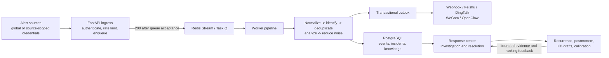

# WebhookWise

[English](README.md) | **中文**

[](https://github.com/itswl/WebhookWise/actions/workflows/ci.yml)
[](LICENSE)
[](https://github.com/itswl/WebhookWise/releases)

*部署在监控系统与聊天工具之间的自托管告警智能层——去重、降噪、AI 分诊,以及一条能解释每次通知(或未通知)的决策轨迹。*

> 本文是英文 [README](README.md) 的精简中文版;完整文档(架构、运维、参考)以英文版为准。

## 定位

WebhookWise 是一个面向生产运维的智能 Webhook 接收、分析与转发服务。它把来自 Prometheus、Grafana、Alertmanager、飞书或任意第三方系统的事件归一为统一结构,异步写入队列与数据库,再通过 AI 分析、降噪去重、事务性转发与可观测性,把告警变成可跟踪、可审计、可行动的运维事件。

它不是简单的 Webhook 中继,而是一个小型 AIOps 控制平面:

- API 在请求入队后立即返回 `200 OK`,耗时处理移入 TaskIQ / Redis Stream;入队是持久性边界,见[交付语义](#交付语义)。
- Worker 流水线负责归一化、持久化、去重、AI/规则分析、降噪与转发决策。
- 转发 Outbox 将业务状态与外部 HTTP/飞书/OpenClaw 副作用解耦。
- OTel 优先的可观测性贯通指标、追踪、日志、事件、信号与性能剖析。

WebhookWise 位于执行类平台的上游:它决定哪些告警值得关注并附带上下文交接,下游的自动排查平台(例如 Ongrid)可以接手处理放行的告警。

## 核心能力

| 能力 | 说明 |
| --- | --- |
| 异步 Webhook 接收 | API 只做鉴权、限流、入队与基础持久化,快速释放上游请求。 |
| 多源归一化 | 适配器把不同生态的载荷归一为统一内部结构。 |
| AI + 规则双路分析 | 优先结构化 LLM 分析,外部服务异常时自动回退规则分析。 |
| OpenClaw 深度分析 | 可选接入 OpenClaw,经 TaskIQ 延迟任务轮询分析结果。 |
| 去重与降噪 | 基于告警哈希、时间窗、相似度及可选语义信号识别重复与衍生告警。 |
| 规则化转发 | 支持通用 Webhook、飞书卡片、钉钉/企业微信机器人(URL 自动识别)与 OpenClaw 目标。 |
| 静默与维护窗口 | 一次性静默(含回测与压制债务报告),周期维护窗口由调度器物化为到期静默。 |
| 轻量升级(Escalation-lite) | 按重要度可选自动 SLA,未确认事件触发 SLA 违约升级卡片(@所有人 / 专用 Webhook);振荡身份可在震荡期间静音。 |
| 学习闭环 | 已解决事件沉淀为知识库草稿;已发布条目附加到外发飞书告警卡片,一键事件复盘草稿(Markdown)闭合回顾环。 |
| 事件情报 | 事件详情给出相似历史事件、疑似近期变更与已发布 Runbook 排序,附显式证据与操作员反馈。 |
| 事件响应闭环 | 命令摘要、变更影响、派生服务画像、手动 Runbook 进度、可选签名飞书动作与产品价值报告,连接检测与可复用知识。 |
| 响应与学习工作台 | 优先级工作队列、结构化解决证据、复发回顾、知识缺口发现与有界反馈校准。 |
| 引导式来源接入 | 源级可撤销凭据 + 首事件向导,新发送方无需共享全局 Webhook 密钥。 |
| 只读告警质量中心 | 为源载荷完整性打分,标记不稳定身份、未匹配恢复、时间戳异常、schema 漂移与响应缺口,不改动源配置。 |
| 事务性 Outbox | 处理结果与转发意图在同一事务落库,由 Worker 异步投递与重试。 |
| OTel 优先可观测性 | 应用只经 OTLP 发出遥测;Alloy 路由指标/日志/追踪到 Prometheus、Loki、Tempo,Pyroscope、Beyla、Alertmanager、Grafana 组成诊断闭环。 |

## 系统流程



进程拓扑、持久化关系、调度器职责、安全边界与完整可观测性链路见[系统架构](docs/architecture/system-overview.md)(英文)。

## 五分钟上手

1. 准备配置:

```bash
cp .env.example .env
```

至少替换 `API_KEY`(管理 API 只读令牌)、`ADMIN_WRITE_KEY`(管理写操作令牌)、`CHANGE_INGEST_TOKEN`(CI/CD 变更事件最小权限令牌)、`WEBHOOK_SECRET`(Webhook HMAC-SHA256 签名密钥兼入口令牌);启用 AI 分析时填写 `OPENAI_API_KEY`。完整配置见 [.env.example.all](.env.example.all);配置只在进程启动时读取,修改后需重启。

2. 启动完整本地栈:

```bash
docker compose up -d --build
curl http://localhost:8000/ready
```

3. 发送测试事件:

```bash
curl -X POST http://localhost:8000/v1/webhook \
  -H "Content-Type: application/json" \
  -d '{"alertname":"TestAlert","severity":"critical","host":"prod-01"}'
```

或经真实入口灌入五分钟演示数据(去重风暴、恢复、振荡身份、多厂商载荷):

```bash
python scripts/seed_demo_data.py --base-url http://localhost:8000
```

开箱即用的源格式:volcengine、Grafana、Prometheus Alertmanager、Datadog、PagerDuty、飞书卡片(代码适配器),以及 Zabbix、Uptime-Kuma、阿里云云监控、腾讯云监控、Jenkins、Sentry 的声明式 YAML 规格(`adapters/specs/`)——写一个 YAML 文件即可接入自己的简单源,见 [adapters/specs/README.md](adapters/specs/README.md)(英文)。

4. 打开入口:

| 入口 | 地址 |
| --- | --- |
| 仪表盘 | `http://localhost:8000/` 或 `http://localhost:8000/dashboard` |
| Swagger UI | `http://localhost:8000/docs` |
| ReDoc | `http://localhost:8000/redoc` |
| 健康检查 | `http://localhost:8000/live` / `http://localhost:8000/ready` |

## 运行时设置 — 免重启的运维策略

大部分配置是静态进程配置(env 是它的家,改动 = 重新部署)。例外是**运维策略**——运行中需要随手调的旋钮(抖动抑制、自动 SLA、背压水位、降噪权重、通知节奏、KB 卡片、追踪保留)。[.env.example.all](.env.example.all) 中标 `[runtime-policy]` 的每个键都由 DB 覆盖平面托管:

- **解析顺序**:DB 覆盖 → env 值 → 代码默认。env 仍是引导默认值,覆盖只是叠在其上的稀疏行。
- **入口**:仪表盘 *Operations → Settings*,或 API —— `GET /v1/runtime-settings`(逐键列出 env/覆盖/生效值)、`PUT` / `DELETE /v1/runtime-settings/{KEY}`(需管理写密钥)。写入经类型注册表校验并留审计。
- **传播**:api / worker / scheduler 全进程 ~60 秒内生效(Redis pub/sub 推动 + 定时刷新),无需重启、无需改文件。
- **故障姿态**:fail-open。DB 或 Redis 异常时沿用最后快照(或纯 env 配置),热路径永不依赖此平面。

## 交付语义

理解这条链路的持久性边界,才能正确评估丢失与重复的风险(完整版见英文 [Delivery Semantics](README.md#delivery-semantics)):

- **接收 → 入队:accepted,不是持久化承诺。** 请求写入 Redis Stream(`XADD`)后 API 即返回 `200 OK`,数据库持久化发生在 Worker 侧;`XADD` 失败时返回 5xx,上游应重试。
- **`WEBHOOK_MQ_STREAM_MAXLEN` 是数据丢失旋钮,不只是内存旋钮。** 持续突发超过 Worker 消费速率、积压越过上限时,最旧的*未确认*条目会被裁剪,对应的已返回 `200` 的 Webhook 被静默丢失。按峰值积压做容量规划,并配合队列积压告警。
- **让积压可见,并可选在裁剪前拒绝。** 仪表盘展示实时队列深度;未消费积压越过 `WEBHOOK_MQ_BACKLOG_WARN_FRACTION`(默认 `0.8`)时,行动中心在静默裁剪*之前*给出严重告警。设置 `WEBHOOK_MQ_INGRESS_HIGH_WATER_FRACTION`(默认 `0`,关闭)后,API 在越过该水位时以 `503 Retry-After` 拒绝新 Webhook,把静默丢失变成可见背压(失败开放:探测出错绝不阻塞入口)。
- **Redis 持久化决定崩溃边界。** 自带 Redis 以 AOF(`everysec`)运行在持久卷上,崩溃最多丢约 1 秒写入;更严格可用 `--appendfsync always` 或带同步复制的托管 Redis。
- **入队之后:at-least-once。** 处理失败带退避重试、耗尽进死信;转发经事务性 Outbox 投递,重试可能产生重复,下游应按 `Idempotency-Key` 请求头去重。

需要"入口零丢失"时,应在上游增加重试/确认,或在 API 前放置持久队列;当前实现以此换取低入口延迟。

## 社区

- 贡献指南:[CONTRIBUTING.md](CONTRIBUTING.md)(英文;完整质量门禁一条命令 `bash scripts/gate.sh`)。
- 安全漏洞:请经 [GitHub Security Advisories](https://github.com/itswl/WebhookWise/security/advisories/new) **私密**报告,不要开公开 issue,见 [SECURITY.md](SECURITY.md)。
- Bug 与功能需求:[GitHub Issues](https://github.com/itswl/WebhookWise/issues)。
- 行为准则:[CODE_OF_CONDUCT.md](CODE_OF_CONDUCT.md)。
- 文档入口:[docs/README.md](docs/README.md)(英文)。

## 许可证

MIT License——见 [LICENSE](LICENSE)。
