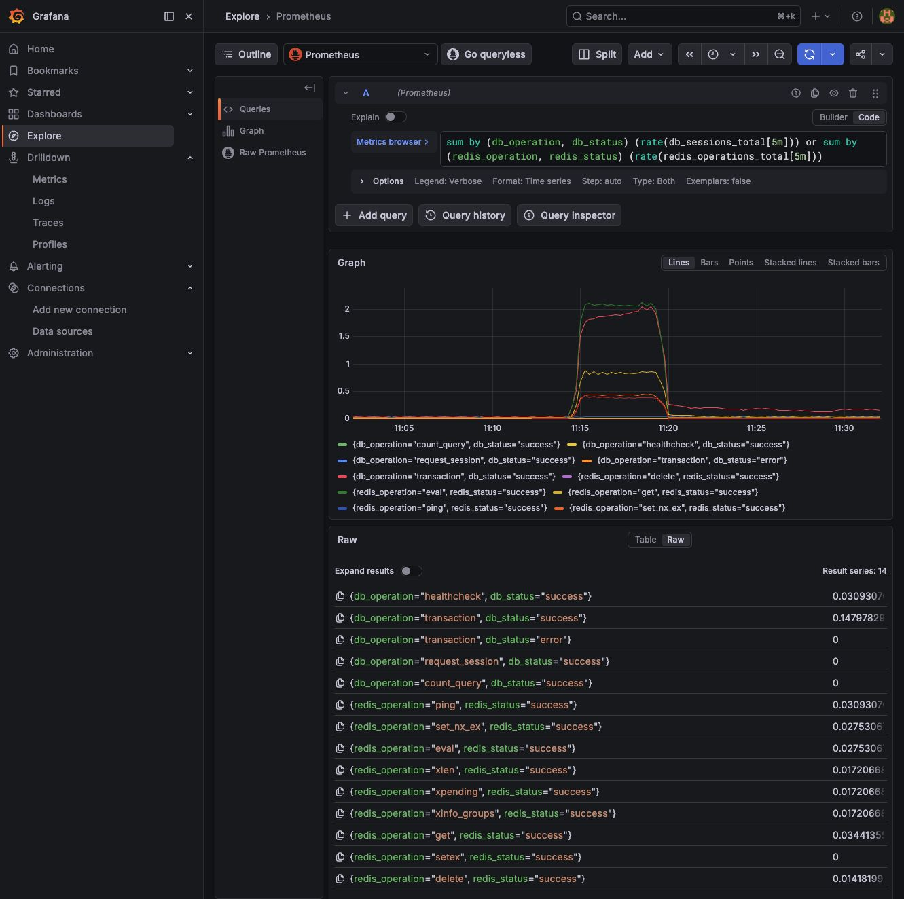
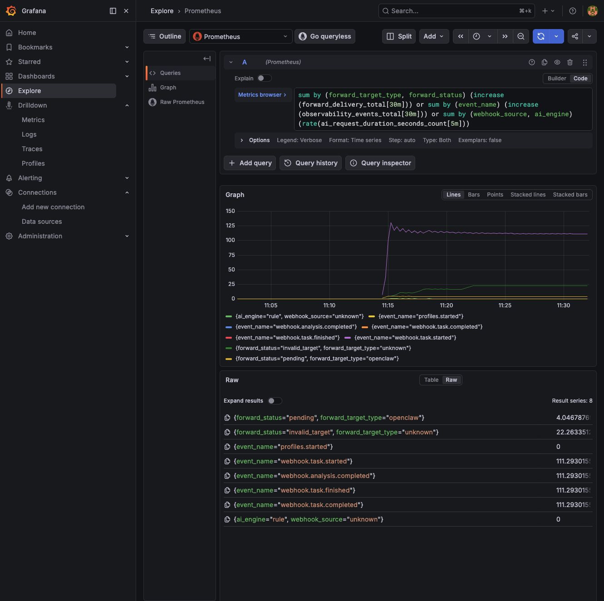
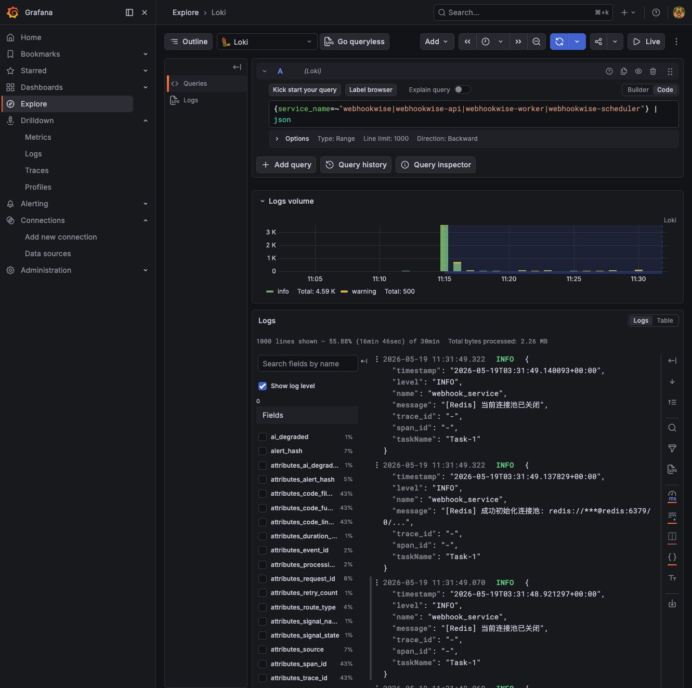
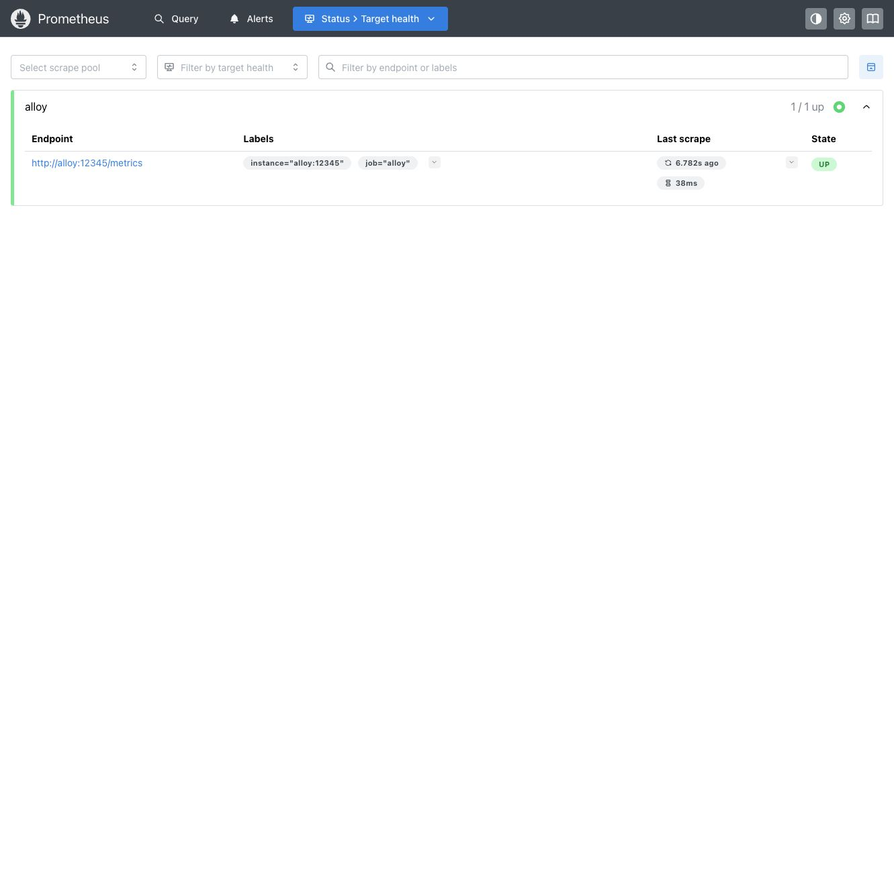
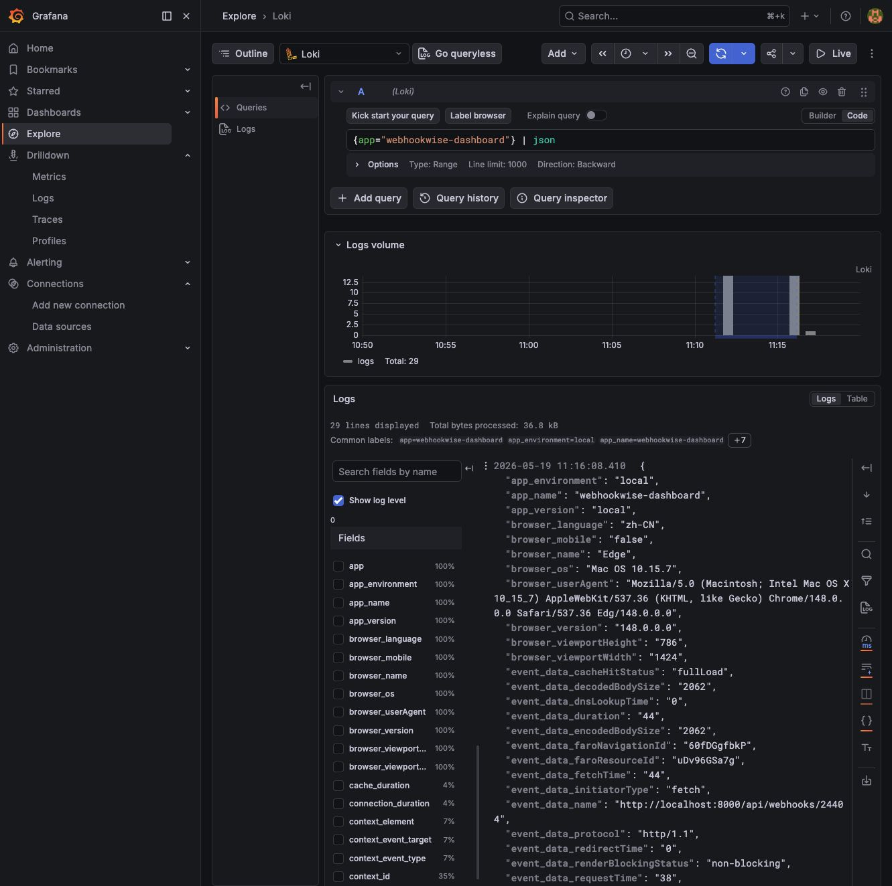
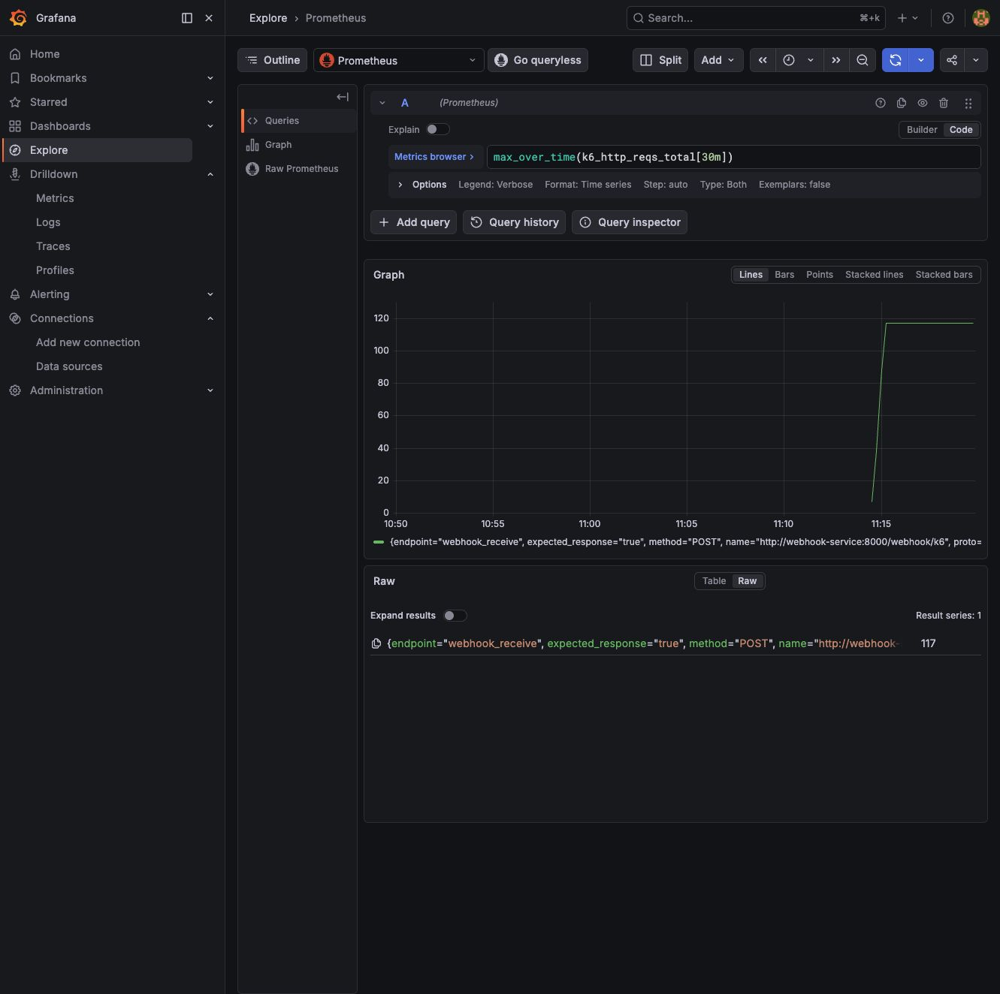

# 本地可观测实验手册

这份手册记录一次完整的本地可观测验证流程：启动 Grafana Alloy / Prometheus / Loki / Tempo / Pyroscope / Beyla，触发 Faro 前端 RUM，运行 k6 压测，然后在 Grafana 里找到对应数据。

## 数据流

```text
API / Worker / Scheduler
  -> OpenTelemetry SDK
  -> Alloy
      -> Prometheus: metrics
      -> Loki: logs
      -> Tempo: traces

Dashboard browser
  -> Grafana Faro Web SDK
  -> Alloy faro.receiver
      -> Loki: browser events and measurements

webhook-service container
  -> Beyla eBPF auto-instrumentation
  -> Alloy
      -> Prometheus: span/process/service graph metrics
      -> Tempo: auto traces

k6
  -> Prometheus remote write
```

## 启动本地栈

在仓库根目录运行：

```bash
docker compose -f docker-compose.yml -f docker-compose.observability.yml up -d --build
```

确认服务状态：

```bash
docker compose -f docker-compose.yml -f docker-compose.observability.yml ps
curl -fsS http://localhost:8000/ready
curl -fsS http://localhost:9090/-/ready
curl -fsS http://localhost:3100/ready
curl -fsS http://localhost:3200/ready
curl -fsS http://localhost:12345/-/ready
```

常用入口：

- Grafana: `http://localhost:3000`, local default is `admin/admin`
- Grafana AIOps dashboard: `http://localhost:3000/d/webhook-wise-aiops/webhookwise-aiops-e5a4a7-e79b98`
- Prometheus: `http://localhost:9090`
- Loki API: `http://localhost:3100`
- Tempo: `http://localhost:3200`
- Pyroscope: `http://localhost:4040`
- Alloy graph: `http://localhost:12345/graph`
- Faro collector endpoint: `http://localhost:12347/collect`

`http://localhost:3100` 返回 404 是正常的。Loki 没有根路径 UI，内容要通过 Grafana Explore 或 Loki API 查询。

## 服务覆盖总览

当前本地栈的服务清单来自：

```bash
docker compose -f docker-compose.yml -f docker-compose.observability.yml config --services
```

| 服务 | 作用 | 健康入口 | 指标入口 | 日志入口 | Trace / Profile |
| --- | --- | --- | --- | --- | --- |
| `webhook-service` / `webhook-receiver` | HTTP API、Dashboard、webhook 入队 | `http://localhost:8000/ready` | Prometheus: `service_name="webhookwise-api"` | Loki: `{service_name="webhookwise-api"}` 或 `{service_name="webhookwise"}` | Tempo: `service.name=webhookwise-api`; Pyroscope: `webhookwise-api` |
| `worker` | 异步处理 webhook、AI、转发、重试 | Docker healthcheck | Prometheus: `service_name="webhookwise-worker"`、`worker_*`、`queue_*` | Loki: `{service_name="webhookwise-worker"}` 或 `{service_name="webhookwise"}` | Tempo: `service.name=webhookwise-worker`; Pyroscope: `webhookwise-worker` |
| `scheduler` | 周期任务、恢复扫描、轮询 | Docker healthcheck | Prometheus: `service_name="webhookwise-scheduler"`、`scheduler_*` | Loki: `{service_name="webhookwise-scheduler"}` 或 `{service_name="webhookwise"}` | Tempo: `service.name=webhookwise-scheduler`; Pyroscope: `webhookwise-scheduler` |
| `migrate` | Alembic 迁移一次性任务 | container exit code | 无，`OTEL_ENABLED=false` | `docker logs webhook-migrate` | 无 |
| `postgres` | 本地数据库 | Docker healthcheck / `pg_isready` | 目前只有应用侧 DB client/pool 指标 | `docker logs webhook-postgres` | 应用 DB spans 和 Beyla SQL spans |
| `redis` | taskiq broker / stream / cache | Docker healthcheck / `redis-cli ping` | 目前只有应用侧 Redis client 指标 | `docker logs webhook-redis` | 应用 Redis spans 和 Beyla Redis spans |
| `grafana` | 查询与 Dashboard UI | `http://localhost:3000/api/health` | Grafana 自身未被 Prometheus scrape | `docker logs webhooks-grafana-1` | 无 |
| `prometheus` | 指标存储和查询 | `http://localhost:9090/-/ready` | `http://localhost:9090/metrics`，本地主要 scrape Alloy | `docker logs webhooks-prometheus-1` | 无 |
| `loki` | 日志存储和查询 | `http://localhost:3100/ready` | Loki 自身未被 Prometheus scrape | `docker logs webhooks-loki-1` | 无 |
| `tempo` | Trace 存储和查询 | `http://localhost:3200/ready` | Tempo 自身未被 Prometheus scrape | `docker logs webhooks-tempo-1` | Grafana Tempo Explore |
| `pyroscope` | Profile 存储和查询 | `http://localhost:4040` | Pyroscope 自身未被 Prometheus scrape | `docker logs webhooks-pyroscope-1` | Grafana Profiles / Pyroscope UI |
| `alloy` | OTLP/Faro 接收、日志 tail、转发 | `http://localhost:12345/-/ready` | Prometheus scrape `alloy:12345` | `docker logs webhooks-alloy-1` | Alloy graph |
| `beyla` | eBPF 自动采集 API 容器 | container running | Prometheus: `source="beyla"`、`traces_*`、`process_*` | `docker logs webhooks-beyla-1` | Tempo: auto traces |
| `k6` | 一次性压测任务 | run exit code | Prometheus: `k6_*` remote write | run output | 无 |
| Dashboard browser / Faro | 前端 RUM | 打开 `http://localhost:8000` | Prometheus: `faro_receiver_*` | Loki: `{app="webhookwise-dashboard"}` | 可转成 frontend traces，取决于 Faro SDK 上报内容 |

注意：Postgres、Redis、Grafana、Loki、Tempo、Pyroscope 当前没有各自的 Prometheus exporter/scrape job。它们在本地手册里通过健康检查、Docker logs、应用侧 client metrics、Beyla 自动 spans 和后端 API 验证。若要生产级实例指标，可补 `postgres_exporter`、`redis_exporter` 以及 Grafana/Loki/Tempo/Pyroscope 自身 metrics scrape。

`scheduler_*` 指标描述的是周期任务执行结果。当前 taskiq 执行侧可能把这些指标打在 `service_name="webhookwise-worker"` 下；排查 scheduler 时同时看 scheduler 容器健康、scheduler 日志、worker 侧 `scheduler_*` 指标。

服务级 Prometheus 总览：


Dashboard 面板覆盖范围、No data 语义和维护 checklist 见 [observability-dashboard.md](observability-dashboard.md)。

## 统一排查路径

遇到问题时按这条链路走：

1. 服务是否活着：`docker compose ... ps` 和各 `/ready`。
2. 请求是否进 API：Prometheus 查 `http_server_request_duration_seconds_count{service_name="webhookwise-api"}`。
3. 是否入队和消费：查 `queue_operations_total`、`queue_pending`、`queue_lag`；`queue_depth` 只表示 Redis Stream 保留长度。
4. worker 是否处理：查 `worker_task_runs_total`、`webhook_processed_total`、`webhook_processing_duration_seconds_bucket`。
5. DB/Redis 是否慢或失败：查 `db_sessions_total`、`redis_operations_total`、对应 duration bucket。
6. 是否转发/AI 异常：查 `forward_*`、`ai_*`、Loki 里按 `trace_id` / `event_name` 搜。
7. 需要链路细节：Tempo 按 `service.name`、`trace_id` 或 Grafana 的 trace/log 跳转。
8. CPU/内存疑点：Pyroscope profiles 或 Beyla `process_*` 指标。

## 看 Alloy 管线

打开 `http://localhost:12345/graph`。这里看的是采集管线拓扑，不是业务数据本身。

重点看几条边：

- `otelcol.receiver.otlp "default"` -> processors -> Prometheus / Loki / Tempo exporters
- `faro.receiver "dashboard"` -> `loki.process "faro"` -> `loki.write "local"`
- `loki.source.file "webhook_logs"` -> `loki.process "webhook_logs"` -> Loki


## 看业务服务指标

Grafana -> Explore -> datasource 选择 `Prometheus`。

### API

```promql
sum by (http_route, http_response_status_code) (
  rate(http_server_request_duration_seconds_count{service_name="webhookwise-api"}[5m])
)
```

```promql
histogram_quantile(
  0.95,
  sum by (le, http_route) (
    rate(http_server_request_duration_seconds_bucket{service_name="webhookwise-api"}[5m])
  )
)
```

```promql
sum by (webhook_source, webhook_status) (
  increase(webhook_received_total[30m])
)
```

```promql
sum by (security_check, security_result) (
  increase(security_checks_total[30m])
)
```


### Worker

```promql
sum by (worker_task_name, worker_task_status) (
  rate(worker_task_runs_total[5m])
)
```

```promql
histogram_quantile(
  0.95,
  sum by (le, worker_task_name) (
    rate(worker_task_duration_seconds_bucket[5m])
  )
)
```

```promql
webhook_running_tasks
or webhook_running_tasks_ratio
```


### Scheduler

```promql
sum by (scheduler_task_name, scheduler_task_status) (
  increase(scheduler_task_runs_total[30m])
)
```

```promql
time() - scheduler_task_last_success_unixtime_seconds
```

```promql
scheduler_task_lag_seconds
```


### Queue

```promql
queue_pending
or queue_lag
or queue_pending_ratio
or queue_lag_ratio
```

```promql
queue_depth
or queue_depth_ratio
```

`queue_depth` 是 Redis Stream 的 `XLEN`。TaskIQ 消费后会 `XACK`，
但 `XACK` 不删除 stream entry，因此它可能随历史消息增长到
`WEBHOOK_MQ_STREAM_MAXLEN` 附近；判断消费是否堵住，应优先看
`queue_pending` 和 `queue_lag`。如果 recording rules 还没加载，使用原始
`queue_*_ratio` 名称兜底。

```promql
sum by (queue_name, queue_operation, queue_status) (
  rate(queue_operations_total[5m])
)
```


### Database Client And Pool

这些是应用侧 DB client/pool 指标，不是 Postgres server exporter 指标。连接池 Gauge 由 OTel 导出回调直接读取 SQLAlchemy pool 当前状态，不再通过 checkout/checkin 事件计数推算。

```promql
sum by (db_operation, db_status) (
  rate(db_sessions_total[5m])
)
```

```promql
db_pool_connections_checked_out
or db_pool_connections_max
or db_pool_connections_checked_out_ratio
or db_pool_connections_max_ratio
```

```promql
histogram_quantile(
  0.95,
  sum by (le, db_operation) (
    rate(db_session_duration_seconds_bucket[5m])
  )
)
```

### Redis Client

这些是应用侧 Redis client 指标，不是 Redis server exporter 指标。

```promql
sum by (redis_operation, redis_status) (
  rate(redis_operations_total[5m])
)
```

```promql
histogram_quantile(
  0.95,
  sum by (le, redis_operation) (
    rate(redis_operation_duration_seconds_bucket[5m])
  )
)
```



### AI / Forwarding / Domain Events

```promql
histogram_quantile(
  0.95,
  sum by (le, webhook_source, ai_engine) (
    rate(ai_request_duration_seconds_bucket[5m])
  )
)
```

```promql
sum by (ai_model, ai_token_type) (
  increase(ai_tokens_total[1h])
)
```

```promql
sum by (forward_target_type, forward_status) (
  increase(forward_delivery_total[30m])
)
```

```promql
sum by (event_name) (
  increase(observability_events_total[30m])
)
```



## 指标解释速查

先记住 Prometheus 里的几个后缀规则：

| 后缀 / 类型 | 怎么读 | 常用 PromQL | 适合回答的问题 |
| --- | --- | --- | --- |
| `_total` / Counter | 只增不减的累计值 | `rate(x_total[5m])`、`increase(x_total[30m])` | 发生频率、吞吐、错误次数 |
| `_bucket` / Histogram | 分桶计数 | `histogram_quantile(0.95, sum by (le, ...) (rate(x_bucket[5m])))` | p95/p99 延迟、请求体大小分布 |
| `_sum` / Histogram | 观测值总和 | `rate(x_sum[5m]) / rate(x_count[5m])` | 平均耗时或平均大小 |
| `_count` / Histogram | 观测次数 | `rate(x_count[5m])` | 样本吞吐 |
| Gauge | 当前状态值 | 直接查询，或 `max_over_time(x[30m])` | 当前积压、连接数、运行中任务 |

代码里使用 OpenTelemetry 点号命名，例如 `http.server.request.duration`。进 Prometheus 后通常会变成下划线命名，例如 `http_server_request_duration_seconds_bucket` / `_count`。本地 Prometheus 里有些应用指标也会出现 `webhookwise_` 前缀版本；日常排查优先用无前缀业务名，查不到时再试前缀版本。

### HTTP / API 指标

| 指标 | 类型 | 关键标签 | 含义 | 异常解读 |
| --- | --- | --- | --- | --- |
| `http_server_request_duration_seconds_count` | Histogram count | `http_request_method`、`http_route`、`http_response_status_code`、`service_name` | API 请求总数 | 5xx 升高说明服务端错误；4xx 升高多半是参数、认证、路由或调用方问题 |
| `http_server_request_duration_seconds_bucket` | Histogram | `http_request_method`、`http_route`、`http_response_status_code` | API 请求耗时分布 | p95/p99 升高时，继续看 Trace、DB、Redis、AI 和 Forwarding 指标 |
| `http_server_request_body_size_bytes_bucket` | Histogram | `http_request_method`、`http_route` | 请求体大小 | Webhook payload 突然变大时，可能导致解析、入库、AI 分析变慢 |
| `http_server_active_requests` | Gauge | `service_name` | 当前正在处理的 HTTP 请求数 | 持续升高通常表示下游慢、请求堆积或进程处理能力不足 |

常用读法：

```promql
sum by (http_route, http_response_status_code) (
  rate(http_server_request_duration_seconds_count{service_name="webhookwise-api"}[5m])
)
```

```promql
histogram_quantile(
  0.95,
  sum by (le, http_route) (
    rate(http_server_request_duration_seconds_bucket{service_name="webhookwise-api"}[5m])
  )
)
```

### Webhook 入口指标

| 指标 | 类型 | 关键标签 | 含义 | 异常解读 |
| --- | --- | --- | --- | --- |
| `webhook_received_total` | Counter | `webhook_source`、`webhook_status` | 接收到的 webhook 数量 | 某个 source 暴涨说明外部告警激增；失败状态升高说明入口校验、解析或入队有问题 |
| `webhook_ingress_payload_size_bytes_bucket` | Histogram | `webhook_source`、`webhook_outcome` | webhook payload 大小分布 | 大 payload 会放大解析、DB、AI 和转发压力 |
| `security_checks_total` | Counter | `security_check`、`security_result` | 安全检查结果计数 | `denied`、`failed` 升高时先查签名、token、来源 IP、限流配置 |
| `webhook_parse_failures_total` | Counter | `webhook_source`、`webhook_field`、`error_reason` | 告警字段解析失败次数 | 某字段持续失败说明上游 payload schema 变化或字段格式不稳定 |

`webhook_received_total` 是入口吞吐，`http_server_request_duration_seconds_count` 是 HTTP 层吞吐。两者不一定完全相等，因为 HTTP 层还包含 ready、dashboard、静态资源或其他接口。

### Webhook Pipeline 指标

| 指标 | 类型 | 关键标签 | 含义 | 异常解读 |
| --- | --- | --- | --- | --- |
| `webhook_pipeline_steps_total` | Counter | `pipeline_step`、`webhook_source`、`webhook_outcome` | pipeline 每个步骤的执行次数 | 某一步 `error` 变多，说明问题集中在该处理阶段 |
| `webhook_pipeline_step_duration_seconds_bucket` | Histogram | `pipeline_step`、`webhook_source`、`webhook_outcome` | pipeline 单步骤耗时 | 用它定位慢在解析、降噪、AI、写库、转发还是其他步骤 |
| `webhook_processing_duration_seconds_bucket` | Histogram | `webhook_source`、`webhook_outcome` | webhook 端到端处理耗时 | p95/p99 升高代表整体处理链路变慢 |
| `webhook_processed_total` | Counter | `webhook_status` | webhook 状态流转计数 | `error`、`failed`、`suppressed` 升高时结合日志和事件查原因 |
| `webhook_running_tasks` | Gauge | 通常无业务标签 | 当前运行中的 webhook 任务数 | 持续高位说明 worker 忙；高位叠加 queue lag 是处理能力不足信号 |

注意：本地 recording rules 会把 `webhook_running_tasks_ratio` 记录为更直观的
`webhook_running_tasks`。如果看到原始 `_ratio` 后缀，它仍代表当前运行任务数，不是百分比。

### 降噪 / 抑制指标

| 指标 | 类型 | 关键标签 | 含义 | 异常解读 |
| --- | --- | --- | --- | --- |
| `webhook_noise_evaluations_total` | Counter | `webhook_source`、`webhook_relation`、`webhook_suppressed` | 降噪判断次数 | 数量升高通常跟入口告警量升高一致 |
| `webhook_noise_evaluation_duration_seconds_bucket` | Histogram | `webhook_source`、`webhook_relation`、`webhook_suppressed` | 降噪判断耗时 | 变慢时检查关联查询、缓存、规则复杂度 |
| `webhook_suppressed_total` | Counter | `webhook_source`、`webhook_relation`、`webhook_suppressed` | 被降噪抑制的数量 | 抑制比例异常升高可能是告警风暴，也可能是规则过严 |
| `webhook_storm_suppressed_total` | Counter | `webhook_source` | 告警风暴快速抑制次数 | 升高说明某来源短时间内噪声很大，需要看上游告警策略 |

### Queue 指标

| 指标 | 类型 | 关键标签 | 含义 | 异常解读 |
| --- | --- | --- | --- | --- |
| `queue_operations_total` | Counter | `queue_name`、`queue_operation`、`queue_status` | 队列操作次数 | `error` 升高时看 Redis 连接、stream/group 是否正常 |
| `queue_operation_duration_seconds_bucket` | Histogram | `queue_name`、`queue_operation`、`queue_status` | 队列操作耗时 | 慢在 enqueue/read/ack 哪一步，可以从 `queue_operation` 分辨 |
| `queue_depth` | Gauge | `queue_stream` | Redis Stream 保留长度，即 `XLEN` | 会随历史消息保留增长到 `WEBHOOK_MQ_STREAM_MAXLEN` 附近；单独升高不代表消费积压 |
| `queue_pending` | Gauge | `queue_stream`、`queue_group` | 已投递但未 ack 的消息数 | 升高说明 worker 拿到了任务但处理或 ack 没跟上 |
| `queue_lag` | Gauge | `queue_stream`、`queue_group` | consumer group 尚未消费到的滞后量 | 持续升高是 worker 处理不过来的直接信号 |

常见组合判断：

| 现象 | 可能原因 |
| --- | --- |
| `queue_depth` 升高，`queue_pending` 和 `queue_lag` 不高 | Redis Stream 在保留历史消息，通常不是消费堵塞 |
| `queue_lag` 升高 | worker 尚未读到新任务，可能是消费能力不足或 worker 没在正常读取 |
| `queue_pending` 升高 | worker 已取到任务，但处理慢、失败重试或 ack 异常 |
| `queue_operation_duration_seconds_bucket` p95 升高 | Redis 慢、网络慢或 stream 操作阻塞 |

### Worker 指标

| 指标 | 类型 | 关键标签 | 含义 | 异常解读 |
| --- | --- | --- | --- | --- |
| `worker_task_runs_total` | Counter | `worker_task_name`、`worker_task_status` | worker 任务执行次数 | `error` 或 `failed` 升高时按任务名查 Loki 日志 |
| `worker_task_duration_seconds_bucket` | Histogram | `worker_task_name`、`worker_task_status` | worker 任务耗时 | p95 高说明任务处理慢，继续拆 DB、Redis、AI、Forwarding |
| `webhook_semaphore_timeouts_total` | Counter | 通常无业务标签 | 获取并发信号量超时次数 | 升高表示当前并发限制被打满，任务排队等待 |
| `webhook_dead_letter_total` | Counter | 通常无业务标签 | 不再重试的死信数量 | 这是高优先级异常，需要查具体 event 和错误原因 |

Worker 指标主要回答“任务有没有被消费、执行是否成功、耗时是否稳定”。它和 Queue 指标一起看最有价值。

### Scheduler 指标

| 指标 | 类型 | 关键标签 | 含义 | 异常解读 |
| --- | --- | --- | --- | --- |
| `scheduler_task_runs_total` | Counter | `scheduler_task_name`、`scheduler_task_status` | 周期任务执行次数 | 某任务长时间没有 success 或 error 升高，需要查 scheduler/worker 日志 |
| `scheduler_task_duration_seconds_bucket` | Histogram | `scheduler_task_name` | 周期任务耗时 | 耗时变长说明扫描范围、DB 查询或下游处理变慢 |
| `scheduler_task_lag_seconds` | Gauge | `scheduler_task_name` | 周期任务相对预期执行时间的滞后 | lag 持续变大说明任务没有按时跑完或调度阻塞 |
| `scheduler_task_last_success_unixtime_seconds` | Gauge | `scheduler_task_name` | 最近一次成功执行的 Unix 时间 | 用 `time() - ...` 看距离上次成功过去多久 |

常用读法：

```promql
time() - scheduler_task_last_success_unixtime_seconds
```

这个值越大，代表该任务越久没有成功执行。对恢复扫描、数据维护这类任务尤其重要。

### Database Client / Pool 指标

这些是应用侧 DB client/pool 指标，不是 Postgres server exporter 指标。`db_pool_connections_checked_out` 与 `db_pool_connections_max` 来自 SQLAlchemy pool 的实时状态回调；原始导出名仍可能带 `_ratio` 后缀，dashboard 会自动 fallback。

| 指标 | 类型 | 关键标签 | 含义 | 异常解读 |
| --- | --- | --- | --- | --- |
| `db_sessions_total` | Counter | `db_operation`、`db_status` | DB session/transaction 生命周期计数 | `error` 升高时查 SQLAlchemy、连接、事务回滚日志 |
| `db_session_duration_seconds_bucket` | Histogram | `db_operation`、`db_status` | DB session/transaction 耗时 | p95 高说明查询慢、事务长、连接等待或锁竞争 |
| `db_pool_connections_checked_out` | Gauge | 通常无业务标签 | 当前借出的 DB 连接数 | 长期接近连接池上限，说明 DB pool 压力大 |
| `db_pool_connections_max` | Gauge | 通常无业务标签 | DB 连接池容量 | 和 checked_out 一起看连接池是否打满 |

注意：`checked_out / max` 才是连接池占用比例。单看 `checked_out` 高不一定异常，要结合 `max`、API p95、DB session p95 一起看。

### Redis Client 指标

这些是应用侧 Redis client 指标，不是 Redis server exporter 指标。

| 指标 | 类型 | 关键标签 | 含义 | 异常解读 |
| --- | --- | --- | --- | --- |
| `redis_operations_total` | Counter | `redis_operation`、`redis_status` | Redis 操作次数 | `error` 升高时看 Redis 连接、超时、命令参数 |
| `redis_operation_duration_seconds_bucket` | Histogram | `redis_operation`、`redis_status` | Redis 操作耗时 | `xlen`、`xpending`、`eval` 等变慢会影响队列和限流 |

Redis 指标要和 Queue 一起看。Queue lag 升高且 Redis p95 也升高时，瓶颈可能在 Redis 或其调用方式；Queue lag 升高但 Redis 不慢时，瓶颈更可能在 worker 业务处理。

### AI 指标

| 指标 | 类型 | 关键标签 | 含义 | 异常解读 |
| --- | --- | --- | --- | --- |
| `ai_request_duration_seconds_bucket` | Histogram | `webhook_source`、`ai_engine` | AI 分析耗时 | p95/p99 高说明模型调用、网络或 fallback 变慢 |
| `ai_request_errors_total` | Counter | `error_type` | AI provider 调用错误 | 超时、限流、鉴权、响应格式错误会在这里体现 |
| `ai_tokens_total` | Counter | `ai_model`、`ai_token_type` | token 消耗 | completion 或 prompt token 暴涨会直接影响成本和耗时 |
| `ai_cost_USD_total` | Counter | `ai_model` | 估算 AI 成本 | 成本异常时按模型和来源拆分 |
| `ai_cache_requests_total` | Counter | `ai_cache_operation`、`ai_cache_result` | AI cache 请求和命中情况 | miss 增多会增加模型调用量 |
| `ai_cache_operation_duration_seconds_bucket` | Histogram | `ai_cache_operation`、`ai_cache_result` | AI cache 操作耗时 | cache 慢会拖累整体分析 |
| `ai_degradations_total` | Counter | `ai_degradation_reason` | AI 降级次数 | 升高说明主路径不稳定，系统在使用 fallback 或简化逻辑 |
| `ai_deep_analysis_total` | Counter | `webhook_status`、`ai_engine` | 深度分析任务结果计数 | failed 升高时看 deep analysis 日志和外部服务状态 |

AI 指标通常和 `webhook_processing_duration_seconds_bucket` 一起看。如果整体处理慢但 AI 不慢，说明瓶颈可能在 DB、Redis、转发或队列。

### Forwarding 指标

| 指标 | 类型 | 关键标签 | 含义 | 异常解读 |
| --- | --- | --- | --- | --- |
| `forward_delivery_total` | Counter | `forward_target_type`、`forward_status` | 转发尝试次数 | failed 升高说明目标地址、网络、鉴权或 payload 有问题 |
| `forward_delivery_duration_seconds_bucket` | Histogram | `forward_target_type`、`forward_status` | 转发请求耗时 | p95 高说明下游目标慢或网络慢 |
| `forward_retry_total` | Counter | `forward_status` | 转发重试结果 | retry failed 升高说明重试仍无法恢复 |
| `forward_outbox_records_total` | Counter | `forward_target_type`、`forward_status` | outbox 记录生命周期计数 | pending/failed 异常说明异步补偿链路有压力 |
| `forward_outbox_process_duration_seconds_bucket` | Histogram | `forward_target_type`、`forward_status` | outbox 处理耗时 | 变慢时检查目标服务和 DB 查询 |
| `forward_outbox_backlog_age_seconds` | Gauge | `forward_target_type`、`forward_status` | 最老未完成 outbox 记录年龄 | 持续升高说明异步转发链路正在积压，即使请求量不高也要排查 |
| `circuit_breaker_state` | Gauge | `circuit_breaker_name`、`circuit_breaker_state` | 熔断器当前状态，当前状态为 1 | open 为 1 说明依赖被保护性切断，应立刻看下游日志和错误率 |

### Domain Events / Signals 指标

| 指标 | 类型 | 关键标签 | 含义 | 异常解读 |
| --- | --- | --- | --- | --- |
| `observability_events_total` | Counter | `event_name` | 结构化业务事件计数 | 用来确认关键业务里程碑是否发生，例如任务开始、分析完成、风暴抑制 |
| `observability_signals_total` | Counter | `signal_name`、`signal_state` | 领域状态转换计数 | 适合看系统进入了 completed、error、suppressed 等状态的频率 |

事件和信号的指标只适合看“发生了多少次”。具体是哪一个 event、request 或 alert，要去 Loki 里按 `event_name`、`trace_id`、`span_id` 查。

### Faro 前端 RUM 指标

| 指标 | 类型 | 含义 | 异常解读 |
| --- | --- | --- | --- |
| `faro_receiver_events_total` | Counter | Faro browser event 数量，例如 `session_start` | 为 0 通常说明没有打开 Dashboard，或 SDK/collector 没通 |
| `faro_receiver_measurements_total` | Counter | 前端性能 measurement 数量，例如 Web Vitals、navigation、resource | 为 0 说明浏览器性能数据没有进入 Alloy |
| `faro_receiver_exceptions_total` | Counter | 前端异常数量 | 升高时去 Loki 查 `{app="webhookwise-dashboard", kind="exception"} | json` |
| `faro_receiver_logs_total` | Counter | 前端日志数量 | 用于确认浏览器日志是否进入 Loki |
| `faro_receiver_request_duration_seconds_bucket` | Histogram | Alloy Faro receiver 接收请求耗时 | 变高说明 collector 处理或网络有压力 |
| `faro_receiver_rate_limiter_requests_total` | Counter | Faro receiver 限流请求计数 | 升高说明前端上报量过大或限流配置过紧 |

Prometheus 只能看 Faro 接收量和 collector 状态。具体浏览器事件内容在 Loki 里看：

```logql
{app="webhookwise-dashboard"} | json
```

### Beyla 自动采集指标

| 指标 | 类型 | 关键标签 | 含义 | 异常解读 |
| --- | --- | --- | --- | --- |
| `traces_span_metrics_calls_total{source="beyla"}` | Counter | `service_name`、`span_name`、`span_kind` | Beyla eBPF 自动识别到的 span 调用次数 | 能看到值说明 eBPF 自动采集链路在工作 |
| `traces_span_metrics_duration_seconds_bucket{source="beyla"}` | Histogram | `service_name`、`span_name`、`span_kind` | Beyla 自动采集到的 HTTP/SQL/Redis span 耗时 | 用来从进程视角补充应用 SDK 指标 |
| `process_cpu_utilization_ratio` | Gauge | `service_name`、`cpu_mode` | 进程 CPU 使用率 | CPU 高但请求不多时，去 Pyroscope 看热点函数 |
| `process_memory_usage_bytes` | Gauge | `service_name` | 进程内存使用 | 持续上升可能是缓存膨胀或泄漏，需要结合 profile 和容器内存 |
| `process_network_io_bytes_total` | Counter | `service_name`、方向标签 | 进程网络 IO | 转发或外部调用异常时可辅助判断流量变化 |

Beyla 是零侵入补充视角。应用 SDK 指标更懂业务语义，Beyla 更贴近真实进程、HTTP、SQL、Redis 调用。

### k6 压测指标

| 指标 | 类型 | 含义 | 异常解读 |
| --- | --- | --- | --- |
| `k6_http_reqs_total` | Counter | 压测总请求数 | 用来确认本轮压测是否真的打到了服务 |
| `k6_http_req_failed_rate` | Gauge | 请求失败率 | smoke 场景应接近 0；升高时看 API 5xx、Loki 错误日志 |
| `k6_http_req_duration_p95` / `k6_http_req_duration_p99` | Gauge | k6 观察到的请求 p95/p99 | 代表客户端视角端到端耗时 |
| `k6_http_req_waiting_p95` / `k6_http_req_waiting_p99` | Gauge | 等待服务端响应首字节的耗时 | 最接近后端处理时间，排查慢请求时优先看 |
| `k6_http_req_blocked_p95` | Gauge | 请求在客户端等待连接槽、DNS、TCP 前的阻塞时间 | 本地异常升高多半是客户端或连接复用问题 |
| `k6_http_req_connecting_p95` | Gauge | TCP 建连耗时 | 本地通常很低，升高时看网络或服务监听 |
| `k6_http_req_sending_p95` | Gauge | 发送请求体耗时 | payload 变大或网络慢时会升高 |
| `k6_http_req_receiving_p95` | Gauge | 接收响应体耗时 | 大响应或网络慢时升高 |
| `k6_checks_rate` | Gauge | k6 脚本断言成功率 | 应接近 1；下降说明脚本里的 status/body 检查失败 |
| `k6_vus` / `k6_vus_max` | Gauge | 当前和最大虚拟用户数 | 用来对齐压测阶段和服务指标变化 |
| `k6_data_sent_total` / `k6_data_received_total` | Counter | 压测发送和接收的数据量 | 辅助判断 payload 或响应体变化 |

k6 结束后会写 stale markers，Grafana instant query 可能为空。查询刚跑完的一轮时用：

```promql
max_over_time(k6_http_req_duration_p95[30m])
```

### 可观测后端自身指标

| 指标 | 组件 | 含义 | 异常解读 |
| --- | --- | --- | --- |
| `alloy_config_last_load_successful` | Alloy | Alloy 配置最后一次加载是否成功 | 为 0 说明配置加载失败 |
| `alloy_component_controller_running_components` | Alloy | 正在运行的 Alloy 组件数 | 数量异常下降说明某些 receiver/exporter 没跑起来 |
| `loki_write_dropped_entries_total` | Alloy/Loki write | 被丢弃的日志条数 | 升高说明 Loki 写入失败、限流或 pipeline 配置问题 |
| `up` | Prometheus | scrape target 是否可用 | 为 0 表示对应 target 抓取失败 |
| `prometheus_tsdb_wal_writes_failed_total` | Prometheus | WAL 写入失败次数 | 升高说明 Prometheus 本地存储有问题 |
| `prometheus_tsdb_wal_storage_size_bytes` | Prometheus | WAL 占用空间 | 持续膨胀时检查磁盘和采样量 |

## 看日志

Grafana -> Explore -> datasource 选择 `Loki`。

全部应用聚合日志：

```logql
{service_name="webhookwise"}
```

按服务看：

```logql
{service_name="webhookwise-api"}
{service_name="webhookwise-worker"}
{service_name="webhookwise-scheduler"}
```

按级别筛选：

```logql
{service_name="webhookwise", level="error"}
```

约定：结构化字段 `level` 固定使用小写 `trace/debug/info/warn/error/fatal`，便于 Loki 查询和告警；日志内容里同时保留 `severity_text`，值为大写 `TRACE/DEBUG/INFO/WARN/ERROR/FATAL`，便于 Grafana line format 或滚动日志里快速扫级别。

Alloy 会把 `level`、`logger`、`severity_text`、`event_name`、`webhook_source`、
`webhook_status` 放进 Loki label，便于过滤；`trace_id` / `span_id` 只从 JSON
中解析出来用于搜索和 derived field 跳转，不作为 label，避免高基数压垮索引。

按结构化事件筛选：

```logql
{service_name="webhookwise"} | json | event_name != ""
```

日志里通常能看到 `trace_id` / `span_id`，可以用这些字段跳到 Tempo 查链路。



基础设施容器日志目前没有统一采进 Loki，用 Docker logs 看：

```bash
docker logs --tail=100 webhooks-alloy-1
docker logs --tail=100 webhooks-prometheus-1
docker logs --tail=100 webhooks-loki-1
docker logs --tail=100 webhooks-tempo-1
docker logs --tail=100 webhooks-pyroscope-1
docker logs --tail=100 webhooks-grafana-1
docker logs --tail=100 webhook-postgres
docker logs --tail=100 webhook-redis
```

## 看 Trace

Grafana -> Explore -> datasource 选择 `Tempo`。

常用搜索：

```text
service.name = webhookwise-api
service.name = webhookwise-worker
service.name = webhookwise-scheduler
```

如果日志中有 `trace_id`，可以在 Tempo 里直接按 trace id 打开。Grafana datasource 已配置 `tracesToLogsV2` 和 `tracesToProfiles`，可从 trace 跳到 Loki 日志和 Pyroscope profile。

从 Loki 反跳 Tempo：Loki datasource 已配置 derived field，会从 JSON 日志的
`trace_id` 里提取 32 位 trace id，点击 `View Trace` 直接打开 Tempo。

从 Tempo 跳 Loki：Tempo datasource 的 `tracesToLogsV2` 会把
`service.name -> service_name`、`webhook.source -> webhook_source`、
`webhook.status -> webhook_status` 映射到 Loki label，并启用 trace id 过滤。

Tempo API 也可快速确认数据：

```bash
curl -fsS 'http://localhost:3200/api/search?tags=service.name%3Dwebhookwise-api&limit=5'
```

## Smoke 与告警

改完可观测配置后，优先跑一条端到端 smoke：

```bash
python scripts/observability/webhookwise_observe.py smoke
```

它会检查健康状态，打一条 `observability-smoke` webhook，然后确认 Prometheus、
Loki、Tempo 和 Prometheus alert rules 都有基本响应。线上只查询不造流量：

```bash
python scripts/observability/webhookwise_observe.py smoke --skip-webhook
```

本地 Prometheus 会加载 `deploy/observability/alerts.yml`。这份规则包含：

- API 5xx 比例
- webhook dead letter
- queue pending / lag 积压
- Redis Stream retained depth 持续增长
- DB pool 接近容量
- AI 错误和高延迟
- Alloy exporter queue 堵塞
- Loki 写入丢弃
- Alloy 配置加载失败

同一个规则文件也提供 recording rules，把容易误解的 `_ratio` gauge 名称记录成
更直接的名字，例如 `queue_pending`、`queue_lag`、`queue_depth`、
`webhook_events_active`、`db_pool_connections_checked_out`。

## 看 Profile

Pyroscope 直接入口：

```text
http://localhost:4040
```

Grafana 里也可以用 Profiles / Pyroscope datasource。Pyroscope 回答的是：

```text
这段时间内，进程 CPU 主要花在哪些函数调用栈上？
```

它不是日志，也不是单个请求 trace。它是连续采样，把一段时间内的调用栈聚合成 top table 和 flamegraph。Metrics / Trace 告诉你哪里慢，Pyroscope 帮你看慢是不是 CPU 热点，以及热点具体落在哪些函数。

当前本地栈为三个 Python 进程打开 profile：

- `webhookwise-api`
- `webhookwise-worker`
- `webhookwise-scheduler`

Pyroscope 页面左上角应用下拉里要选这些业务服务。不要误选 `pyroscope`，否则看到的是 Pyroscope 后端自己。比如 `internal/runtime/syscall.Syscall6` 是 Go runtime 的系统调用 wrapper，表示 Pyroscope 后端在跟操作系统交互，不是 WebhookWise 业务热点。

常用查询形态：

```text
{service_name="webhookwise-api", profile_type="process_cpu:cpu:nanoseconds:cpu:nanoseconds"}
{service_name="webhookwise-worker", profile_type="process_cpu:cpu:nanoseconds:cpu:nanoseconds"}
{service_name="webhookwise-scheduler", profile_type="process_cpu:cpu:nanoseconds:cpu:nanoseconds"}
```

优先在以下场景看 profile：

- API p95/p99 变高，但 DB/Redis/AI 没明显慢调用。
- worker 队列积压，同时 CPU 明显升高。
- scheduler 任务 duration 变长，但日志里没有错误。

### Pyroscope 页面怎么读

| 区域 | 怎么读 | 说明 |
| --- | --- | --- |
| `CPU CORES` 折线 | 进程 CPU 使用量 | `250m` 是 0.25 core，`500m` 是 0.5 core，`1` 是 1 core |
| query 输入框 | 当前 profile selector | 重点确认 `service_name` 是否是业务服务 |
| 时间范围 | profile 聚合窗口 | 跑压测或复现问题后，优先切到对应的 5m/15m 窗口 |
| Top Table | 函数排行榜 | 可按 `Self` 或 `Total` 排序 |
| Flamegraph | 调用栈宽度图 | 横向越宽代表累计采样越多，颜色不代表严重程度 |

Top Table 的两个时间列很关键：

| 列 | 含义 | 排查用法 |
| --- | --- | --- |
| `Self` | 函数自己消耗的 CPU 时间，不含子调用 | 适合找真正自己在烧 CPU 的函数 |
| `Total` | 函数自己加所有子调用的 CPU 时间 | 适合找热点所在的大分支 |

如果一个函数 `Self=0` 但 `Total` 很大，它通常只是父级调用链，例如进程启动、worker 框架、线程入口，不代表它自己慢。需要继续往下钻子函数。

Flamegraph 的读法：

- 最上面的 `total` 是当前时间窗口内采样聚合到的 CPU 时间，不是进程运行总时长。
- 横向越宽，表示这个函数及其子调用占用的 CPU 样本越多。
- 纵向表示调用深度，下面是入口，上面是更深的函数。
- 颜色只用于区分块，不表示红色就是异常。
- 无流量时 profile 很容易被后台线程、采集线程、sleep 循环占据。

### 常见函数名怎么理解

| 函数 / 前缀 | 通常含义 | 是否业务热点 |
| --- | --- | --- |
| `internal/runtime/*`、`runtime.*` | Go 或语言 runtime 底层函数 | 通常不是 WebhookWise 业务代码 |
| `Runner.run`、`sleep` | Pyroscope Python agent 的采样/上传后台循环，或常驻等待 | 通常不是业务热点 |
| `MetricReaderStorage.collect`、`PeriodicExportingMetricReader.collect` | OpenTelemetry metrics 定期采集 | 可观测自身开销 |
| `OTLPMetricExporter`、`encode_metric`、`_encode_*` | OTel metrics 编码和导出到 Alloy | 可观测自身开销 |
| `Session.prepare_request`、`parse_url`、`get_netrc_auth` | Python HTTP client 为 exporter 准备请求 | 多数是 OTel/Pyroscope 上报链路 |
| `BaseProcess.run`、`ForkProcess`、`ProcessManager.*` | worker 进程管理和启动框架 | 父级调用链，不直接代表业务慢 |
| `RedisStreamBroker.listen` | worker 监听 Redis Stream 任务 | 和队列消费有关，值得结合 queue 指标看 |
| `BatchProcessor.worker` | OTel batch processor 后台导出线程 | 可观测自身开销 |
| `_async_traced_execute_factory...` | 被 tracing 包装后的异步任务执行入口 | 值得继续往下钻业务函数 |
| `services/...`、`api/...`、`core/...`、`db/...` | WebhookWise 业务代码 | 重点关注 |

### API profile 示例怎么判断

如果选择 `webhookwise-api` 后，看到类似：

```text
Runner.run
sleep
Server.on_tick
Server.main_loop
MetricReaderStorage.collect
PeriodicExportingMetricReader.collect
OTLPMetricExporter
encode_metric
```

通常说明当前 API 没有明显业务 CPU 热点，页面主要采到了：

- Pyroscope agent 自己的采样/上传循环。
- OpenTelemetry metrics 定时导出。
- 服务运行循环。

这类图在本地空闲或轻流量时很常见，不代表 API 有业务性能问题。要看真实业务热点，先跑 k6 或手动打 webhook 流量，再把时间范围切到压测那几分钟。

### Worker profile 示例怎么判断

如果选择 `webhookwise-worker` 后，`CPU CORES` 偶尔冲高，比如接近 2 cores，但 Top Table 主要是：

```text
start_listen
BaseProcess.run
ProcessManager.start
run_worker
RedisStreamBroker.listen
BatchProcessor.worker
_async_traced_execute_factory...
```

可以这样读：

- `BaseProcess.*`、`ProcessManager.*`、`run_worker` 是 worker 框架和父级调用链，`Total` 大不等于它们自己慢。
- `start_listen`、`RedisStreamBroker.listen` 表示 worker 正在监听和分发 Redis Stream 任务。
- `BatchProcessor.worker` 多半是 OTel 后台导出，不是业务处理。
- `_async_traced_execute_factory...` 更接近任务执行入口，需要点进去或搜索业务模块名。

继续在搜索框里搜：

```text
services
webhooks
operations
forward
analysis
redis
sqlalchemy
json
```

如果能搜到 `services/operations/tasks.py`、`services/webhooks/...`、`services/forwarding/...` 且块很宽，才说明热点落在业务代码。若 worker queue lag 高但业务函数不宽，瓶颈可能在 DB、Redis、AI、HTTP 转发等等待型 IO，此时应回到 Trace 和 duration 指标。

### Profile 和其他信号一起用

| 现象 | Pyroscope 里看到 | 下一步 |
| --- | --- | --- |
| API p95 高，profile 里业务函数很宽 | CPU 热点 | 优化对应函数、减少解析/计算、缓存结果 |
| API p95 高，profile 里业务函数不宽 | 可能是 IO 等待 | 看 Tempo、DB/Redis/AI/Forwarding duration |
| worker queue lag 高，worker CPU 也高 | worker 计算忙 | 找宽的 `services/...` 分支，优化或扩 worker |
| worker queue lag 高，worker profile 不宽 | worker 在等外部依赖或拿不到任务 | 看 Redis、DB、AI、Forwarding、worker 日志 |
| scheduler duration 高，profile 不宽 | 多半是扫描查询或外部等待 | 看 scheduler trace、DB session duration、日志 |
| Top Table 主要是 OTel/Pyroscope 函数 | 可观测后台成本占主导 | 增加业务流量后再看，或调大采样/导出间隔 |


## 看可观测后端自身

### Alloy

```promql
alloy_config_last_load_successful
alloy_component_controller_running_components
loki_write_dropped_entries_total
faro_receiver_rate_limiter_requests_total
```

Alloy 自身 metrics 页面：

```text
http://localhost:12345/metrics
```

### Prometheus

```promql
up
prometheus_tsdb_wal_writes_failed_total
prometheus_tsdb_wal_storage_size_bytes
```

Prometheus targets:

```text
http://localhost:9090/targets
```



### Loki / Tempo / Pyroscope / Grafana

这些组件当前主要通过健康接口和 Docker logs 验证：

```bash
curl -fsS http://localhost:3100/ready
curl -fsS http://localhost:3200/ready
curl -fsS http://localhost:3000/api/health
curl -fsS http://localhost:4040
```

如果要把它们自身的 runtime metrics 纳入同一个 Prometheus，需要在 `deploy/observability/prometheus.yml` 增加 scrape job，并确认各组件 metrics endpoint 和网络地址。

## 看 Faro 前端 RUM

Faro 是前端浏览器数据。它只会在打开业务 Dashboard 后上报：

```text
http://localhost:8000
```

本地页面会加载 `templates/static/js/faro.js`，默认把数据发到：

```text
http://localhost:12347/collect
```

Faro 接收量在 Prometheus 里看：

```promql
faro_receiver_events_total
or faro_receiver_measurements_total
or faro_receiver_exceptions_total
or faro_receiver_logs_total
```

Faro 具体事件在 Loki 里看：

```logql
{app="webhookwise-dashboard"} | json
```

分类型查看：

```logql
{app="webhookwise-dashboard", kind="event"} | json
{app="webhookwise-dashboard", kind="measurement"} | json
```

截图里可以看到 `session_start`、`faro.performance.navigation`、`faro.performance.resource` 以及 Web Vitals measurement。



如果 `faro_receiver_*` 一直是 0，先检查：

- 是否打开过 `http://localhost:8000`
- 浏览器是否能访问 `https://unpkg.com/@grafana/faro-web-sdk...`
- Alloy 是否暴露了 `12347`
- `http://localhost:12345/graph` 中是否有 `faro.receiver "dashboard"`

## 看 Beyla 自动采集

Beyla 是 API 容器旁边的 eBPF sidecar。它没有单独 UI，数据进 Prometheus 和 Tempo。

确认 Beyla 容器：

```bash
docker compose -f docker-compose.yml -f docker-compose.observability.yml ps beyla
docker logs --tail=80 webhooks-beyla-1
```

Prometheus 里看 Beyla span metrics：

```promql
sum by (span_name, span_kind) (
  traces_span_metrics_calls_total{
    source="beyla",
    service_name="webhookwise-api"
  }
)
```

看 p95：

```promql
histogram_quantile(
  0.95,
  sum by (le, span_name) (
    rate(traces_span_metrics_duration_seconds_bucket{
      source="beyla",
      service_name="webhookwise-api"
    }[5m])
  )
)
```

看进程资源：

```promql
sum by (cpu_mode) (
  process_cpu_utilization_ratio{service_name="webhookwise-api"}
)
```


Tempo 里也可以搜索：

```text
service.name = webhookwise-api
```

Docker Desktop 上可能看到类似 `bpffs` 的 warning。它表示 pinned map / log enricher / profile correlation 等增强能力受限，基础 HTTP / SQL / Redis 指标和 trace 仍然可以工作。

## 跑 k6 压测

运行仓库内置 smoke 压测：

```bash
docker compose -f docker-compose.yml -f docker-compose.observability.yml --profile load run --rm k6
```

默认脚本是 `tests/k6/webhook_smoke.js`：

- 10s ramp to 2 VUs
- 30s ramp to 6 VUs
- 10s ramp down to 0
- 请求 `POST /webhook/k6`
- 输出到 Prometheus remote write

一次健康结果示例：

```text
http_reqs: 117
http_req_failed: 0.00%
http_req_duration p95: 14.26ms
http_req_duration p99: 17.6ms
checks: 100%
```

k6 指标在 Prometheus 里看。k6 结束后会写 stale markers，所以 instant query 可能为空。查询刚跑完的一轮时用 `max_over_time(...[30m])`。

```promql
max_over_time(k6_http_reqs_total[30m])
```

```promql
max_over_time(k6_http_req_failed_rate[30m])
```

```promql
max_over_time(k6_http_req_duration_p95[30m])
max_over_time(k6_http_req_duration_p99[30m])
```

```promql
max_over_time(k6_checks_rate[30m])
```



同时可以从 API 侧验证 webhook 入口确实收到流量：

```promql
sum by (http_route, http_response_status_code) (
  increase(http_server_request_duration_seconds_count{
    service_name="webhookwise-api",
    http_route="/webhook/{source}"
  }[30m])
)
```

## 常见现象

| 现象 | 解释 | 处理 |
| --- | --- | --- |
| `http://localhost:3100` 是 404 | Loki 没有根路径 UI | 用 Grafana Explore 或 `/ready` / API |
| k6 instant query 为空 | k6 run 结束后写 stale markers | 用 `max_over_time(...[30m])` |
| Faro 计数为 0 | 没有打开业务前端或 SDK 未加载 | 打开 `http://localhost:8000` 并检查 browser console/network |
| Beyla 没有 UI | Beyla 是采集 sidecar | 在 Prometheus / Tempo 看 `source="beyla"` |
| Alloy graph 有线但 Grafana 没数据 | 可能还没产生业务事件 | 打开 Dashboard、调用 API 或跑 k6 |

## 清理

停止本地栈：

```bash
docker compose -f docker-compose.yml -f docker-compose.observability.yml down
```

如果只是重跑压测，不需要重启整套栈。
