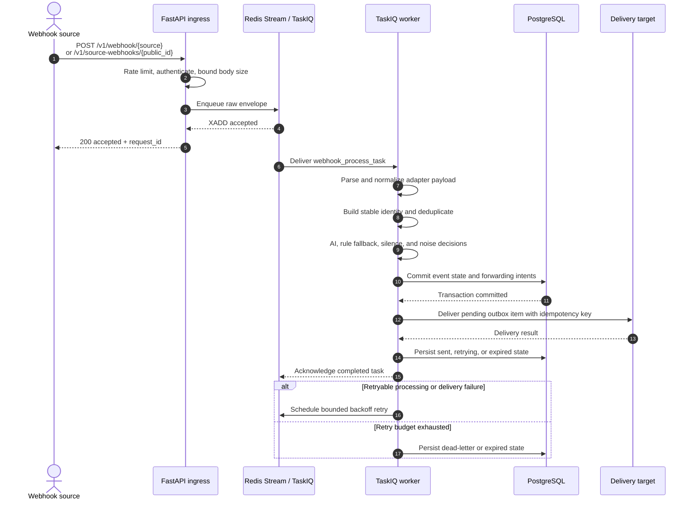
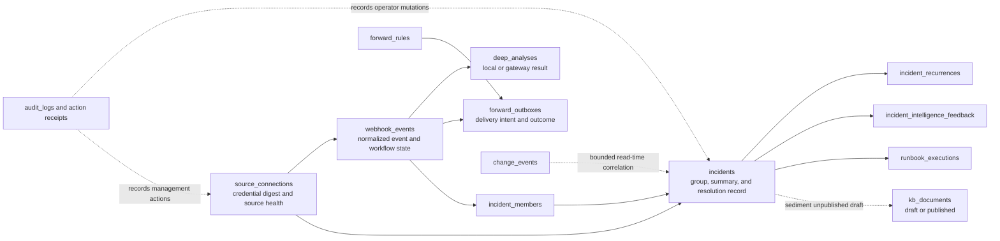
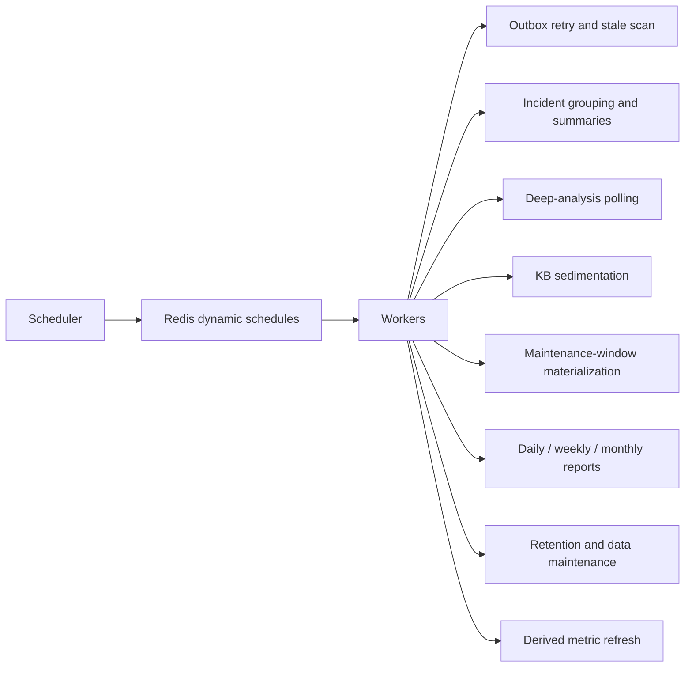
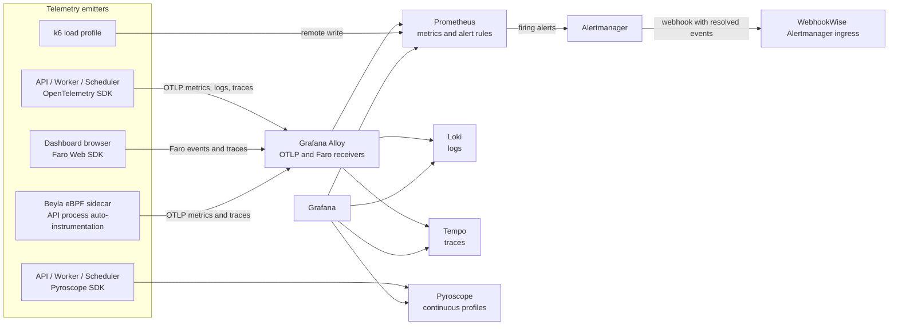

# System Architecture

WebhookWise is a modular monolith deployed as separate API, worker, and
scheduler processes. PostgreSQL is the durable system of record. Redis provides
the TaskIQ queue, dynamic schedules, caches, distributed locks, and short-lived
coordination state.

The architecture is centered on one product loop:

```text
alert ingest -> noise reduction -> incident response -> verified resolution
             -> reusable knowledge -> better future recommendations
```

## Runtime Topology

```mermaid
flowchart TB
    subgraph producers["Event and change producers"]
        monitors["Monitoring systems<br/>Grafana / Alertmanager / Prometheus / vendors"]
        cicd["CI/CD and change systems"]
        feishu["Feishu interactive actions"]
        operators["Operators and dashboard users"]
    end

    subgraph business["WebhookWise business stack"]
        api["FastAPI API and dashboard<br/>webhook-service"]
        redis["Redis<br/>TaskIQ Stream / schedules / cache / locks"]
        worker["TaskIQ worker<br/>horizontally scalable"]
        scheduler["TaskIQ scheduler<br/>singleton dispatcher"]
        postgres["PostgreSQL<br/>durable system of record"]
        migrate["Alembic migrate<br/>one-shot startup gate"]
    end

    subgraph external["External decision and delivery systems"]
        ai["LLM provider"]
        gateway["Deep-analysis gateway"]
        targets["Webhook / Feishu / DingTalk / WeCom targets"]
    end

    monitors -->|"global or source-scoped webhook"| api
    cicd -->|"normalized change event"| api
    feishu -->|"signed, idempotent callback"| api
    operators -->|"dashboard and management API"| api

    migrate -->|"schema ready"| api
    migrate -->|"schema ready"| worker
    migrate -->|"schema ready"| scheduler

    api -->|"enqueue accepted envelope"| redis
    api <-->|"management reads and writes"| postgres
    scheduler -->|"dispatch periodic and delayed tasks"| redis
    worker -->|"consume and acknowledge tasks"| redis
    worker <-->|"events, incidents, outbox, knowledge"| postgres
    worker -->|"analysis request"| ai
    worker -->|"submit and poll"| gateway
    worker -->|"deliver persisted outbox items"| targets
```



The API returns `200 OK` after Redis accepts the webhook envelope. That response
means accepted and queued, not persisted in PostgreSQL. Event persistence,
analysis, incident grouping, and forwarding happen asynchronously.

## Webhook Processing Sequence



The event update and `ForwardOutbox` intent are committed in one database
transaction. The remote HTTP side effect is deliberately outside that
transaction and is retried with a stable idempotency key.

## Product and Learning Loop

```mermaid
flowchart LR
    onboard["Guided source onboarding<br/>scoped credentials"]
    ingest["Alert ingest and normalization"]
    quality["Read-only alert quality center"]
    reduce["Identity, deduplication,<br/>silence, and noise reduction"]
    group["Incident grouping"]
    queue["Prioritized response queue"]
    investigate["Similar incidents, changes,<br/>runbooks, and deep analysis"]
    respond["Acknowledge, assign, SLA,<br/>and manual runbook progress"]
    resolve["Human-confirmed resolution"]
    learn["Recurrence review,<br/>postmortem, and KB draft"]
    calibrate["Bounded recommendation calibration"]

    onboard --> ingest
    ingest --> reduce
    ingest -.->|"source and event diagnostics"| quality
    reduce --> group
    group --> queue
    queue --> investigate
    investigate --> respond
    respond --> resolve
    resolve --> learn
    learn --> calibrate
    calibrate -->|"ranking evidence only"| investigate
    quality -.->|"recommendations only; no source mutation"| onboard
```



The learning path is intentionally conservative:

- recurrence detection creates a review candidate and never reopens an old
  incident;
- resolution evidence is operator-owned and takes precedence over generated
  summaries;
- unpublished incident-derived knowledge remains excluded from retrieval;
- feedback calibrates ranking within a bounded range and never executes
  remediation;
- the alert quality center is read-only.

## Durable Data Map



Solid arrows represent direct persisted references. Dashed arrows represent a
workflow or query-time relationship rather than a required foreign key.

PostgreSQL owns durable business truth. Redis may accelerate or coordinate a
decision, but clearing Redis must not redefine incident resolution, forwarding
outcomes, source credentials, or published knowledge.

## Scheduler Responsibilities

The scheduler is a singleton dispatcher. Workers execute the scheduled tasks:



Scaling the worker is supported. Scaling the scheduler is not recommended;
distributed task locks are a safety net, not a replacement for singleton
deployment.

## Observability Topology



Application code exports telemetry over OTLP and does not expose a Prometheus
`/metrics` endpoint. Pyroscope is the intentional direct-backend exception.
Beyla shares the API container PID namespace and must be recreated after the API
container is replaced. Its read-write `/sys/fs/bpf` mount enables pinned-map
features such as log enrichment and profile correlation.

See [Observability](../operations/observability/overview.md) for configuration,
profiles, restart order, query tools, and signal semantics.

## Authentication Boundaries

| Surface | Credential and safety boundary |
| --- | --- |
| `/v1/webhook` and `/v1/webhook/{source}` | Global webhook token or HMAC authentication plus ingress rate limiting. |
| `/v1/source-webhooks/{public_id}` | Revocable source-scoped bearer token; only its digest and display hint are persisted. |
| `POST /v1/changes` | Least-privilege change-ingest token and idempotent external ID. |
| Read-only management API and dashboard data | `API_KEY`, with per-IP management rate limiting. |
| Management mutations | `ADMIN_WRITE_KEY` in addition to the management boundary. |
| Feishu interactive actions | Signed callback, replay protection, idempotency receipt, and audit log. |
| MCP | Optional, read-only, explicitly enabled, and protected by the management API key. |

## Compose Deployment Profiles

| Profile or project | Components | Lifecycle |
| --- | --- | --- |
| Root `compose.yaml` | PostgreSQL, Redis, migrate, API, worker, scheduler | Everyday business stack. |
| `backup` profile | Scheduled `pg_dump` container | Optional durable backup job. |
| `webhookwise-observability` | Alloy, Prometheus, Alertmanager, Loki, Grafana | Default observability backends. |
| `diagnostics` profile | Tempo, Pyroscope, Beyla | Enable when traces, profiles, or eBPF diagnostics are required. |
| `load` profile | k6 | One-shot synthetic load and smoke checks. |

All projects join `webhookwise_webhook_net`. The observability project depends
on the business network already existing, so start the business stack first.

## Code Ownership

- `api/` binds HTTP contracts and authentication dependencies.
- `services/webhooks/` owns ingress orchestration, processing stages, source
  onboarding, and alert-quality read models.
- `services/incidents/` owns grouping, intelligence, response, resolution,
  recurrence, runbook progress, and postmortems.
- `services/analysis/`, `services/forwarding/`, `services/notifications/`,
  `services/kb/`, and `services/silences/` own their respective domain policies.
- `services/operations/` registers TaskIQ work and periodic dispatch.
- `core/` owns shared runtime primitives, not product policy.

See [Architecture Boundaries](boundaries.md) for the complete ownership and
dependency rules.
