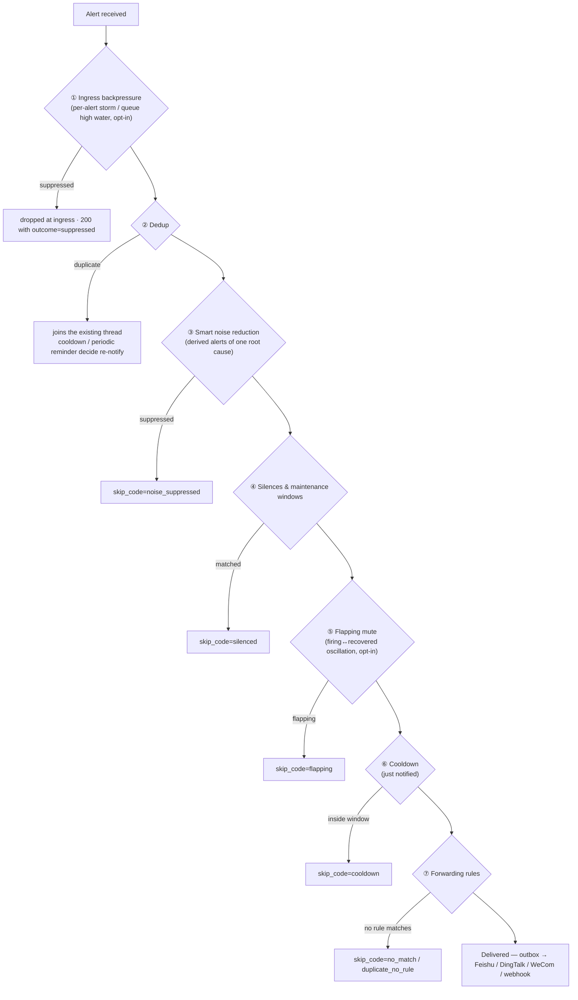

# The operator's surface

What WebhookWise does, and the knobs that steer it. Split out of the README,
which had grown to 383 lines and stopped working as a front door.

Read this when you are configuring or operating an instance. For what the code
looks like from the inside, start at
[architecture/system-overview.md](architecture/system-overview.md).

## What it does

| Capability | Description |
| --- | --- |
| Asynchronous Webhook receiving | The API only handles authentication, rate limiting, enqueueing, and basic persistence, releasing the upstream request quickly. |
| Multi-source normalization | Adapters normalize payloads from different ecosystems into a unified internal structure. |
| AI + rule dual analysis | Structured LLM analysis is preferred; it automatically falls back to rule-based analysis when the external service has problems. |
| Deep analysis | Optionally hand an alert to an external investigator gateway (OpenClaw / hookprobe / Hermes dialects) and poll for the report via TaskIQ delayed tasks. |
| Inbound rule policy | Per alert rule: skip the model, skip the investigation, or cap its severity — the ceiling chosen from the investigator's own verdicts rather than by feel. |
| Deduplication and noise reduction | Identifies duplicate and derived alerts based on alert hash, time window, similarity, and optional semantic signals. |
| Rule-based forwarding | Supports generic Webhook, Feishu card, DingTalk/WeCom bot (URL auto-detected), and deep-analysis targets. |
| Silencing and maintenance windows | One-off silences (with backtest + suppression debt report) plus recurring maintenance windows materialized into expiring silences by the scheduler. |
| Escalation-lite | Optional auto-SLA per importance arms the SLA-breach escalation card (@all / dedicated webhook) for unacknowledged incidents; status-flapping identities are detected and can be muted while they oscillate. |
| Learn loop | Resolved incidents sediment into KB drafts; published KB entries are attached to outgoing Feishu alert cards and one-click incident postmortem drafts (Markdown) close the review loop. |
| Incident intelligence | Incident detail ranks similar resolved incidents, suspected recent changes, and published runbooks with explicit evidence and operator feedback. |
| Incident response loop | A compact command summary, change impact, derived service profiles, manual runbook progress, optional signed Feishu actions, and product-value reporting connect detection to reusable knowledge. |
| Response and learning workspace | A prioritized work queue, structured resolution evidence, recurrence review, knowledge-gap discovery, and bounded feedback calibration turn incident handling into reusable operational knowledge. |
| Guided inbound onboarding | Source-scoped, revocable credentials and a first-event wizard connect new senders without sharing the global webhook secret. |
| Read-only alert quality center | Scores source payload completeness and highlights unstable identities, unmatched recoveries, timestamp anomalies, schema drift, and response gaps without changing source configuration. |
| Transactional Outbox | Processing results and forwarding intent are written to the database in the same transaction, then delivered and retried asynchronously by the Worker. |
| OTel-first observability | The application emits telemetry over OTLP; Alloy routes metrics, logs, and traces to Prometheus, Loki, and Tempo, while Pyroscope, Beyla, Alertmanager, and Grafana complete the diagnostic loop. |
| Runtime settings plane | Keys tagged `[runtime-policy]` accept DB-backed live overrides from the dashboard/API, propagate to every process within ~60s, and fail open — see [Runtime Settings](#runtime-settings). |
| MCP server for agents | Opt-in (`MCP_ENABLED`) Streamable-HTTP MCP endpoint at `/mcp` exposing the query layer to any agent (Claude / Cursor / custom). Read-only except `propose_remediation`, which executes nothing and only records a proposal for a human — see [docs/reference/mcp.md](reference/mcp.md). |
| Agent skills + operator guide | Four operator skills in [`.agents/skills/`](../.agents/skills) (investigate an alert, shift review, noise tuning, observability triage) orchestrate the MCP tools for any agent — Codex reads the directory natively, Claude Code reaches it through per-machine symlinks (see `AGENTS.md`), hookprobe mounts it as its user layer. The dashboard ships a bilingual six-step guide at `#/guide`. |
| Approval-gated remediation | An agent can propose one of the Action Center's commands; nothing runs until an operator approves it, and approval executes the same audited path the dashboard button does — see [docs/features/approval-gated-remediation.md](features/approval-gated-remediation.md). |
| Offline analysis eval | A frozen corpus of labelled alerts is replayed through the analysis engine on every change and held to recorded thresholds in CI, so a prompt or keyword edit cannot quietly lower the importance verdict that routes alerts — see [evals/README.md](../evals/README.md). |
| WebhookWise Lite | A one-process edition of the same thesis: SQLite, no Redis, ~800 lines, four suppression gates — see [lite/README.md](../lite/README.md). |

## The suppression stack — "why didn't I get notified?"

Eight mechanisms can stop an alert from reaching chat. They are not eight
mysteries: every alert passes the same gates in the same order, and the
decision trace records exactly which gate acted (dashboard → Decision Trace).

Rules of thumb: gates ①⑤ are **opt-in** (default off); ②③⑥ are automatic
noise control; ④⑦⑧ are operator-authored policy. Every skip is visible —
nothing is dropped without a decision-trace row naming the gate.

## Runtime settings

Most config is static process configuration (env is its home, change = redeploy).
The exception is **operator policy** — the knobs you tune while running the
system (flapping, auto-SLA, backpressure fractions, noise weights, notify
cadence, KB cards, trace retention). Every key tagged `[runtime-policy]` in
[.env.example.all](../.env.example.all) is served by a DB-backed override plane:

- **Resolution order:** DB override → env value → code default. The env value
  stays the bootstrap default; an override is a sparse row on top of it.
- **Where:** dashboard *Operations → Settings*, or the API —
  `GET /v1/runtime-settings` (list with env/override/effective per key),
  `PUT /v1/runtime-settings/{KEY}` / `DELETE …/{KEY}` (admin write key
  required). Writes are validated against a typed registry and audited.
- **Propagation:** all processes (api / worker / scheduler) apply a change
  within ~60 seconds — a Redis pub/sub nudge plus an interval refresh; no
  restart, no file edit.
- **Failure posture:** fail-open. If the DB or Redis is unhealthy the last
  snapshot (or plain env config) keeps serving; the hot path never depends on
  this plane.

## Delivery semantics

Understanding the durability boundaries of this path is what lets you correctly assess the risk of loss and duplication:

- **Receive → enqueue: accepted (not a durability promise).** The API returns `200 OK` as soon as the request is written to the Redis Stream (`XADD`); DB persistence happens on the Worker side. So `200 OK` means "accepted and enqueued", not "persisted". When the Redis `XADD` fails, the API returns 5xx and the upstream should retry.
- **`WEBHOOK_MQ_STREAM_MAXLEN` is a data-loss knob, not just a memory knob.** The stream is trimmed by an approximate cap (`MAXLEN ~`): when sustained bursts exceed the Worker consumption rate and the backlog exceeds that cap, the oldest *un-acked* entries are trimmed, and the corresponding webhooks that already returned `200` are silently lost. During capacity planning, set this value based on peak backlog and pair it with queue backlog alerts (`queue.pending` / `queue.lag`).
- **Make the backlog visible, and optionally refuse before trimming.** The dashboard surfaces live queue depth, pending, and lag (Overview tile), and the Action Center raises a critical item once the *unconsumed* backlog (undelivered `lag` + un-acked `pending`) crosses `WEBHOOK_MQ_BACKLOG_WARN_FRACTION` of `MAXLEN` (default `0.8`) — *before* the silent trim. The signal is the unconsumed backlog, not total stream length: a busy stream's length sits at `MAXLEN` of already-acked entries, which is normal retention, not a backlog. To turn silent loss into visible backpressure, set `WEBHOOK_MQ_INGRESS_HIGH_WATER_FRACTION` (default `0`, disabled): above that fraction of `MAXLEN` the API rejects new webhooks with `503 Retry-After` so a retrying upstream holds them, instead of the stream trimming its *oldest* un-acked entries. It reads a short-TTL cached backlog (no per-request Redis round trip) and fails open (a probe error never blocks ingress). Enable it only after capacity-planning `MAXLEN` and confirming your senders retry on 503.
- **Redis persistence determines the crash boundary.** The bundled Redis runs with AOF enabled (`--appendonly yes --appendfsync everysec`) on a durable named volume (see `deploy/compose/docker-compose.infra.yml`; the Kubernetes StatefulSet matches), so a Redis crash loses at most ~1 second of writes — the in-flight Stream entries not yet fsynced by the last `everysec` flush. For a stricter boundary set `--appendfsync always` (fsync every write, higher latency) or use a managed Redis with synchronous replication.
- **After enqueue: at-least-once.** Failed Worker processing retries with backoff and goes to dead-letter once exhausted; forwarding is delivered through the transactional Outbox, and stale-recovery plus retries may deliver duplicates. Downstream should deduplicate based on the `Idempotency-Key` request header (see [services/forwarding](../services/forwarding)).

When you need "zero loss at ingress", you should add retries/acknowledgements upstream or place a durable queue in front of the API; the current implementation trades this off for low ingress latency.

