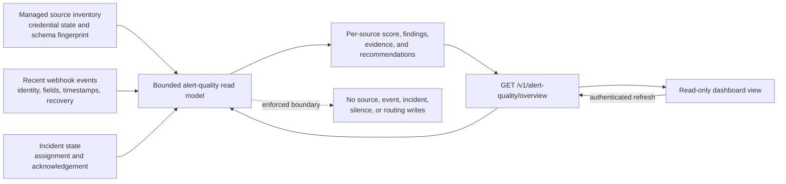

# Alert Quality Center

The Alert Quality Center is a read-only diagnostic view for inbound alert
sources. It answers whether the data entering WebhookWise is stable enough for
deduplication, incident grouping, routing, recovery matching, and later
analysis.

Open **Routing → Alert quality** in the dashboard, or query:

```text
GET /v1/alert-quality/overview?window_days=7&source_limit=100
```

The endpoint requires the normal read API credential. It exposes no write
method and does not edit source connections, silences, forwarding rules,
alerts, or incidents.

## Read-model flow



The service selects only the columns required for its checks and bounds every
inventory or event scan. It does not create a second quality table, update the
source, or apply a recommendation automatically.

## Checks

The bounded scan currently reports:

- stable identity coverage: a rule name, rule ID, or fingerprint that remains
  consistent between firing and recovery;
- service, environment, and upstream severity coverage;
- payload timestamps that are far ahead of or behind receive time;
- recovery signals that did not join the incident their own firing side had
  already formed. A fire -> resolve pair that never formed an incident is
  counted separately, as a *standalone pair*: incidents need two correlated
  non-recovery alerts, so such a pair could not have matched by construction
  and is not a defect in what the source sent;
- conservative identity-churn detection for a small set of alert anchors
  producing mostly unique deduplication keys;
- repeatedly firing identities without a later recovery signal;
- recent payload schema drift recorded by a managed source connection;
- incidents still unacknowledged and unassigned after two hours;
- enabled managed sources with no event in the selected window.

Missing upstream severity is not filled from AI output for this score. The
center measures source quality, so downstream inference must not make an
incomplete sender appear healthy.

## Scoring

Each source with recent events starts at 100. Findings apply bounded,
explainable deductions. The response returns every finding's code, severity,
affected count/rate, penalty, evidence, and up to five example event IDs.

Sources without recent events receive `quality_score: null` rather than a
fabricated low score. An enabled managed source can still receive the
`no_recent_events` finding so a disconnected sender is visible.

The top-level score is the unweighted average across sources that have data.
This prevents one high-volume source from hiding a broken low-volume source.

## Scan bounds

Payload-level checks use the latest 20,000 events in the selected window.
Managed-source inventory is bounded at 500 rows, and the API returns at most
`source_limit` source results. The `scan` object reports each limit and whether
the result was truncated.

Counts such as total events in the window are calculated independently from the
payload sample. Treat field coverage as sampled when `scan.event_truncated` is
true.

## Interpreting recommendations

Recommendations describe changes to make in Grafana, Alertmanager, Uptime
Kuma, or another sender. They are informational text only. The first useful
fixes are usually:

1. add a stable alert name/fingerprint that excludes timestamps and values;
2. add consistent `service`, `environment`, and `severity` labels;
3. enable resolved notifications and preserve the same identity fields in the
   firing and recovery payloads;
4. verify timezone and Unix timestamp units;
5. keep the JSON field names and types stable across alert states.

After changing a sender, select a shorter dashboard window to verify the new
payloads without waiting for older events to age out of a longer report.
