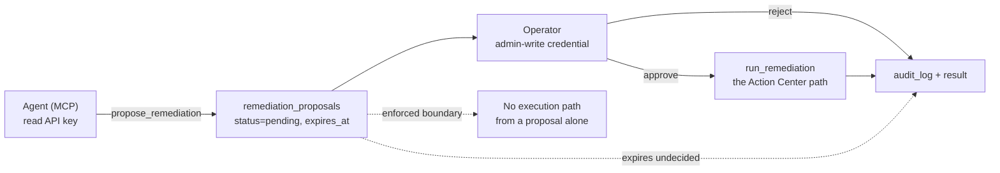

# Approval-gated remediation

An agent that can read everything and change nothing has one failure mode: it
writes a paragraph and waits for a human to retype it as a click. An agent that
can change things has a worse one. A proposal is the third option — the agent
asks, a person allows, and the system runs the same command the dashboard button
runs.



## What a proposal is

A row. It holds the action, its arguments, who asked, why, and when the ask goes
stale. Creating one changes nothing about the deployment; only an approval
executes, and it executes by calling `run_remediation` — the function the
dashboard's Action Center button already calls.

That is the property worth stating plainly: **adding a proposer did not widen the
set of things that can happen to this system.** The executable actions are still
exactly `retry_outbox`, `retry_dead_letters`, `retry_stuck_events`,
`retry_incident_summaries`, `test_enable_rule`, `disable_rule`, `acknowledge`.

## The states, and why `failed` is not `rejected`

| status | meaning |
| --- | --- |
| `pending` | nobody has decided; still inside its expiry window |
| `approved` | a person allowed it **and** it ran — see `result.changed` |
| `rejected` | a person declined it; nothing ran |
| `expired` | nobody decided in time; nothing ran |
| `failed` | a person allowed it and the execution raised — see `result.error` |

`approved` and `failed` both mean a human said yes. Collapsing `failed` into
`rejected` would hide that, and the person reading the audit trail later would
have no way to tell "we decided against this" from "we decided for it and it
broke" — which is how somebody re-approves a broken action forever. The API
returns `502` for an approval that failed to execute, so it cannot be mistaken
for success.

## What keeps it bounded

- **Only runnable proposals exist.** Arguments are validated by constructing the
  executor's own `RemediationRequest`, so an unknown action, or a
  single-resource action with no resource, is refused at proposal time instead of
  discovered by the person who approved it.
- **A reason is required.** A proposal nobody can review is a proposal nobody
  should approve.
- **One pending proposal per action+resource.** An agent in a retry loop cannot
  fill the review queue with the same suggestion; a partial unique index is the
  race backstop behind the readable check.
- **A capped pending queue** (50). A review queue nobody can read is a review
  queue nobody reads.
- **Expiry** (default 24h, max 168h), enforced when a proposal is read and when
  it is decided — never by a background sweep, because a stopped scheduler must
  not be able to leave a stale proposal looking approvable.
- **Idempotency.** A decided proposal cannot be decided again, so a double-click
  or a retried request cannot run the action twice.

## Using it

From an agent, over MCP:

```json
{"name": "propose_remediation",
 "arguments": {"action": "retry_outbox",
               "resource_id": 4182,
               "reason": "outbox 4182 has retried 6 times against the same 503 from the Feishu webhook; the target recovered at 09:12 per list_forward_outbox",
               "proposed_by": "hookprobe"}}
```

Reading and deciding over HTTP. Two headers, not one: the `/v1` router is behind
the read-key guard, and the write endpoints add an admin-write dependency on top
of it. An admin-write key alone fails the read guard (401), and a read key alone
fails the write dependency (403, saying so).

```bash
# Read the queue — read key only.
curl -s -H "X-API-Key: $API_KEY" \
  'https://<host>/v1/action-center/proposals?status=pending'

# Propose / approve / reject — both keys.
curl -s -X POST -H "X-API-Key: $API_KEY" -H "X-Admin-Write-Key: $ADMIN_WRITE_KEY" \
  -H 'Content-Type: application/json' \
  -d '{"action":"retry_outbox","resource_id":4182,"reason":"..."}' \
  'https://<host>/v1/action-center/proposals'

curl -s -X POST -H "X-API-Key: $API_KEY" -H "X-Admin-Write-Key: $ADMIN_WRITE_KEY" \
  'https://<host>/v1/action-center/proposals/12/approve'

curl -s -X POST -H "X-API-Key: $API_KEY" -H "X-Admin-Write-Key: $ADMIN_WRITE_KEY" \
  'https://<host>/v1/action-center/proposals/12/reject'
```

The MCP transport authenticates with the **read** API key, so proposing over MCP
needs only read access. Approving always needs admin-write. That split is the
security boundary; the inertness of a proposal is what makes it a safe one.

## Deciding from the dashboard

**Operations → Action Center** renders the pending queue above the fault list:
the localized action name with its exact command beside it, the proposer, the
reason, the expiry, and Approve / Reject. Approve confirms first — it runs a real
command — and Reject does not. The block renders **nothing** when the queue is
empty, so it costs no space on a quiet board.

The three outcomes are reported differently, because they are different: a
success toast for an executed approval, a warning when the command ran and
changed nothing, and an error naming the failure when the execution raised
(HTTP 502 — approved, did not run).

## Deciding from Feishu

A new proposal queues one idempotent card (`event_type=remediation_proposed`,
outbox key `remediation-proposal:{id}`) to wherever incident cards go — a
forward rule claiming the event type wins, else the configured fallback.
**Approve & execute** / **Reject** buttons render only on the app channel with
the full card-action configuration present; a webhook-only deployment gets the
plain card and decides from the dashboard.

The card grammar was deliberately widened rather than reused: proposals carry
their own signed value (`resource_type=remediation_proposal`, actions
`approve|reject`, verified by `verify_proposal_action_value`), and the incident
verifier still rejects everything that is not an incident. Two guards are
stricter than the incident path, because approving executes a command:

- **The operator allowlist is fail-closed.** Incident actions treat an empty
  `FEISHU_ALLOWED_OPERATOR_OPEN_IDS` as allow-all; a proposal decision with the
  allowlist empty is refused outright.
- **A button never outlives its proposal.** The signed value's expiry is
  clamped to the proposal's own `expires_at`, not the (much longer)
  card-action TTL.

Decisions land in the same `decide_proposal` path the dashboard uses — same
execution, same audit trail, `actor=feishu:<open_id>` — and the toast mirrors
the dashboard's three outcomes. A stale button (already decided, expired)
answers with an error toast and an idempotency receipt, not a failure.

## Not built yet

- **Card refresh after a decision.** The card answers with a toast, but its
  buttons stay rendered; a second press gets the "already decided" toast
  rather than a disabled button.
