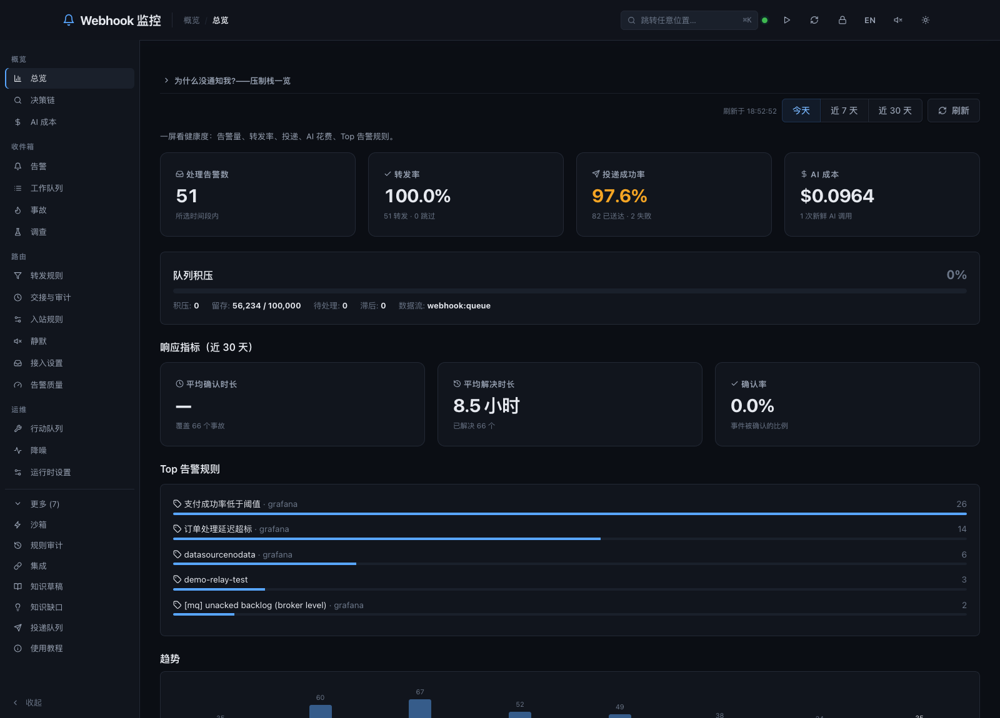
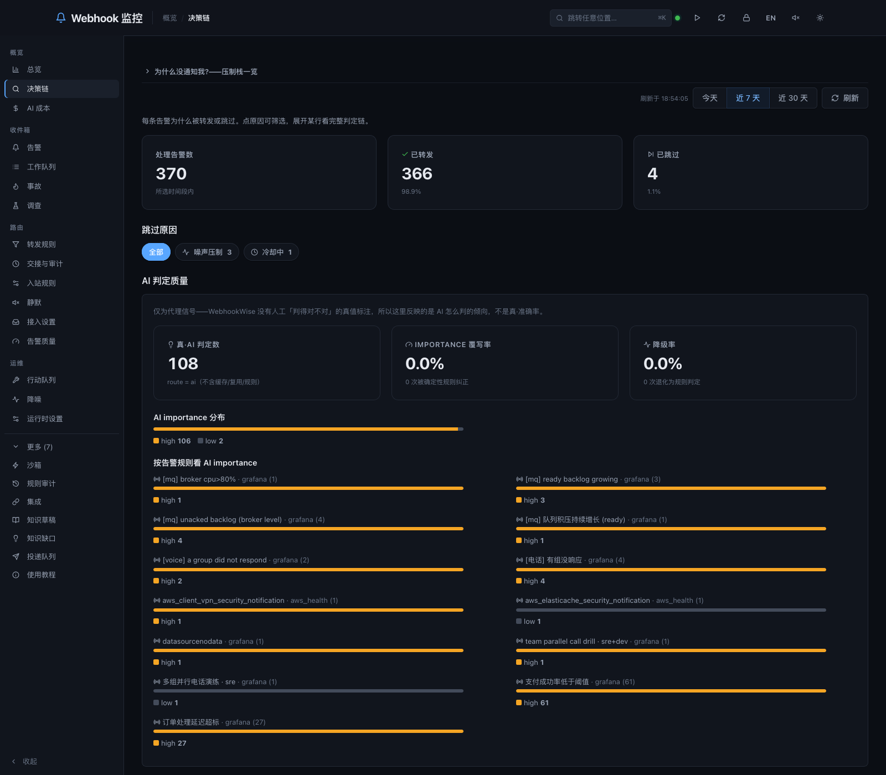
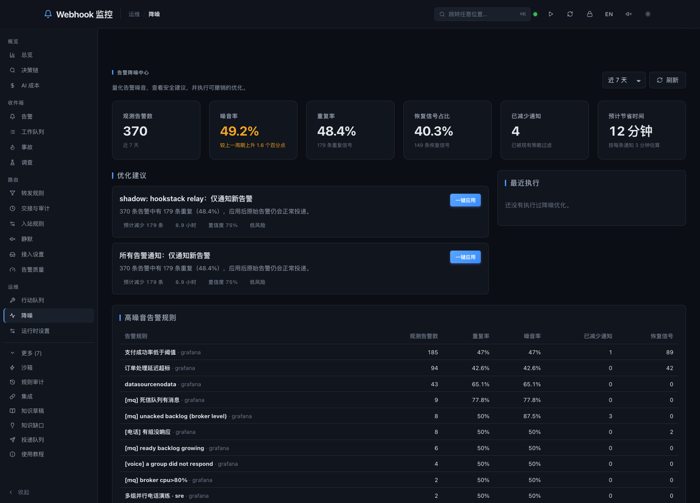
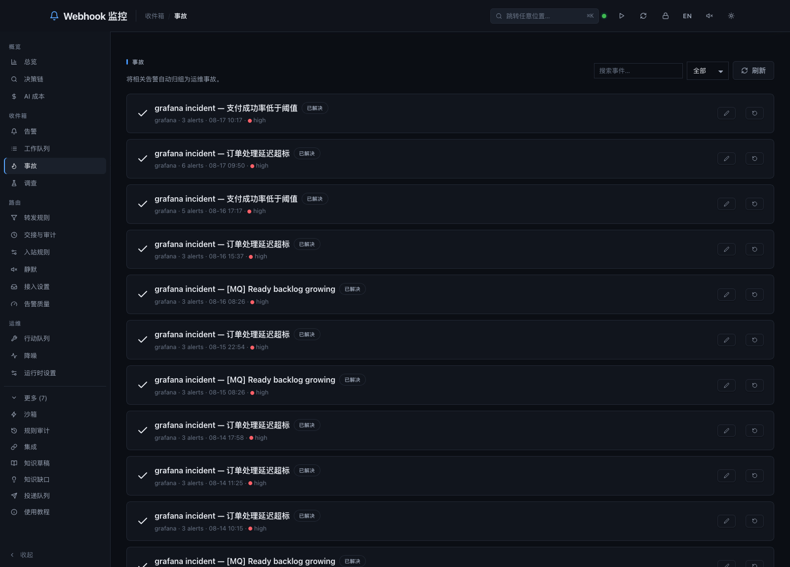
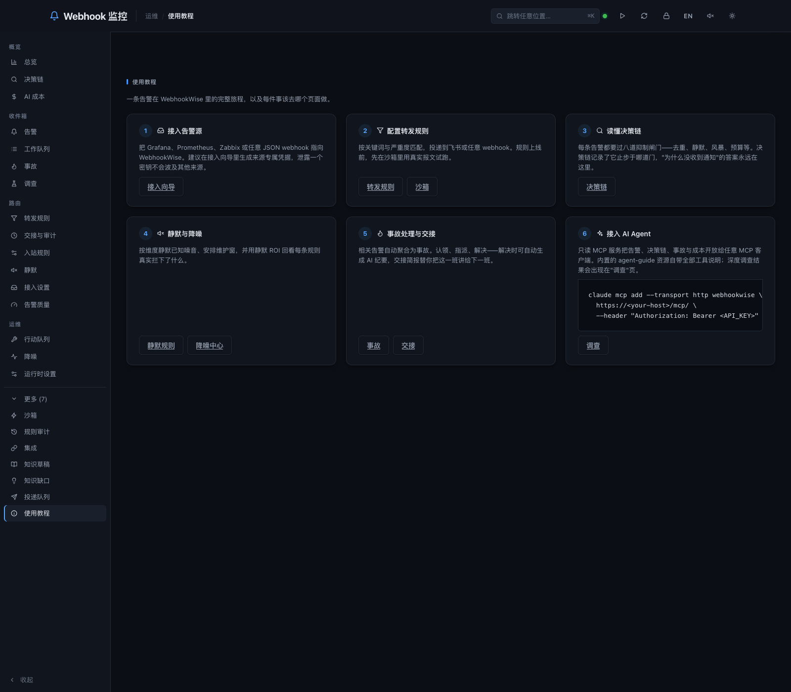

WebhookWise sits between your monitoring and your chat. It normalizes events
from Prometheus, Grafana, Alertmanager, Feishu or anything that can POST JSON,
judges each one, decides who to tell — and records why, so *"why didn't I get
paged?"* has an answer that is not a guess.

**In production at two companies for eight months**, across tens of thousands of
real alerts. Every figure and screenshot here comes from the deployment that is
running now — not a benchmark, and not a demo seed.

Self-hosted, MIT, one `docker compose up`. →
**[github.com/itswl/WebhookWise](https://github.com/itswl/WebhookWise)**



---

## Every alerting tool claims to reduce noise. This one can show whether it did.

An agentic investigator reads the alerts that earn it — searching, correlating,
reasoning for minutes — and returns a report with its own severity. That makes a
labelled set nobody had to annotate, and the first time it was scored the answer
was unflattering:

| | |
| --- | --- |
| Alerts WebhookWise filed `high` | **330 / 367 in a week (90%)** |
| Of those investigated, the investigator agreed | **21 / 80 (26%)** |

`high` had come to mean "there is an alert". So the loop closes: a calibration
script scores the cheap verdict against the reports per alert rule and proposes
a ceiling; a person applies it; **59% of weekly volume stopped being `high`**.

The guard matters more than the mechanism — it refuses to propose a downgrade
for a rule the investigator called high more than a third of the time, because
that noise has to be fixed by making the alert more specific, not by muting it.

That is the shape of the whole project: **a decision, a record of why, and a way
to find out afterwards that the decision was wrong.**



---

## Suppression you can audit

Eight gates stand between an alert and a person — dedup, silence, maintenance
window, storm, cooldown, budget — and every stop is recorded, so a silence rule
can be *scored* rather than trusted. The noise centre reads those records back
as ROI per rule: what each one caught, how many minutes it bought, and which
rules are zombies (ninety days, zero matches). New rules are backtested against
history before they go live.

Last week on the live deployment: **$5.55 of model spend, $9.95 saved** by cache
reuse and by not paying for alerts suppression had already answered.



---

## Ask it questions

The read side is exposed over MCP — 20 tools, a usage guide resource, and
investigation prompts — so any MCP client can query the deployment directly:

```bash
claude mcp add --transport http webhookwise \
  https://<your-host>/mcp/ \
  --header "Authorization: Bearer <API_KEY>"
```

Then ask *"why didn't #923 page me?"*, *"what happened on this shift?"*, or
*"which rules can I delete?"* Four ready-made skills ship with the repo: alert
investigation, shift handover, noise audit, observability triage.

Deliberately read-only — nothing an agent calls changes what the deployment
does. The one write records an inert proposal that an operator must approve.



---

## Start smaller

| | |
| --- | --- |
| **WebhookWise Lite** | One container, SQLite, no Redis, ~800 lines, four suppression gates. Try the idea before the full stack. |
| **Full stack** | FastAPI + TaskIQ + PostgreSQL + Redis, OpenTelemetry throughout. `docker compose up -d`. |

Deliberately not built: on-call schedules and status pages. That is Grafana
OnCall's ground and a status-page service's ground. This does the gatekeeping.



---

## Read more

- [Repository](https://github.com/itswl/WebhookWise) · [What it does, and the knobs](https://github.com/itswl/WebhookWise/blob/main/docs/capabilities.md) · [How it works inside](https://github.com/itswl/WebhookWise/blob/main/docs/architecture/system-overview.md)
- [Why it is built this way — including the rejected options](https://github.com/itswl/WebhookWise/tree/main/.agents/notes)
- [hookstack](https://itswl.github.io/hookstack/) — the small-services counterpart, including the agent runner that does the deep investigations
