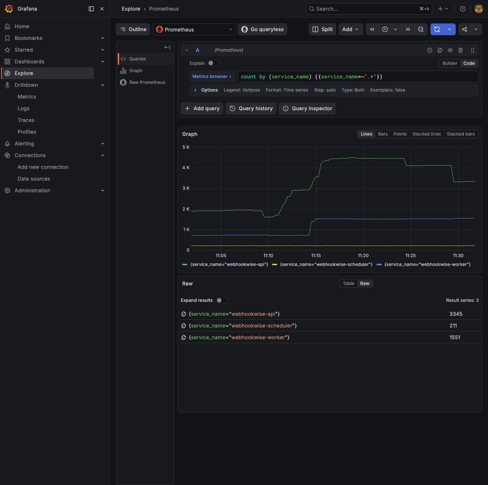
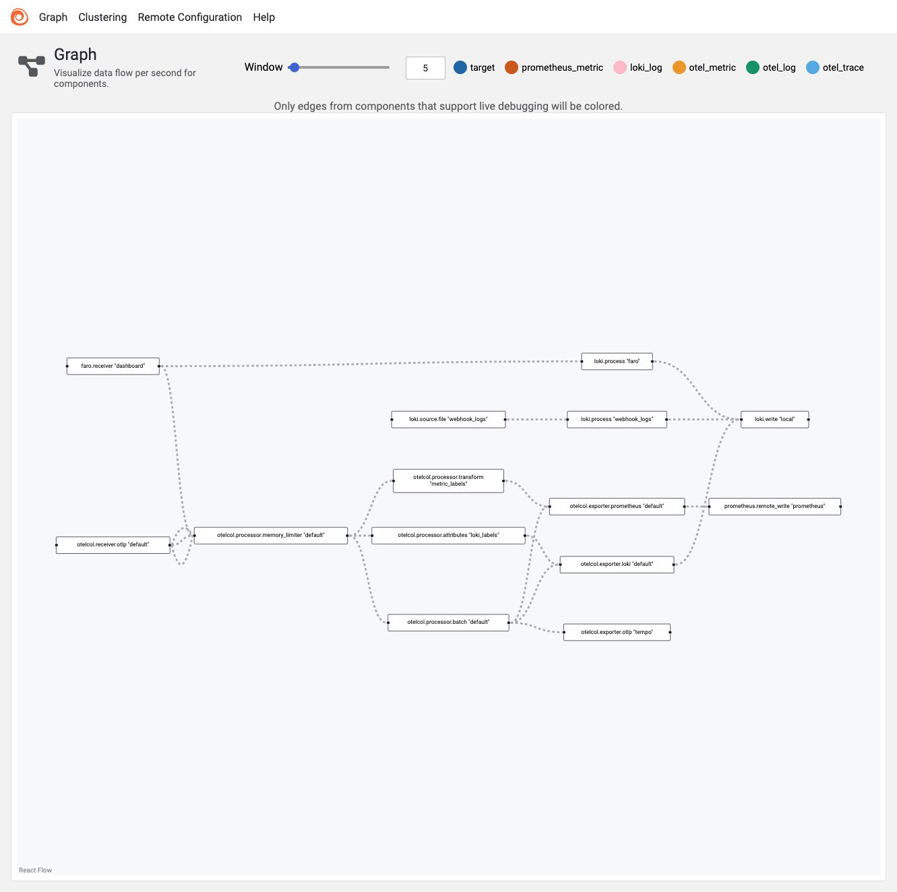

# Local Observability Lab Handbook

This handbook records a complete local observability verification flow: start Grafana Alloy / Prometheus / Loki / Tempo / Pyroscope / Beyla, trigger Faro frontend RUM, run a k6 load test, and then find the corresponding data in Grafana.

## Booklet Navigation

- Startup, service coverage, and unified troubleshooting paths: this document
- [Business metrics and metric cheat sheet](metrics.md)
- [Logs, traces, smoke, and alerts](logs-traces.md)
- [Profile analysis](profiling.md)
- [Observability backends, Faro, Beyla, and k6](backends-rum-load.md)

## Data Flow

```text
API / Worker / Scheduler
  -> OpenTelemetry SDK
  -> Alloy
      -> Prometheus: metrics
      -> Loki: logs
      -> Tempo: traces

Dashboard browser
  -> Grafana Faro Web SDK
  -> Alloy faro.receiver
      -> Loki: browser events and measurements

webhook-service container
  -> Beyla eBPF auto-instrumentation
  -> Alloy
      -> Prometheus: span/process/service graph metrics
      -> Tempo: auto traces

k6
  -> Prometheus remote write
```

## Starting the Local Stack

In the repository root, start the business stack first, then the observability stack:

```bash
docker compose up -d --build
docker compose -p webhookwise-observability --env-file .env -f deploy/compose/docker-compose.observability.yml up -d --build
```

To have the API, Worker, and Scheduler report to the local observability stack, `.env` must at least enable `OTEL_ENABLED=true` and `OTEL_LOGS_ENABLED=true`, and set `OTEL_EXPORTER_OTLP_ENDPOINT=http://alloy:4317` and `OTEL_EXPORTER_OTLP_PROTOCOL=grpc`. When enabling Pyroscope, also set `PYROSCOPE_ENABLED=true` and `PYROSCOPE_SERVER_ADDRESS=http://pyroscope:4040`, then restart the business containers after the changes.

Check service status:

```bash
docker compose ps
docker compose -p webhookwise-observability --env-file .env -f deploy/compose/docker-compose.observability.yml ps
curl -fsS http://localhost:8000/ready
curl -fsS http://localhost:9090/-/ready
curl -fsS http://localhost:3100/ready
curl -fsS http://localhost:3200/ready
curl -fsS http://localhost:12345/-/ready
```

Common entry points:

- Grafana: `http://localhost:3000`, local default is `admin/admin`
- Grafana AIOps dashboard: `http://localhost:3000/d/webhook-wise-aiops/webhookwise-aiops-e5a4a7-e79b98`
- Prometheus: `http://localhost:9090`
- Loki API: `http://localhost:3100`
- Tempo: `http://localhost:3200`
- Pyroscope: `http://localhost:4040`
- Alloy graph: `http://localhost:12345/graph`
- Faro collector endpoint: `http://localhost:12347/collect`

It is normal for `http://localhost:3100` to return 404. Loki has no root-path UI; query its contents through Grafana Explore or the Loki API.

## Service Coverage Overview

The current local stack service list comes from:

```bash
docker compose -p webhookwise-observability --env-file .env -f deploy/compose/docker-compose.observability.yml config --services
```

For the business service logs in the table below, use `docker compose logs <service>`; for the observability service logs, use `docker compose -p webhookwise-observability --env-file .env -f deploy/compose/docker-compose.observability.yml logs <service>`.

| Service | Role | Health entry | Metrics entry | Logs entry | Trace / Profile |
| --- | --- | --- | --- | --- | --- |
| `webhook-service` / `webhook-receiver` | HTTP API, Dashboard, webhook enqueue | `http://localhost:8000/ready` | Prometheus: `service_name="webhookwise-api"` | Loki: `{service_name="webhookwise-api"}` | Tempo: `service.name=webhookwise-api`; Pyroscope: `webhookwise-api` |
| `worker` | Asynchronously process webhooks, AI, forwarding, and retries | Docker healthcheck | Prometheus: `service_name="webhookwise-worker"`, `worker_*`, `queue_*` | Loki: `{service_name="webhookwise-worker"}` | Tempo: `service.name=webhookwise-worker`; Pyroscope: `webhookwise-worker` |
| `scheduler` | Periodic tasks, recovery scans, polling | Docker healthcheck | Prometheus: `service_name="webhookwise-scheduler"`, `scheduler_*` | Loki: `{service_name="webhookwise-scheduler"}` | Tempo: `service.name=webhookwise-scheduler`; Pyroscope: `webhookwise-scheduler` |
| `migrate` | One-off Alembic migration task | container exit code | None, `OTEL_ENABLED=false` | `docker compose ... logs migrate` | None |
| `postgres` | Local database | Docker healthcheck / `pg_isready` | Currently only application-side DB client/pool metrics | `docker compose ... logs postgres` | Application DB spans and Beyla SQL spans |
| `redis` | taskiq broker / stream / cache | Docker healthcheck / `redis-cli ping` | Currently only application-side Redis client metrics | `docker compose ... logs redis` | Application Redis spans and Beyla Redis spans |
| `grafana` | Query and Dashboard UI | `http://localhost:3000/api/health` | Grafana itself is not scraped by Prometheus | `docker compose ... logs grafana` | None |
| `prometheus` | Metric storage and querying | `http://localhost:9090/-/ready` | `http://localhost:9090/metrics`; locally it mainly scrapes Alloy | `docker compose ... logs prometheus` | None |
| `loki` | Log storage and querying | `http://localhost:3100/ready` | Loki itself is not scraped by Prometheus | `docker compose ... logs loki` | None |
| `tempo` | Trace storage and querying | `http://localhost:3200/ready` | Tempo itself is not scraped by Prometheus | `docker compose ... logs tempo` | Grafana Tempo Explore |
| `pyroscope` | Profile storage and querying | `http://localhost:4040` | Pyroscope itself is not scraped by Prometheus | `docker compose ... logs pyroscope` | Grafana Profiles / Pyroscope UI |
| `alloy` | OTLP/Faro receiving and signal forwarding | `http://localhost:12345/-/ready` | Prometheus scrape `alloy:12345` | `docker compose ... logs alloy` | Alloy graph |
| `beyla` | eBPF auto-instrumentation of the API container | container running | Prometheus: `source="beyla"`, `traces_*`, `process_*` | `docker compose ... logs beyla` | Tempo: auto traces |
| `k6` | One-off load-testing task | run exit code | Prometheus: `k6_*` remote write | run output | None |
| Dashboard browser / Faro | Frontend RUM | Open `http://localhost:8000` | Prometheus: `faro_receiver_*` | Loki: `{app="webhookwise-dashboard"}` | Can be turned into frontend traces, depending on what the Faro SDK reports |

Note: Postgres, Redis, Grafana, Loki, Tempo, and Pyroscope currently do not have their own Prometheus exporter/scrape job. In this local handbook they are verified through health checks, Compose service logs, application-side client metrics, Beyla auto spans, and backend APIs. For production-grade instance metrics, you can add `postgres_exporter`, `redis_exporter`, and metrics scraping for Grafana/Loki/Tempo/Pyroscope themselves.

The `scheduler_*` metrics describe periodic task execution results. The current taskiq execution side may emit these metrics under `service_name="webhookwise-worker"`; when troubleshooting the scheduler, also look at the scheduler container health, scheduler logs, and the worker-side `scheduler_*` metrics.

Service-level Prometheus overview:



For dashboard panel coverage, No data semantics, and the maintenance checklist, see [dashboards.md](../dashboards.md).

## Unified Troubleshooting Path

When you hit a problem, follow this chain:

1. Are the services alive: `docker compose ... ps` and each `/ready`.
2. Are requests reaching the API: in Prometheus, query `http_server_request_duration_seconds_count{service_name="webhookwise-api"}`.
3. Are they enqueued and consumed: query `queue_operations_total`, `queue_pending`, `queue_lag`; `queue_depth` only represents the retained Redis Stream length.
4. Is the worker processing: query `worker_task_runs_total`, `webhook_processed_total`, `webhook_processing_duration_seconds_bucket`.
5. Are DB/Redis slow or failing: query `db_sessions_total`, `redis_operations_total`, and the corresponding duration buckets.
6. Are forwarding/AI failing: query `forward_*`, `ai_requests_total`, `ai_*`, and search Loki by `trace_id` / `event.name`.
7. Need trace details: in Tempo, search by `service.name`, `trace_id`, or use Grafana's trace/log jumps.
8. CPU/memory suspicions: Pyroscope profiles or Beyla `process_*` metrics.

## Viewing the Alloy Pipeline

Open `http://localhost:12345/graph`. What you see here is the collection pipeline topology, not the business data itself.

Focus on a few edges:

- `otelcol.receiver.otlp "default"` -> processors -> Prometheus / Loki / Tempo exporters
- `faro.receiver "dashboard"` -> `loki.process "faro"` -> `loki.write "local"`
- Application logs also go through `otelcol.receiver.otlp "default"` and no longer enter Loki via file tailing


