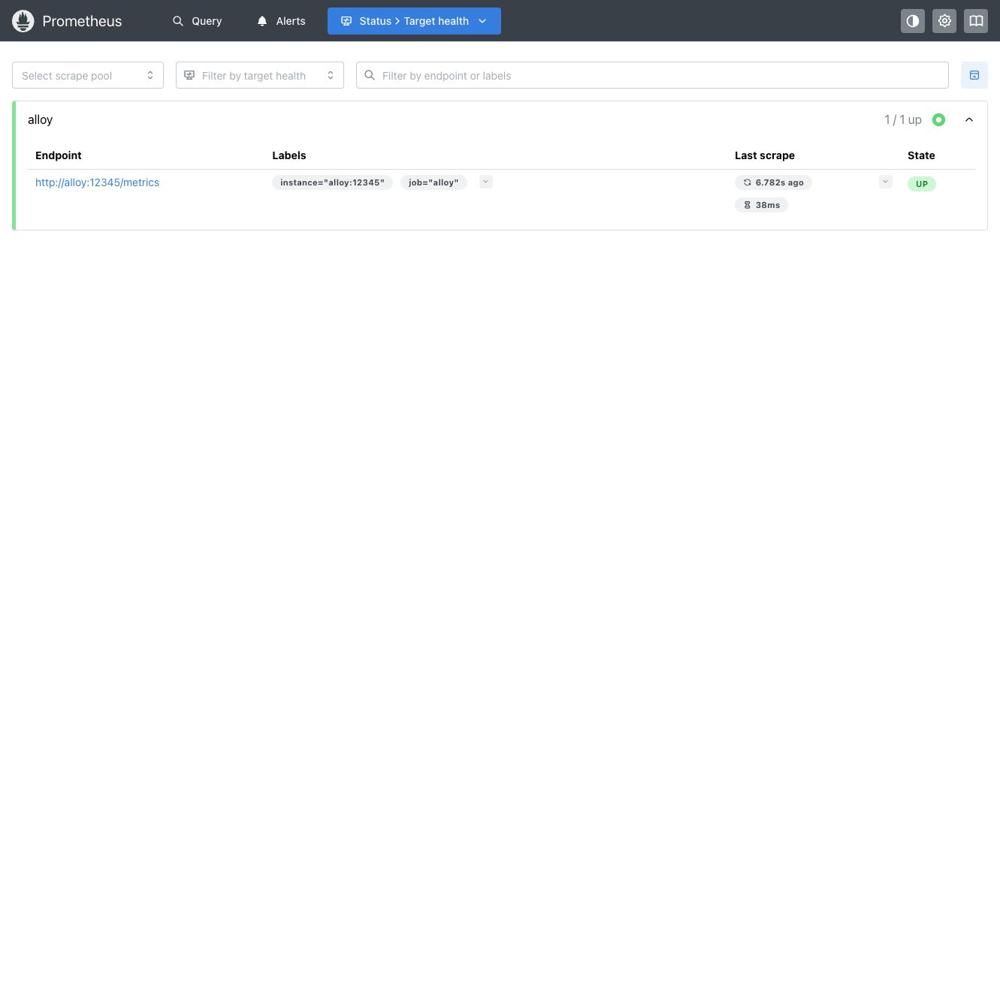
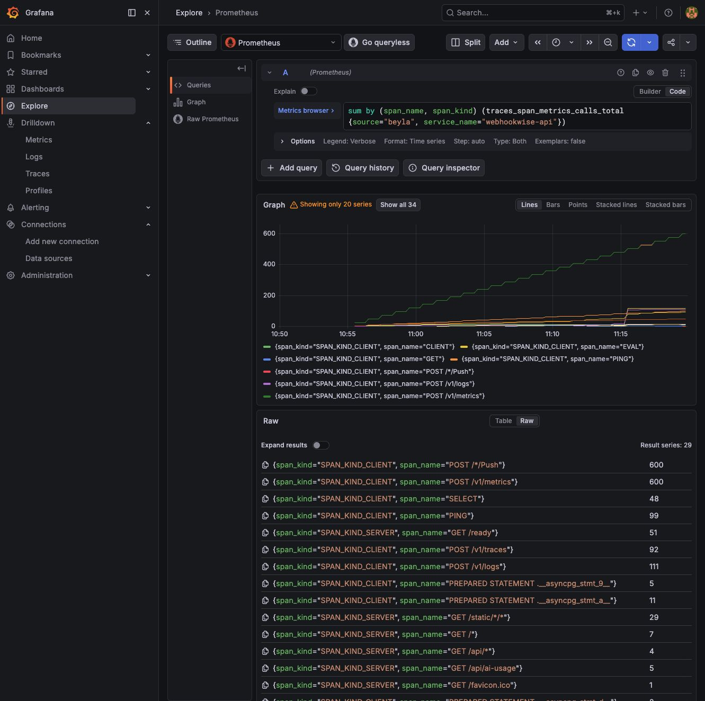
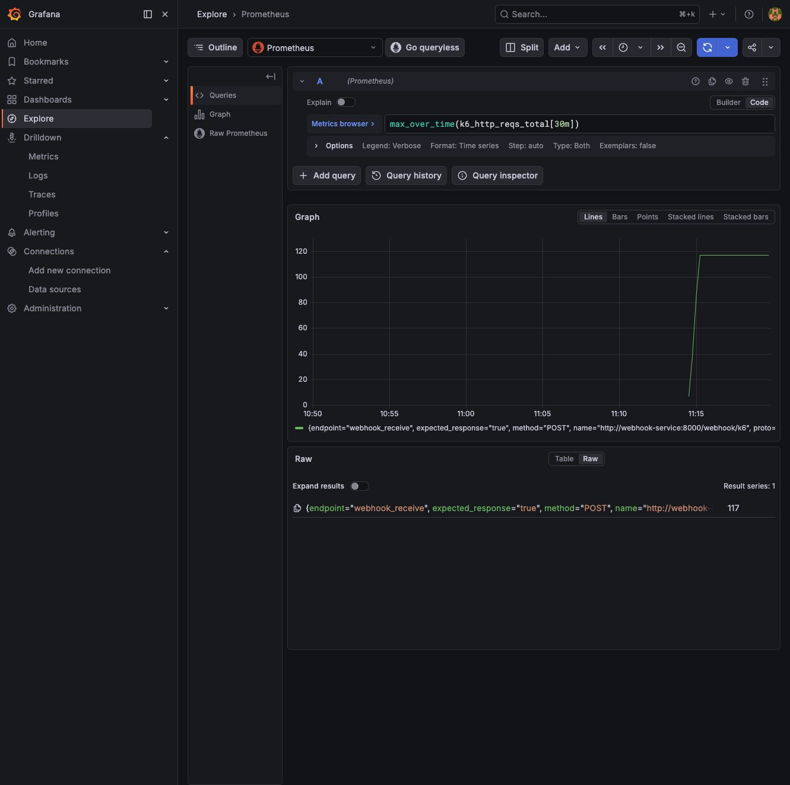

# Local Observability Lab Handbook: Observability Backends, RUM, Beyla, and k6

[Back to overview](README.md)

## Inspecting the Observability Backends Themselves

### Alloy

```promql
alloy_config_last_load_successful
alloy_component_controller_running_components
loki_write_dropped_entries_total
faro_receiver_rate_limiter_requests_total
```

Alloy's own metrics page:

```text
http://localhost:12345/metrics
```

### Prometheus

```promql
up
prometheus_tsdb_wal_writes_failed_total
prometheus_tsdb_wal_storage_size_bytes
```

Prometheus targets:

```text
http://localhost:9090/targets
```



### Loki / Tempo / Pyroscope / Grafana

These components are currently verified mainly through their health endpoints and Docker logs:

```bash
curl -fsS http://localhost:3100/ready
curl -fsS http://localhost:3200/ready
curl -fsS http://localhost:3000/api/health
curl -fsS http://localhost:4040
```

To bring their own runtime metrics into the same Prometheus, you need to add a scrape job in `deploy/observability/prometheus/prometheus.yml` and confirm each component's metrics endpoint and network address.

## Frontend RUM (removed)

There is no frontend RUM pipeline any more. The Faro receiver is gone from
`deploy/observability/alloy/config.alloy` and `templates/static/js/faro.js` no
longer exists, so `faro_receiver_*` metrics and the
`{app="webhookwise-dashboard"}` Loki stream will never return data — a query
against them reads as "quiet", which is the most misleading possible answer.

It was removed with the `loki.process "faro"` stage during the 2026-08 Alloy
work, when the collector was refusing every batch and the whole log pipeline
was empty for four days. Browser telemetry was the one signal nothing
consumed: no dashboard panel, no alert, no SLO read it.

If frontend errors become worth collecting again, add the receiver AND the
panel that reads it in the same change — the instrument rule in CLAUDE.md
exists because this section is what the alternative looks like.

## Inspecting Beyla Auto-instrumentation

Beyla is an eBPF sidecar next to the API container. It has no UI of its own; its data goes into Prometheus and Tempo.

Confirm the Beyla container:

```bash
docker compose -p webhookwise-observability --env-file .env -f deploy/compose/docker-compose.observability.yml ps beyla
docker compose -p webhookwise-observability --env-file .env -f deploy/compose/docker-compose.observability.yml logs --tail=80 beyla
```

View the Beyla span metrics in Prometheus:

```promql
sum by (span_name, span_kind) (
  traces_span_metrics_calls_total{
    source="beyla",
    service_name="webhookwise-api"
  }
)
```

View p95:

```promql
histogram_quantile(
  0.95,
  sum by (le, span_name) (
    rate(traces_span_metrics_duration_seconds_bucket{
      source="beyla",
      service_name="webhookwise-api"
    }[5m])
  )
)
```

View process resources:

```promql
sum by (cpu_mode) (
  process_cpu_utilization_ratio{service_name="webhookwise-api"}
)
```



You can also search in Tempo:

```text
service.name = webhookwise-api
```

On Docker Desktop you may see a `bpffs`-style warning. It means that enhanced capabilities such as pinned maps, the log enricher, and profile correlation are limited, but the basic HTTP / SQL / Redis metrics and traces still work.

## Running k6 Load Tests

Run the built-in smoke load test:

```bash
docker compose -p webhookwise-observability --env-file .env -f deploy/compose/docker-compose.observability.yml --profile load run --rm k6
```

The default script is `tests/k6/webhook_smoke.js`:

- 10s ramp to 2 VUs
- 30s ramp to 6 VUs
- 10s ramp down to 0
- Requests `POST /v1/webhook/k6`
- Outputs to Prometheus remote write

An example of a healthy result:

```text
http_reqs: 117
http_req_failed: 0.00%
http_req_duration p95: 14.26ms
http_req_duration p99: 17.6ms
checks: 100%
```

View the k6 metrics in Prometheus. k6 writes stale markers after it finishes, so an instant query may be empty. When querying the run you just completed, use `max_over_time(...[30m])`.

```promql
max_over_time(k6_http_reqs_total[30m])
```

```promql
max_over_time(k6_http_req_failed_rate[30m])
```

```promql
max_over_time(k6_http_req_duration_p95[30m])
max_over_time(k6_http_req_duration_p99[30m])
```

```promql
max_over_time(k6_checks_rate[30m])
```



You can also verify from the API side that the webhook ingress actually received traffic:

```promql
sum by (http_route, http_response_status_code) (
  increase(http_server_request_duration_seconds_count{
    service_name="webhookwise-api",
    http_route="/v1/webhook/{source}"
  }[30m])
)
```

## Common Phenomena

| Phenomenon | Explanation | What to do |
| --- | --- | --- |
| `http://localhost:3100` is 404 | Loki has no root-path UI | Use Grafana Explore or `/ready` / the API |
| k6 instant query is empty | k6 writes stale markers after the run ends | Use `max_over_time(...[30m])` |
| Faro count is 0 | The business frontend was not opened or the SDK did not load | Open `http://localhost:8000` and check the browser console/network |
| Beyla has no UI | Beyla is a collection sidecar | Look at `source="beyla"` in Prometheus / Tempo |
| Alloy graph has edges but Grafana has no data | No business events may have been produced yet | Open the Dashboard, call the API, or run k6 |

## Cleanup

Stop the local stack:

```bash
docker compose -p webhookwise-observability --env-file .env -f deploy/compose/docker-compose.observability.yml down
```

If you are only rerunning the load test, you do not need to restart the entire stack.
