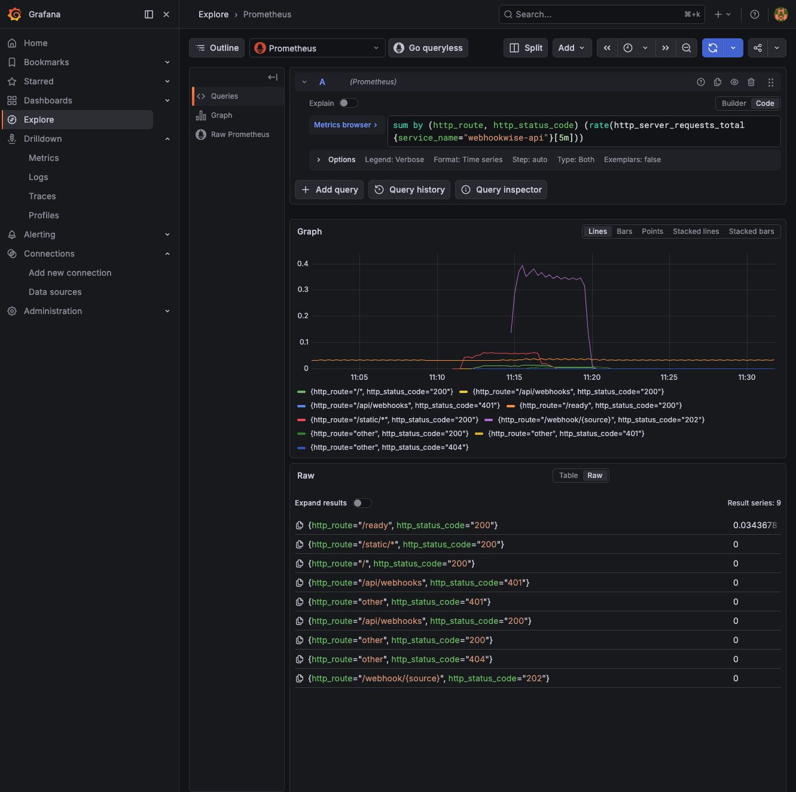
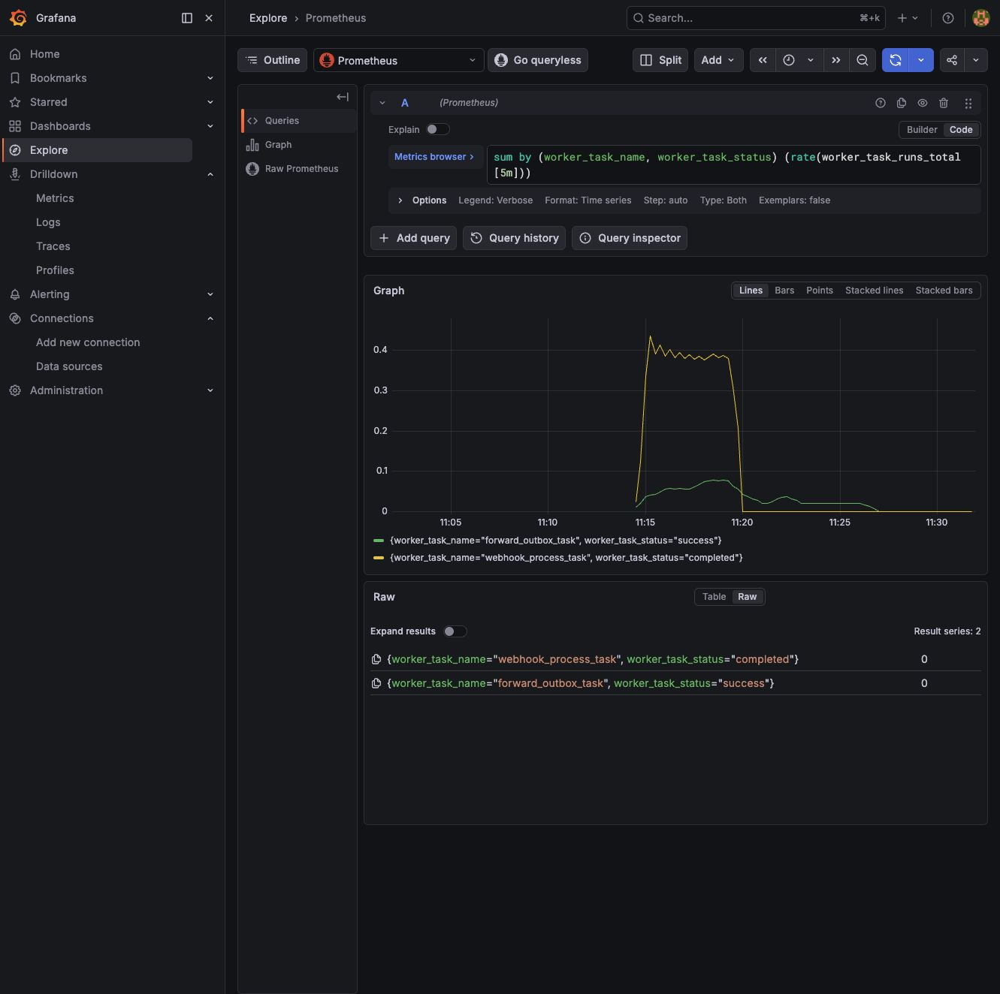
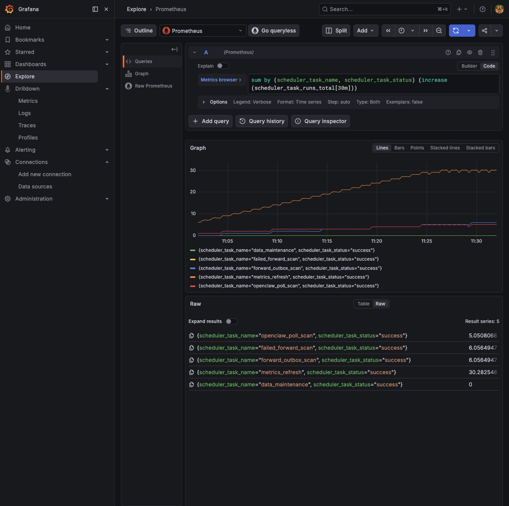
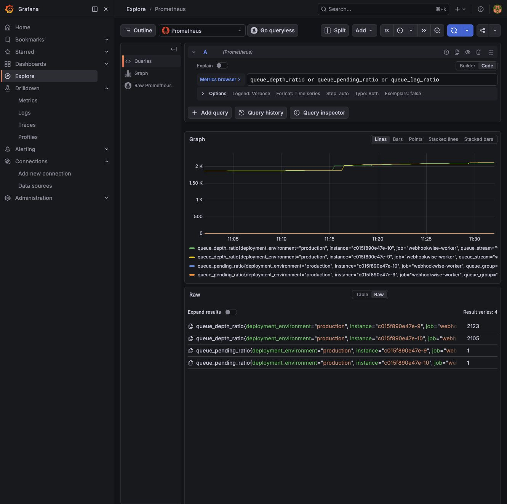

# 本地可观测实验手册：指标

[返回总览](README.md)

## 看业务服务指标

Grafana -> Explore -> datasource 选择 `Prometheus`。

### API

```promql
sum by (http_route, http_response_status_code) (
  rate(http_server_request_duration_seconds_count{service_name="webhookwise-api"}[5m])
)
```

```promql
histogram_quantile(
  0.95,
  sum by (le, http_route) (
    rate(http_server_request_duration_seconds_bucket{service_name="webhookwise-api"}[5m])
  )
)
```

```promql
sum by (webhook_source, webhook_status) (
  increase(webhook_received_total[30m])
)
```

```promql
sum by (security_check, security_result) (
  increase(security_checks_total[30m])
)
```



### Worker

```promql
sum by (worker_task_name, worker_task_status) (
  rate(worker_task_runs_total[5m])
)
```

```promql
histogram_quantile(
  0.95,
  sum by (le, worker_task_name) (
    rate(worker_task_duration_seconds_bucket[5m])
  )
)
```

```promql
webhook_running_tasks
or webhook_running_tasks_ratio
```



### Scheduler

```promql
sum by (scheduler_task_name, scheduler_task_status) (
  increase(scheduler_task_runs_total[30m])
)
```

```promql
time() - scheduler_task_last_success_unixtime_seconds
```

```promql
scheduler_task_lag_seconds
```



### Queue

```promql
queue_pending
or queue_lag
```

```promql
queue_depth
```

`queue_depth` 是 Redis Stream 的 `XLEN`。TaskIQ 消费后会 `XACK`，
但 `XACK` 不删除 stream entry，因此它可能随历史消息增长到
`WEBHOOK_MQ_STREAM_MAXLEN` 附近；判断消费是否堵住，应优先看
`queue_pending` 和 `queue_lag`。

```promql
sum by (queue_name, queue_operation, queue_status) (
  rate(queue_operations_total[5m])
)
```



### Database Client And Pool

这些是应用侧 DB client/pool 指标，不是 Postgres server exporter 指标。连接池 Gauge 由 OTel 导出回调直接读取 SQLAlchemy pool 当前状态，不再通过 checkout/checkin 事件计数推算。

```promql
sum by (db_operation, db_status) (
  rate(db_sessions_total[5m])
)
```

```promql
db_pool_connections_checked_out
or db_pool_connections_max
```

```promql
histogram_quantile(
  0.95,
  sum by (le, db_operation) (
    rate(db_session_duration_seconds_bucket[5m])
  )
)
```

### Redis Client

这些是应用侧 Redis client 指标，不是 Redis server exporter 指标。

```promql
sum by (redis_operation, redis_status) (
  rate(redis_operations_total[5m])
)
```

```promql
histogram_quantile(
  0.95,
  sum by (le, redis_operation) (
    rate(redis_operation_duration_seconds_bucket[5m])
  )
)
```


### AI / Forwarding / Domain Events

```promql
histogram_quantile(
  0.95,
  sum by (le, webhook_source, ai_engine) (
    rate(ai_request_duration_seconds_bucket[5m])
  )
)
```

```promql
sum by (ai_model, ai_token_type) (
  increase(ai_tokens_total[1h])
)
```

```promql
sum by (forward_target_type, forward_status) (
  increase(forward_delivery_total[30m])
)
```

```promql
sum by (event_name) (
  increase(observability_events_total[30m])
)
```


## 指标解释速查

先记住 Prometheus 里的几个后缀规则：

| 后缀 / 类型 | 怎么读 | 常用 PromQL | 适合回答的问题 |
| --- | --- | --- | --- |
| `_total` / Counter | 只增不减的累计值 | `rate(x_total[5m])`、`increase(x_total[30m])` | 发生频率、吞吐、错误次数 |
| `_bucket` / Histogram | 分桶计数 | `histogram_quantile(0.95, sum by (le, ...) (rate(x_bucket[5m])))` | p95/p99 延迟、请求体大小分布 |
| `_sum` / Histogram | 观测值总和 | `rate(x_sum[5m]) / rate(x_count[5m])` | 平均耗时或平均大小 |
| `_count` / Histogram | 观测次数 | `rate(x_count[5m])` | 样本吞吐 |
| Gauge | 当前状态值 | 直接查询，或 `max_over_time(x[30m])` | 当前积压、连接数、运行中任务 |

代码里使用 OpenTelemetry 点号命名，例如 `http.server.request.duration`。进 Prometheus 后通常会变成下划线命名，例如 `http_server_request_duration_seconds_bucket` / `_count`。本地 Prometheus 里有些应用指标也会出现 `webhookwise_` 前缀版本；日常排查优先用无前缀业务名，查不到时再试前缀版本。

本地栈固定使用 OTel semantic conventions schema
`https://opentelemetry.io/schemas/1.41.0`。升级 schema 时先改
`OTEL_SCHEMA_URL` / `OTEL_SEMCONV_VERSION`，再更新指标、日志字段、Trace
属性和大盘契约测试。Histogram exemplars 已启用，Grafana 中带 exemplar 的
延迟样本可以直接跳 Tempo trace。

### SLO / RED / USE 快速入口

| 目标 | Recording rule | 读法 |
| --- | --- | --- |
| API 成功率 | `webhookwise:http_request_success_ratio_5m` | 低于 0.99 时先查 HTTP 5xx、Loki error、Tempo 慢 trace |
| API 请求率 | `webhookwise:http_request_rate_5m` | 业务入口吞吐，和错误率/延迟一起看 |
| API p95 | `webhookwise:http_request_duration_p95_5m` | RED latency，升高时继续拆 DB、Redis、AI、Forwarding |
| Ingress 入队成功率 | `webhookwise:webhook_ingress_success_ratio_5m` | 低于 0.99 时查限流、payload、TaskIQ 入队 |
| Pipeline 完成率 | `webhookwise:webhook_processing_success_ratio_5m` | 低于 0.98 时查 pipeline step、dead-letter、依赖健康 |
| Forward 成功率 | `webhookwise:forward_delivery_success_ratio_5m` | 低于 0.95 时查 target/circuit breaker/outbox |
| AI 降级率 | `webhookwise:ai_degradation_ratio_5m` | 高于 0.1 时查 provider error、cache、模型延迟 |
| DB pool 使用率 | `webhookwise:db_pool_utilization_ratio` | 接近 1 时查慢事务、连接等待、worker 并发 |
| 队列积压 | `webhookwise:queue_backlog` | 结合 worker task p95 和 Redis latency 判断是否扩容 |
| Redis 不可用 | `webhookwise:redis_unavailable_rate_5m` | 大于 0 表示系统已经进入 Redis 降级路径 |

### HTTP / API 指标

| 指标 | 类型 | 关键标签 | 含义 | 异常解读 |
| --- | --- | --- | --- | --- |
| `http_server_request_duration_seconds_count` | Histogram count | `http_request_method`、`http_route`、`http_response_status_code`、`service_name` | API 请求总数 | 5xx 升高说明服务端错误；4xx 升高多半是参数、认证、路由或调用方问题 |
| `http_server_request_duration_seconds_bucket` | Histogram | `http_request_method`、`http_route`、`http_response_status_code` | API 请求耗时分布 | p95/p99 升高时，继续看 Trace、DB、Redis、AI 和 Forwarding 指标 |
| `http_server_request_body_size_bytes_bucket` | Histogram | `http_request_method`、`http_route` | 请求体大小 | Webhook payload 突然变大时，可能导致解析、入库、AI 分析变慢 |
| `http_server_active_requests` | Gauge | `service_name` | 当前正在处理的 HTTP 请求数 | 持续升高通常表示下游慢、请求堆积或进程处理能力不足 |

常用读法：

```promql
sum by (http_route, http_response_status_code) (
  rate(http_server_request_duration_seconds_count{service_name="webhookwise-api"}[5m])
)
```

```promql
histogram_quantile(
  0.95,
  sum by (le, http_route) (
    rate(http_server_request_duration_seconds_bucket{service_name="webhookwise-api"}[5m])
  )
)
```

### Webhook 入口指标

| 指标 | 类型 | 关键标签 | 含义 | 异常解读 |
| --- | --- | --- | --- | --- |
| `webhook_received_total` | Counter | `webhook_source`、`webhook_status` | 接收到的 webhook 数量 | 某个 source 暴涨说明外部告警激增；失败状态升高说明入口校验、解析或入队有问题 |
| `webhook_ingress_payload_size_bytes_bucket` | Histogram | `webhook_source`、`webhook_outcome` | webhook payload 大小分布 | 大 payload 会放大解析、DB、AI 和转发压力 |
| `security_checks_total` | Counter | `security_check`、`security_result` | 安全检查结果计数 | `denied`、`failed` 升高时先查签名、token、来源 IP、限流配置 |

`webhook_received_total` 是入口吞吐，`http_server_request_duration_seconds_count` 是 HTTP 层吞吐。两者不一定完全相等，因为 HTTP 层还包含 ready、dashboard、静态资源或其他接口。

### Webhook Pipeline 指标

| 指标 | 类型 | 关键标签 | 含义 | 异常解读 |
| --- | --- | --- | --- | --- |
| `webhook_pipeline_steps_total` | Counter | `pipeline_step`、`webhook_source`、`webhook_outcome` | pipeline 每个步骤的执行次数 | 某一步 `error` 变多，说明问题集中在该处理阶段 |
| `webhook_pipeline_step_duration_seconds_bucket` | Histogram | `pipeline_step`、`webhook_source`、`webhook_outcome` | pipeline 单步骤耗时 | 用它定位慢在解析、降噪、AI、写库、转发还是其他步骤 |
| `webhook_processing_duration_seconds_bucket` | Histogram | `webhook_source`、`webhook_outcome` | webhook 端到端处理耗时 | p95/p99 升高代表整体处理链路变慢 |
| `webhook_processed_total` | Counter | `webhook_status` | webhook 状态流转计数 | `error`、`failed`、`suppressed` 升高时结合日志和事件查原因 |
| `webhook_running_tasks` | Gauge | 通常无业务标签 | 当前运行中的 webhook 任务数 | 持续高位说明 worker 忙；高位叠加 queue lag 是处理能力不足信号 |

注意：本地 recording rules 会把 OTel 原始 gauge 记录为更直观的项目指标名，
Dashboard 和查询脚本统一使用 `webhook_running_tasks` 等 recording rule 名称。

### 降噪 / 抑制指标

| 指标 | 类型 | 关键标签 | 含义 | 异常解读 |
| --- | --- | --- | --- | --- |
| `webhook_noise_evaluations_total` | Counter | `webhook_source`、`webhook_relation`、`webhook_suppressed` | 降噪判断次数 | 数量升高通常跟入口告警量升高一致 |
| `webhook_noise_evaluation_duration_seconds_bucket` | Histogram | `webhook_source`、`webhook_relation`、`webhook_suppressed` | 降噪判断耗时 | 变慢时检查关联查询、缓存、规则复杂度 |
| `webhook_noise_evaluations_total{webhook_suppressed="true"}` | Counter query | `webhook_source`、`webhook_relation`、`webhook_suppressed` | 被降噪抑制的数量 | 抑制比例异常升高可能是告警风暴，也可能是规则过严 |
| `webhook_storm_suppressed_total` | Counter | `webhook_source` | 告警风暴快速抑制次数 | 升高说明某来源短时间内噪声很大，需要看上游告警策略 |

### Queue 指标

| 指标 | 类型 | 关键标签 | 含义 | 异常解读 |
| --- | --- | --- | --- | --- |
| `queue_operations_total` | Counter | `queue_name`、`queue_operation`、`queue_status` | 队列操作次数 | `error` 升高时看 Redis 连接、stream/group 是否正常 |
| `queue_operation_duration_seconds_bucket` | Histogram | `queue_name`、`queue_operation`、`queue_status` | 队列操作耗时 | 慢在 enqueue/read/ack 哪一步，可以从 `queue_operation` 分辨 |
| `queue_depth` | Gauge | `queue_stream` | Redis Stream 保留长度，即 `XLEN` | 会随历史消息保留增长到 `WEBHOOK_MQ_STREAM_MAXLEN` 附近；单独升高不代表消费积压 |
| `queue_pending` | Gauge | `queue_stream`、`queue_group` | 已投递但未 ack 的消息数 | 升高说明 worker 拿到了任务但处理或 ack 没跟上 |
| `queue_lag` | Gauge | `queue_stream`、`queue_group` | consumer group 尚未消费到的滞后量 | 持续升高是 worker 处理不过来的直接信号 |

常见组合判断：

| 现象 | 可能原因 |
| --- | --- |
| `queue_depth` 升高，`queue_pending` 和 `queue_lag` 不高 | Redis Stream 在保留历史消息，通常不是消费堵塞 |
| `queue_lag` 升高 | worker 尚未读到新任务，可能是消费能力不足或 worker 没在正常读取 |
| `queue_pending` 升高 | worker 已取到任务，但处理慢、失败重试或 ack 异常 |
| `queue_operation_duration_seconds_bucket` p95 升高 | Redis 慢、网络慢或 stream 操作阻塞 |

### Worker 指标

| 指标 | 类型 | 关键标签 | 含义 | 异常解读 |
| --- | --- | --- | --- | --- |
| `worker_task_runs_total` | Counter | `worker_task_name`、`worker_task_status` | worker 任务执行次数 | `error` 或 `failed` 升高时按任务名查 Loki 日志 |
| `worker_task_duration_seconds_bucket` | Histogram | `worker_task_name`、`worker_task_status` | worker 任务耗时 | p95 高说明任务处理慢，继续拆 DB、Redis、AI、Forwarding |
| `webhook_dead_letter_total` | Counter | 通常无业务标签 | 不再重试的死信数量 | 这是高优先级异常，需要查具体 event 和错误原因 |

Worker 指标主要回答“任务有没有被消费、执行是否成功、耗时是否稳定”。它和 Queue 指标一起看最有价值。

### Scheduler 指标

| 指标 | 类型 | 关键标签 | 含义 | 异常解读 |
| --- | --- | --- | --- | --- |
| `scheduler_task_runs_total` | Counter | `scheduler_task_name`、`scheduler_task_status` | 周期任务执行次数 | 某任务长时间没有 success 或 error 升高，需要查 scheduler/worker 日志 |
| `scheduler_task_duration_seconds_bucket` | Histogram | `scheduler_task_name` | 周期任务耗时 | 耗时变长说明扫描范围、DB 查询或下游处理变慢 |
| `scheduler_task_lag_seconds` | Gauge | `scheduler_task_name` | 周期任务相对预期执行时间的滞后 | lag 持续变大说明任务没有按时跑完或调度阻塞 |
| `scheduler_task_last_success_unixtime_seconds` | Gauge | `scheduler_task_name` | 最近一次成功执行的 Unix 时间 | 用 `time() - ...` 看距离上次成功过去多久 |

常用读法：

```promql
time() - scheduler_task_last_success_unixtime_seconds
```

这个值越大，代表该任务越久没有成功执行。对恢复扫描、数据维护这类任务尤其重要。

### Database Client / Pool 指标

这些是应用侧 DB client/pool 指标，不是 Postgres server exporter 指标。`db_pool_connections_checked_out` 与 `db_pool_connections_max` 来自 SQLAlchemy pool 的实时状态回调。

| 指标 | 类型 | 关键标签 | 含义 | 异常解读 |
| --- | --- | --- | --- | --- |
| `db_sessions_total` | Counter | `db_operation`、`db_status` | DB session/transaction 生命周期计数 | `error` 升高时查 SQLAlchemy、连接、事务回滚日志 |
| `db_session_duration_seconds_bucket` | Histogram | `db_operation`、`db_status` | DB session/transaction 耗时 | p95 高说明查询慢、事务长、连接等待或锁竞争 |
| `db_pool_connections_checked_out` | Gauge | 通常无业务标签 | 当前借出的 DB 连接数 | 长期接近连接池上限，说明 DB pool 压力大 |
| `db_pool_connections_max` | Gauge | 通常无业务标签 | DB 连接池容量 | 和 checked_out 一起看连接池是否打满 |

注意：`checked_out / max` 才是连接池占用比例。单看 `checked_out` 高不一定异常，要结合 `max`、API p95、DB session p95 一起看。

### Redis Client 指标

这些是应用侧 Redis client 指标，不是 Redis server exporter 指标。

| 指标 | 类型 | 关键标签 | 含义 | 异常解读 |
| --- | --- | --- | --- | --- |
| `redis_operations_total` | Counter | `redis_operation`、`redis_status` | Redis 操作次数 | `error` 升高时看 Redis 连接、超时、命令参数 |
| `redis_operation_duration_seconds_bucket` | Histogram | `redis_operation`、`redis_status` | Redis 操作耗时 | `xlen`、`xpending`、`eval` 等变慢会影响队列和限流 |

Redis 指标要和 Queue 一起看。Queue lag 升高且 Redis p95 也升高时，瓶颈可能在 Redis 或其调用方式；Queue lag 升高但 Redis 不慢时，瓶颈更可能在 worker 业务处理。

### AI 指标

| 指标 | 类型 | 关键标签 | 含义 | 异常解读 |
| --- | --- | --- | --- | --- |
| `ai_request_duration_seconds_bucket` | Histogram | `webhook_source`、`ai_engine` | AI 分析耗时 | p95/p99 高说明模型调用、网络或 fallback 变慢 |
| `ai_request_errors_total` | Counter | `error_type` | AI provider 调用错误 | 超时、限流、鉴权、响应格式错误会在这里体现 |
| `ai_tokens_total` | Counter | `ai_model`、`ai_token_type` | token 消耗 | completion 或 prompt token 暴涨会直接影响成本和耗时 |
| `ai_cost_USD_total` | Counter | `ai_model` | 估算 AI 成本 | 成本异常时按模型和来源拆分 |
| `ai_cache_requests_total` | Counter | `ai_cache_operation`、`ai_cache_result` | AI cache 请求和命中情况 | miss 增多会增加模型调用量 |
| `ai_cache_operation_duration_seconds_bucket` | Histogram | `ai_cache_operation`、`ai_cache_result` | AI cache 操作耗时 | cache 慢会拖累整体分析 |
| `ai_degradations_total` | Counter | `ai_degradation_reason` | AI 降级次数 | 升高说明主路径不稳定，系统在使用 fallback 或简化逻辑 |
| `ai_deep_analysis_total` | Counter | `webhook_status`、`ai_engine` | 深度分析任务结果计数 | failed 升高时看 deep analysis 日志和外部服务状态 |

AI 指标通常和 `webhook_processing_duration_seconds_bucket` 一起看。如果整体处理慢但 AI 不慢，说明瓶颈可能在 DB、Redis、转发或队列。

### Forwarding 指标

| 指标 | 类型 | 关键标签 | 含义 | 异常解读 |
| --- | --- | --- | --- | --- |
| `forward_delivery_total` | Counter | `forward_target_type`、`forward_status` | 转发尝试次数 | failed 升高说明目标地址、网络、鉴权或 payload 有问题 |
| `forward_delivery_duration_seconds_bucket` | Histogram | `forward_target_type`、`forward_status` | 转发请求耗时 | p95 高说明下游目标慢或网络慢 |
| `forward_outbox_records_total` | Counter | `forward_target_type`、`forward_status` | outbox 记录生命周期计数 | pending/failed 异常说明异步补偿链路有压力 |
| `forward_outbox_process_duration_seconds_bucket` | Histogram | `forward_target_type`、`forward_status` | outbox 处理耗时 | 变慢时检查目标服务和 DB 查询 |
| `forward_outbox_backlog_age_seconds` | Gauge | `forward_target_type`、`forward_status` | 最老未完成 outbox 记录年龄 | 持续升高说明异步转发链路正在积压，即使请求量不高也要排查 |
| `circuit_breaker_state` | Gauge | `circuit_breaker_name`、`circuit_breaker_state` | 熔断器当前状态，当前状态为 1 | open 为 1 说明依赖被保护性切断，应立刻看下游日志和错误率 |

### 新增阶段性指标

| 指标 | 类型 | 关键标签 | 含义 | 异常解读 |
| --- | --- | --- | --- | --- |
| `webhook_ingress_requests_total` | Counter | `webhook_source`、`webhook_outcome` | API 入口接收、抑制、拒绝、入队结果 | rejected/error 增多先查鉴权、限流、body size 和 TaskIQ 入队 |
| `webhook_ingress_request_duration_seconds_bucket` | Histogram | `webhook_source`、`webhook_outcome` | API 入口从收包到入队耗时 | queued p95 高通常是请求体读取、Redis/TaskIQ 入队慢 |
| `webhook_dedup_decisions_total` | Counter | `webhook_source`、`dedup_action` | dedup 决策结果 | reuse 激增说明告警重复；rechain 增多说明同类告警持续跨窗口出现 |
| `webhook_dedup_duration_seconds_bucket` | Histogram | `webhook_source`、`dedup_action` | dedup 查询耗时 | 高延迟优先查 Redis 和 DB fallback |
| `webhook_analysis_results_total` | Counter | `webhook_source`、`webhook_route`、`webhook_importance`、`ai_degraded` | 分析结果分布 | `ai_degraded=true` 增多说明 LLM 不可用或策略拒绝 |
| `webhook_forward_decisions_total` | Counter | `webhook_source`、`forward_decision`、`forward_reason`、`forward_target_type` | webhook 是否进入转发链路 | skipped/no_match 增多通常是规则问题；queued 但 delivery failed 是下游问题 |
| `ai_requests_total` | Counter | `webhook_source`、`ai_engine`、`ai_status` | AI / rule / cache 请求结果 | openai error、cache hit、rule success 能区分模型失败和主动降级 |
| `db_health_state` | Gauge | `db_state` | 数据库健康状态 | unhealthy=1 时先查 DB 连接、迁移、statement timeout |

### Domain Events / Signals 指标

| 指标 | 类型 | 关键标签 | 含义 | 异常解读 |
| --- | --- | --- | --- | --- |
| `observability_events_total` | Counter | OTel `event.name`，Prometheus 中为 `event_name` | 结构化业务事件计数 | 用来确认关键业务里程碑是否发生，例如任务开始、分析完成、风暴抑制 |
| `observability_signals_total` | Counter | OTel `signal.name`、`signal.state`，Prometheus 中为 `signal_name`、`signal_state` | 领域状态转换计数 | 适合看系统进入了 completed、error、suppressed 等状态的频率 |

事件和信号的指标只适合看“发生了多少次”。具体是哪一个 event、request 或 alert，要去 Loki 里按 `event.name`、`trace_id`、`span_id` 查。

### Faro 前端 RUM 指标

| 指标 | 类型 | 含义 | 异常解读 |
| --- | --- | --- | --- |
| `faro_receiver_events_total` | Counter | Faro browser event 数量，例如 `session_start` | 为 0 通常说明没有打开 Dashboard，或 SDK/collector 没通 |
| `faro_receiver_measurements_total` | Counter | 前端性能 measurement 数量，例如 Web Vitals、navigation、resource | 为 0 说明浏览器性能数据没有进入 Alloy |
| `faro_receiver_exceptions_total` | Counter | 前端异常数量 | 升高时去 Loki 查 `{app="webhookwise-dashboard", kind="exception"} | json` |
| `faro_receiver_logs_total` | Counter | 前端日志数量 | 用于确认浏览器日志是否进入 Loki |
| `faro_receiver_request_duration_seconds_bucket` | Histogram | Alloy Faro receiver 接收请求耗时 | 变高说明 collector 处理或网络有压力 |
| `faro_receiver_rate_limiter_requests_total` | Counter | Faro receiver 限流请求计数 | 升高说明前端上报量过大或限流配置过紧 |

Prometheus 只能看 Faro 接收量和 collector 状态。具体浏览器事件内容在 Loki 里看：

```logql
{app="webhookwise-dashboard"} | json
```

### Beyla 自动采集指标

| 指标 | 类型 | 关键标签 | 含义 | 异常解读 |
| --- | --- | --- | --- | --- |
| `traces_span_metrics_calls_total{source="beyla"}` | Counter | `service_name`、`span_name`、`span_kind` | Beyla eBPF 自动识别到的 span 调用次数 | 能看到值说明 eBPF 自动采集链路在工作 |
| `traces_span_metrics_duration_seconds_bucket{source="beyla"}` | Histogram | `service_name`、`span_name`、`span_kind` | Beyla 自动采集到的 HTTP/SQL/Redis span 耗时 | 用来从进程视角补充应用 SDK 指标 |
| `process_cpu_utilization_ratio` | Gauge | `service_name`、`cpu_mode` | 进程 CPU 使用率 | CPU 高但请求不多时，去 Pyroscope 看热点函数 |
| `process_memory_usage_bytes` | Gauge | `service_name` | 进程内存使用 | 持续上升可能是缓存膨胀或泄漏，需要结合 profile 和容器内存 |
| `process_network_io_bytes_total` | Counter | `service_name`、方向标签 | 进程网络 IO | 转发或外部调用异常时可辅助判断流量变化 |

Beyla 是零侵入补充视角。应用 SDK 指标更懂业务语义，Beyla 更贴近真实进程、HTTP、SQL、Redis 调用。

### k6 压测指标

| 指标 | 类型 | 含义 | 异常解读 |
| --- | --- | --- | --- |
| `k6_http_reqs_total` | Counter | 压测总请求数 | 用来确认本轮压测是否真的打到了服务 |
| `k6_http_req_failed_rate` | Gauge | 请求失败率 | smoke 场景应接近 0；升高时看 API 5xx、Loki 错误日志 |
| `k6_http_req_duration_p95` / `k6_http_req_duration_p99` | Gauge | k6 观察到的请求 p95/p99 | 代表客户端视角端到端耗时 |
| `k6_http_req_waiting_p95` / `k6_http_req_waiting_p99` | Gauge | 等待服务端响应首字节的耗时 | 最接近后端处理时间，排查慢请求时优先看 |
| `k6_http_req_blocked_p95` | Gauge | 请求在客户端等待连接槽、DNS、TCP 前的阻塞时间 | 本地异常升高多半是客户端或连接复用问题 |
| `k6_http_req_connecting_p95` | Gauge | TCP 建连耗时 | 本地通常很低，升高时看网络或服务监听 |
| `k6_http_req_sending_p95` | Gauge | 发送请求体耗时 | payload 变大或网络慢时会升高 |
| `k6_http_req_receiving_p95` | Gauge | 接收响应体耗时 | 大响应或网络慢时升高 |
| `k6_checks_rate` | Gauge | k6 脚本断言成功率 | 应接近 1；下降说明脚本里的 status/body 检查失败 |
| `k6_vus` / `k6_vus_max` | Gauge | 当前和最大虚拟用户数 | 用来对齐压测阶段和服务指标变化 |
| `k6_data_sent_total` / `k6_data_received_total` | Counter | 压测发送和接收的数据量 | 辅助判断 payload 或响应体变化 |

k6 结束后会写 stale markers，Grafana instant query 可能为空。查询刚跑完的一轮时用：

```promql
max_over_time(k6_http_req_duration_p95[30m])
```

### 可观测后端自身指标

| 指标 | 组件 | 含义 | 异常解读 |
| --- | --- | --- | --- |
| `alloy_config_last_load_successful` | Alloy | Alloy 配置最后一次加载是否成功 | 为 0 说明配置加载失败 |
| `alloy_component_controller_running_components` | Alloy | 正在运行的 Alloy 组件数 | 数量异常下降说明某些 receiver/exporter 没跑起来 |
| `loki_write_dropped_entries_total` | Alloy/Loki write | 被丢弃的日志条数 | 升高说明 Loki 写入失败、限流或 pipeline 配置问题 |
| `up` | Prometheus | scrape target 是否可用 | 为 0 表示对应 target 抓取失败 |
| `prometheus_tsdb_wal_writes_failed_total` | Prometheus | WAL 写入失败次数 | 升高说明 Prometheus 本地存储有问题 |
| `prometheus_tsdb_wal_storage_size_bytes` | Prometheus | WAL 占用空间 | 持续膨胀时检查磁盘和采样量 |
