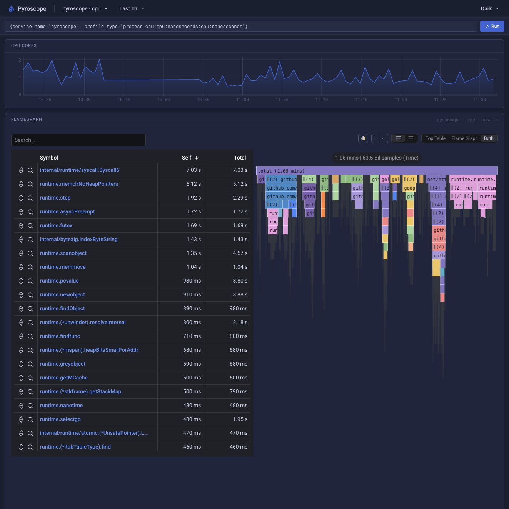

# Local Observability Lab Handbook: Profiles

[Back to overview](README.md)

## Viewing Profiles

Direct Pyroscope entry:

```text
http://localhost:4040
```

You can also use the Profiles / Pyroscope datasource in Grafana. What Pyroscope answers is:

```text
During this time, which function call stacks did the process CPU mostly spend time on?
```

It is not logs, and it is not a single request trace. It is continuous sampling that aggregates the call stacks over a time period into a top table and a flamegraph. Metrics / traces tell you where it is slow; Pyroscope helps you see whether the slowness is a CPU hot spot and exactly which functions the hot spot falls in.

The current local stack enables profiling for three Python processes:

- `webhookwise-api`
- `webhookwise-worker`
- `webhookwise-scheduler`

In the application dropdown at the top-left of the Pyroscope page, select these business services. Do not accidentally select `pyroscope`, or you will see the Pyroscope backend itself. For example, `internal/runtime/syscall.Syscall6` is the Go runtime's syscall wrapper, indicating that the Pyroscope backend is interacting with the operating system, not a WebhookWise business hot spot.

Common query forms:

```text
{service_name="webhookwise-api", profile_type="process_cpu:cpu:nanoseconds:cpu:nanoseconds"}
{service_name="webhookwise-worker", profile_type="process_cpu:cpu:nanoseconds:cpu:nanoseconds"}
{service_name="webhookwise-scheduler", profile_type="process_cpu:cpu:nanoseconds:cpu:nanoseconds"}
```

Prefer looking at profiles in the following scenarios:

- API p95/p99 rises, but there is no obvious slow DB/Redis/AI call.
- The worker queue is backed up while CPU rises noticeably.
- Scheduler task duration grows longer, but there are no errors in the logs.

### How to Read the Pyroscope Page

| Area | How to read it | Notes |
| --- | --- | --- |
| `CPU CORES` line | Process CPU usage | `250m` is 0.25 core, `500m` is 0.5 core, `1` is 1 core |
| query input box | The current profile selector | Mainly confirm whether `service_name` is a business service |
| Time range | The profile aggregation window | After running a load test or reproducing a problem, switch to the corresponding 5m/15m window |
| Top Table | A ranking of functions | Can be sorted by `Self` or `Total` |
| Flamegraph | A call-stack width chart | The wider it is horizontally, the more cumulative samples; color does not indicate severity |

The two time columns in the Top Table are key:

| Column | Meaning | Troubleshooting use |
| --- | --- | --- |
| `Self` | The CPU time the function itself consumes, excluding child calls | Good for finding functions that are really burning CPU themselves |
| `Total` | The function's own CPU time plus that of all child calls | Good for finding the large branch where the hot spot lives |

If a function has `Self=0` but a large `Total`, it is usually just a parent call chain, for example process startup, the worker framework, or a thread entry point, and does not mean it is slow itself. You need to keep drilling down into child functions.

How to read the flamegraph:

- The `total` at the very top is the CPU time aggregated from samples within the current time window, not the total process runtime.
- The wider it is horizontally, the more CPU samples this function and its child calls take.
- The vertical axis represents call depth: the entry point is at the bottom and deeper functions are at the top.
- Color is only used to distinguish blocks; red does not mean it is abnormal.
- When there is no traffic, the profile is easily dominated by background threads, collection threads, and sleep loops.

### How to Understand Common Function Names

| Function / Prefix | Typical meaning | Business hot spot? |
| --- | --- | --- |
| `internal/runtime/*`, `runtime.*` | Low-level Go or language runtime functions | Usually not WebhookWise business code |
| `Runner.run`, `sleep` | The Pyroscope Python agent's sampling/upload background loop, or a resident wait | Usually not a business hot spot |
| `MetricReaderStorage.collect`, `PeriodicExportingMetricReader.collect` | Periodic OpenTelemetry metrics collection | Observability's own overhead |
| `OTLPMetricExporter`, `encode_metric`, `_encode_*` | OTel metrics encoding and export to Alloy | Observability's own overhead |
| `Session.prepare_request`, `parse_url`, `get_netrc_auth` | The Python HTTP client preparing requests for the exporter | Mostly the OTel/Pyroscope reporting path |
| `BaseProcess.run`, `ForkProcess`, `ProcessManager.*` | The worker process management and startup framework | A parent call chain that does not directly indicate slow business code |
| `RedisStreamBroker.listen` | The worker listening for Redis Stream tasks | Related to queue consumption; worth viewing together with queue metrics |
| `BatchProcessor.worker` | The OTel batch processor background export thread | Observability's own overhead |
| `_async_traced_execute_factory...` | The tracing-wrapped async task execution entry point | Worth drilling further down into business functions |
| `services/...`, `api/...`, `core/...`, `db/...` | WebhookWise business code | Focus here |

### How to Judge an API Profile Example

If, after selecting `webhookwise-api`, you see something like:

```text
Runner.run
sleep
Server.on_tick
Server.main_loop
MetricReaderStorage.collect
PeriodicExportingMetricReader.collect
OTLPMetricExporter
encode_metric
```

it usually means the API currently has no obvious business CPU hot spot, and the page mainly sampled:

- The Pyroscope agent's own sampling/upload loop.
- Periodic OpenTelemetry metrics export.
- The service run loop.

This kind of graph is very common when local traffic is idle or light, and it does not mean the API has a business performance problem. To see real business hot spots, first run k6 or manually send webhook traffic, then switch the time range to those few minutes of the load test.

### How to Judge a Worker Profile Example

If, after selecting `webhookwise-worker`, `CPU CORES` occasionally spikes, for example close to 2 cores, but the Top Table is mainly:

```text
start_listen
BaseProcess.run
ProcessManager.start
run_worker
RedisStreamBroker.listen
BatchProcessor.worker
_async_traced_execute_factory...
```

you can read it this way:

- `BaseProcess.*`, `ProcessManager.*`, and `run_worker` are the worker framework and parent call chain; a large `Total` does not mean they are slow themselves.
- `start_listen` and `RedisStreamBroker.listen` mean the worker is listening for and dispatching Redis Stream tasks.
- `BatchProcessor.worker` is mostly OTel background export, not business processing.
- `_async_traced_execute_factory...` is closer to the task execution entry point; you need to click into it or search for business module names.

Continue searching in the search box:

```text
services
webhooks
operations
forward
analysis
redis
sqlalchemy
json
```

Only when you can find `services/operations/tasks.py`, `services/webhooks/...`, or `services/forwarding/...` and the blocks are wide does it mean the hot spot is in business code. If worker queue lag is high but the business functions are not wide, the bottleneck may be in wait-type IO such as DB, Redis, AI, and HTTP forwarding, in which case you should go back to traces and duration metrics.

### Using Profiles Together with Other Signals

| Phenomenon | What you see in Pyroscope | Next step |
| --- | --- | --- |
| API p95 high, business functions wide in the profile | CPU hot spot | Optimize the function, reduce parsing/computation, cache results |
| API p95 high, business functions not wide in the profile | Possibly IO waiting | Look at Tempo and DB/Redis/AI/Forwarding duration |
| Worker queue lag high, worker CPU also high | Worker is compute-busy | Find the wide `services/...` branch and optimize or scale out the worker |
| Worker queue lag high, worker profile not wide | The worker is waiting on external dependencies or cannot get tasks | Look at Redis, DB, AI, Forwarding, and worker logs |
| Scheduler duration high, profile not wide | Mostly scan queries or external waits | Look at scheduler traces, DB session duration, and logs |
| Top Table is mainly OTel/Pyroscope functions | Observability background cost dominates | Look again after adding business traffic, or increase the sampling/export interval |



